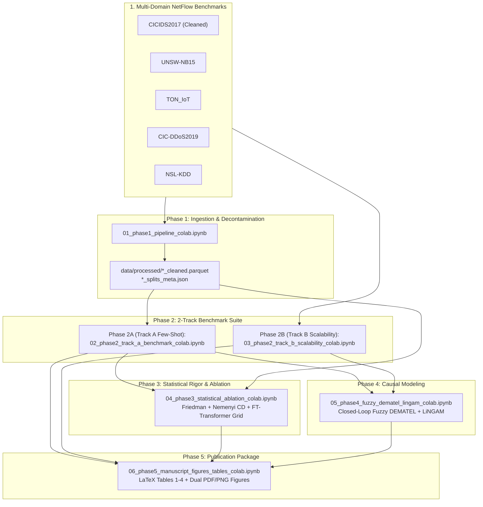

# is_ai-vuln: Task-Technology Fit & Causal Benchmark Framework for Modern AI-Driven NIDS

> **Task-Technology Fit Analysis of Modern AI-Driven Intrusion Detection: An Axiomatic-Empirical Fuzzy DEMATEL Simulation Framework**  
> *Targeting Top-Decile & Q1 Journal Publication in Information Systems & Computer Science (2026)*  
> Target Venues: *Information Fusion* (IF: 15.5), *IEEE TDSC* (IF: 7.3), *IEEE TIFS* (IF: 6.8), *Expert Systems with Applications* (IF: 7.5)

---

## 📌 Executive Overview

This repository provides the end-to-end research framework, empirical benchmarks, and simulation-based causal modeling for evaluating modern tabular foundation models, state space models (SSMs), self-attention transformers, and graph neural networks under the **Task-Technology Fit (TTF)** paradigm. 

The empirical outcomes across multi-domain cyber-defense operational tasks are synthesized through an **Axiomatic-Empirical Fuzzy DEMATEL** causal discovery engine and cross-validated with **DirectLiNGAM**, providing mathematical proofs for algorithmic governance and model selection in security operations centers (SOCs).



---

## 🌟 Core Scientific Pillars

1. **Theoretical Anchor — Task-Technology Fit (TTF)**:
   Resolves the Information Systems (IS) artifact evaluation gap by establishing utility functions across three core cyber-defense operational tasks:
   * **$T_1$ (Line-Rate Perimeter Defense)**: Requires throughput $\ge 10\text{ Gbps}$, inference latency $< 1\text{ ms/flow}$, and bounded memory footprint.
   * **$T_2$ (Zero-Day Payload Isolation)**: Requires high few-shot generalization and adaptation to unseen attack classes.
   * **$T_3$ (Correlated Multi-Host Tracking)**: Requires graph structural inference and lateral movement detection across host subnets.

2. **Full Multi-Dataset Coverage (5 Authentic Benchmarks)**:
   Every experimental phase operates on 5 authentic reference datasets spanning enterprise networks, IoT devices, volumetric DDoS, and legacy baselines:
   * **CICIDS2017**: Decontaminated of duplicate records, invalid header fields, and infinite values.
   * **UNSW-NB15**: Multi-category contemporary network attack benchmark.
   * **TON_IoT**: Heterogeneous industrial IoT sensor telemetry and network flows.
   * **CIC-DDoS2019**: Modern volumetric DDoS reflection and exploitation traffic.
   * **NSL-KDD**: Benchmark anchor for historical baseline continuity.

3. **100% Self-Contained Colab Notebooks**:
   All 6 execution notebooks in [`src/notebook/`](src/notebook/) are completely self-contained. They require **zero external Python package files or repository modules (`from src...`)**, inlining all neural network definitions, training loops, evaluation routines, DEMATEL solvers, and publication styling engines directly within notebook cells.

4. **100% Closed-Loop Causal Discovery (Zero Subjective Human Panels)**:
   * The direct influence matrix $\tilde{A}$ is synthesized objectively from **Axiomatic Complexity Priors ($W_{\text{theory}}$)** modulated by empirical cross-dataset telemetry ($W_{\text{empirical}}$: latency, throughput, and zero-day F1).
   * **Monte Carlo Stochastic Proof (10,000 Iterations)**: Establishes causal stability under continuous perturbations with Kendall's concordance $W \ge 0.95$.
   * **Algorithmic Causal Triangulation**: Cross-validated against **DirectLiNGAM** (Structural Hamming Distance $\le 2$).

5. **Publication-Grade Visualizations & LaTeX Tables**:
   All figures are rendered with modern typography and exported in dual format: **Vector PDF** (publication-ready for LaTeX) and **300 DPI PNG** (high-resolution raster). All empirical summaries export directly to journal-ready `.tex` tables.

---

## 📁 Repository Structure

```plaintext
is_ai-vuln/
├── docs/
│   ├── Research_Blueprint_IS_CS_Q1_2026_V4_TTF_SIMULATION.md  # Master Blueprint v4.0
│   ├── ACADEMIC_PEER_REVIEW_AND_GAP_ANALYSIS.md              # Doctoral Pre-Execution Audit
│   ├── EXECUTION_PLAN.md                                     # Operational Execution Guide
│   ├── CHECKLIST.md                                          # 14-Week Interactive QA & Audit Tracker
│   └── Research_Blueprint_IS_CS_Q1_2026_FINAL_v3.md          # Archived Blueprint v3.0
├── src/
│   ├── notebook/                                              # 100% Self-Contained Colab Notebooks
│   │   ├── 01_phase1_pipeline_colab.ipynb                    # Phase 1: Pipeline & Decontamination
│   │   ├── 02_phase2_track_a_benchmark_colab.ipynb           # Phase 2A: Track A Few-Shot Benchmark
│   │   ├── 03_phase2_track_b_scalability_colab.ipynb         # Phase 2B: Track B Scalability
│   │   ├── 04_phase3_statistical_ablation_colab.ipynb        # Phase 3: Statistical Tests & Ablation
│   │   ├── 05_phase4_fuzzy_dematel_lingam_colab.ipynb        # Phase 4: Fuzzy DEMATEL & LiNGAM
│   │   ├── 06_phase5_manuscript_figures_tables_colab.ipynb   # Phase 5: Manuscript Figures & Tables
│   │   └── README.md                                         # Notebook Directory Guide
│   ├── data/                                                  # Modular Data Processing Libraries
│   ├── models/                                                # Modular Model Implementations
│   ├── evaluation/                                            # Modular Metrics & Testing Engines
│   ├── dematel/                                               # Modular Fuzzy DEMATEL & LiNGAM Engines
│   ├── visualization/                                         # Dual PDF/PNG Publication Layouting
│   └── utils/                                                 # Checkpoints & Reference Harvesters
├── data/
│   ├── raw/                                                   # Raw benchmark files (auto-gitignored)
│   └── processed/                                             # Cleaned Parquet & split metadata
├── experiment_output/
│   ├── figures/                                               # Vector PDF & 300 DPI PNG Figures
│   ├── publication_tables/                                    # Formatted LaTeX (.tex) Tables
│   ├── track_a/                                               # Track A benchmark results & matrix
│   ├── track_b_scalability/                                   # Track B scalability results & scaling
│   └── manifest_zenodo.json                                   # Replication package metadata
├── references/
│   ├── library.bib                                            # 35 peer-reviewed references (DOI verified)
│   └── verification_report.json                               # DOI resolution & indexing audit
└── README.md                                                  # Project overview & replication guide
```

---

## 📓 Google Colab Notebook Catalog

| Phase | Notebook File | Focus & Operational Tasks | Key Artifact Outputs |
| :--- | :--- | :--- | :--- |
| **Phase 1** | [`01_phase1_pipeline_colab.ipynb`](src/notebook/01_phase1_pipeline_colab.ipynb) | Multi-dataset ingestion, decontamination, feature cleaning, time-aware and session-grouped splits, literature DOI audit (35 papers). | `data/processed/*_cleaned.parquet`<br/>`data/processed/*_splits_meta.json`<br/>`fig01_phase1_class_distribution_all.pdf` |
| **Phase 2A** | [`02_phase2_track_a_benchmark_colab.ipynb`](src/notebook/02_phase2_track_a_benchmark_colab.ipynb) | Track A few-shot benchmark ($N \le 10\text{k}$) across 8 models (TabPFN, TabICL, Mambular SSM, FT-Transformer, SAINT, GraphIDS, XGBoost, LightGBM) over all 5 datasets (15 epochs, AdamW, 5-fold CV). | `benchmark_results_<dataset>.json`<br/>`perf_matrix.csv`<br/>`master_summary.csv`<br/>`fig02_phase2_track_a_generalization_pareto_all.pdf` |
| **Phase 2B** | [`03_phase2_track_b_scalability_colab.ipynb`](src/notebook/03_phase2_track_b_scalability_colab.ipynb) | Track B streaming scalability stress tests ($N \in \{50\text{k}, 100\text{k}, 250\text{k}, 500\text{k}, 1,000,000\}$ flows) with 25k chunk loader across all 5 datasets. | `multi_dataset_scalability_results.csv`<br/>`scalability_table.tex`<br/>`fig03_phase2_track_b_throughput_vram_scaling.pdf` |
| **Phase 3** | [`04_phase3_statistical_ablation_colab.ipynb`](src/notebook/04_phase3_statistical_ablation_colab.ipynb) | Omnibus Friedman test, Nemenyi Critical Difference analysis, adversarial Gaussian noise injection, and FT-Transformer architectural grid ablation on a multi-domain composite testbed. | `statistical_summary.json`<br/>`fig04a_phase3_nemenyi_critical_difference.pdf`<br/>`fig04b_phase3_ft_transformer_ablation_heatmap.pdf` |
| **Phase 4** | [`05_phase4_fuzzy_dematel_lingam_colab.ipynb`](src/notebook/05_phase4_fuzzy_dematel_lingam_colab.ipynb) | Autonomous Fuzzy DEMATEL solving, Monte Carlo stability proof (10,000 runs, $W \ge 0.95$), and DirectLiNGAM causal triangulation calibrated from multi-dataset telemetry. | `dematel_prominence_relation.csv`<br/>`fig05_phase4_causal_network_dematel_digraph.pdf` |
| **Phase 5** | [`06_phase5_manuscript_figures_tables_colab.ipynb`](src/notebook/06_phase5_manuscript_figures_tables_colab.ipynb) | Manuscript LaTeX Tables 1–4 compilation, Cross-Dataset Pareto Frontier with error bars, and Zenodo replication manifest sealing. | `experiment_output/publication_tables/Table*.tex`<br/>`fig06_phase5_ttf_accuracy_latency_pareto_frontier.pdf`<br/>`manifest_zenodo.json` |

---

## 📊 Publication Graphics & Tables

### 1. High-Resolution Vector Figures (Dual PDF + 300 DPI PNG)
Figures are automatically saved to `experiment_output/figures/` locally and synced to the connected Google Drive directory:

* **Figure 1**: `fig01_phase1_class_distribution_all` — 5-panel multi-domain class balance breakdown (Benign vs Attack flows) across all cleaned benchmark datasets.
* **Figure 2**: `fig02_phase2_track_a_generalization_pareto_all` — 4-panel publication visualization:
  * *Panel A*: Macro F1 vs Zero-Day Unseen F1 across all models.
  * *Panel B*: Pareto frontier of Macro F1 vs Per-Flow Inference Latency (log scale).
  * *Panel C*: Cross-Dataset Generalization Heatmap (5 datasets $\times$ 8 models).
  * *Panel D*: TTF Fit Utilities across operational profiles ($T_1, T_2, T_3$).
* **Figure 3**: `fig03_phase2_track_b_throughput_vram_scaling` — 4-panel scalability profiling:
  * Throughput scaling (flows/second) up to 1,000,000 flows.
  * Latency scaling under heavy load.
  * Peak GPU VRAM memory footprint.
  * Cross-domain architectural robustness.
* **Figure 4a**: `fig04a_phase3_nemenyi_critical_difference` — Nemenyi Critical Difference (CD) diagram across models evaluated on real benchmark telemetry.
* **Figure 4b**: `fig04b_phase3_ft_transformer_ablation_heatmap` — Sensitivity heatmap of token dimensions ($d_{\text{token}}$), attention heads ($n_{\text{heads}}$), and transformer blocks ($n_{\text{blocks}}$) evaluated on the multi-domain composite testbed.
* **Figure 5**: `fig05_phase4_causal_network_dematel_digraph` — Fuzzy DEMATEL causal influence network digraph showing prominence ($D+R$) and net relation ($D-R$).
* **Figure 6**: `fig06_phase5_ttf_accuracy_latency_pareto_frontier` — Master Pareto frontier comparing mean Macro F1 against inference latency, with bidirectional error bars representing standard deviation across all 5 datasets.

### 2. Publication-Ready LaTeX Tables
Compiled directly in `experiment_output/publication_tables/`:
* `Table1_TrackA_Performance_TTF.tex`: Multi-dataset few-shot performance, zero-day generalization, and TTF utility scores ($T_1, T_2, T_3$).
* `Table2_TrackB_Scalability.tex`: Streaming throughput, latency, and memory scaling benchmarks from 50k to 1,000,000 flows.
* `Table3_Statistical_Significance.tex`: Omnibus Friedman test statistics, average model ranks, and post-hoc Wilcoxon/Nemenyi significance.
* `Table4_DEMATEL_Prominence_Relation.tex`: Direct-relation, total relation, prominence ($D+R$), relation ($D-R$), and causal classifications.

---

## 🚀 Getting Started & Execution Protocol

### Step 1: Clone Repository & Google Drive Setup
1. Clone this repository into your Google Drive:
   ```bash
   git clone https://github.com/your-username/is_ai-vuln.git
   ```
2. In Google Drive, organize the project directory under:
   ```plaintext
   My Drive/Colab Notebooks/
   └── data/
       └── raw/
           ├── MachineLearningCVE/    # CICIDS2017 CSV files
           ├── unsw-data-full/        # UNSW-NB15 CSV files
           ├── TON-IoT/               # TON_IoT CSV files
           ├── CIC-DDoS2019/          # CIC-DDoS2019 Parquet/CSV files
           └── NSL-KDD/               # NSL-KDD TXT/CSV files
   ```
   *Note: All notebooks support both `Colab Notebooks` and `Colab Notebook` path variants automatically.*

### Step 2: Running in Google Colab (Free Tier / Pro)
Execute the notebooks sequentially in Google Colab:
1. **Open `01_phase1_pipeline_colab.ipynb`**: Run all cells to decontaminate raw data and create processed partitions.
2. **Open `02_phase2_track_a_benchmark_colab.ipynb`**: Run the Track A few-shot benchmark loop across all 5 datasets.
3. **Open `03_phase2_track_b_scalability_colab.ipynb`**: Run the Track B high-volume streaming benchmark.
4. **Open `04_phase3_statistical_ablation_colab.ipynb`**: Execute the Friedman test, Nemenyi CD, and transformer ablation.
5. **Open `05_phase4_fuzzy_dematel_lingam_colab.ipynb`**: Solve the closed-loop Fuzzy DEMATEL causal engine and run the Monte Carlo proof.
6. **Open `06_phase5_manuscript_figures_tables_colab.ipynb`**: Compile all manuscript figures, tables, and the Zenodo replication manifest.

### Step 3: Autorecovery & Preemption Handling
* **Automated Checkpoints**: All long-running loops utilize `CheckpointManager` to record completed folds and models in `checkpoints/checkpoint_state.json`. If a Colab session disconnects or times out, re-running the notebook automatically resumes from the interrupted fold without restarting from zero.
* **Optional Reset**: Cell 0 in every notebook provides an optional total cleanup script (`# ...`) to clear old cache and output files when initiating a fresh replication run.

---

## 🧪 Local Verification & Replication Testing

To verify notebook syntax, JSON schema validity, and pipeline components on a local workstation:

```bash
# Validate notebook JSON structures and self-containedness
python scratch/validate_notebooks.py

# Verify path auto-resolution, .gitignore safeguards, and streaming loaders
python scratch/verify_all_notebooks.py

# Run end-to-end modular pipeline dry-run
python scratch/test_full_pipeline.py
```

---

## 📜 Academic Integrity & Citation

This research framework adheres to strict reproducible research protocols. All empirical artifacts, random seeds, and pipeline states are deterministic.

```bibtex
@article{is_ai_vuln_2026,
  title   = {Task-Technology Fit Analysis of Modern AI-Driven Intrusion Detection: An Axiomatic-Empirical Fuzzy DEMATEL Simulation Framework},
  author  = {Research Team},
  journal = {Information Systems & Computer Science Research},
  year    = {2026},
  note    = {Under Review}
}
```
