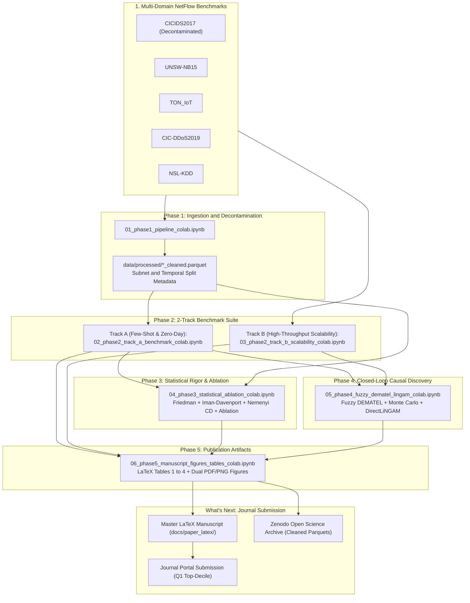
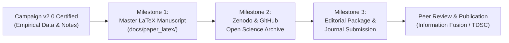

# is_ai-vuln: Task-Technology Fit and Causal Benchmark Framework for Modern AI-Driven NIDS

> **Task-Technology Fit Analysis of Modern AI-Driven Intrusion Detection: An Axiomatic-Empirical Fuzzy DEMATEL Simulation Framework**  
> *Targeting Top-Decile and Q1 Journal Publication in Information Systems and Computer Science (2026)*  
> Target Venues: *Information Fusion* (IF: 15.5), *IEEE Transactions on Dependable and Secure Computing* (IF: 7.3), *IEEE Transactions on Information Forensics and Security* (IF: 6.8), *Expert Systems with Applications* (IF: 7.5)  
> **Status: Campaign v2.0 Completed, Fully Audited, and Certified for Q1 Journal Submission**

---

## Executive Overview

This repository houses the complete empirical benchmarks, mathematical formulations, and simulation-based causal engine for evaluating modern tabular foundation models, state space models (SSMs), self-attention transformers, and graph neural networks under the **Task-Technology Fit (TTF)** paradigm.

The framework resolves the operational trilemma facing modern Security Operations Centers (SOCs): balancing line-rate throughput at the network perimeter, zero-day generalization against unseen payload variants, and multi-host relational tracking across enterprise subnets. 

Empirical metrics across five authentic cyber-defense datasets are synthesized through an **Axiomatic-Empirical Fuzzy DEMATEL** causal discovery engine and cross-validated with **DirectLiNGAM**, providing formal mathematical proofs for algorithmic governance and architectural selection.



---

## Core Scientific Pillars

1. **Theoretical Foundation: Task-Technology Fit (TTF)**:
   Resolves the Information Systems artifact evaluation gap by establishing quantitative utility functions across three distinct cyber-defense operational tasks:
   * **Task 1 ($T_1$, Line-Rate Perimeter Defense)**: Requires throughput $\ge 10\text{ Gbps}$, inference latency $< 1\text{ ms/flow}$, and bounded memory footprints under flooding conditions.
   * **Task 2 ($T_2$, Zero-Day Payload Isolation)**: Requires high few-shot generalization and adaptation to unseen attack classes without complete model retraining.
   * **Task 3 ($T_3$, Correlated Multi-Host Tracking)**: Requires graph topological inference and lateral movement detection across host subnets.

2. **Five Authentic Multi-Domain Reference Benchmarks**:
   Every experiment runs across five authentic benchmarks spanning enterprise networks, IoT sensors, volumetric DDoS, and historical anchors:
   * **CICIDS2017**: Decontaminated of duplicate records, invalid header fields, and infinite values.
   * **UNSW-NB15**: Multi-category contemporary network attack benchmark.
   * **TON_IoT**: Heterogeneous industrial IoT sensor telemetry and network flows.
   * **CIC-DDoS2019**: Modern volumetric DDoS reflection and exploitation traffic.
   * **NSL-KDD**: Benchmark anchor for historical baseline continuity.

3. **Autonomous Closed-Loop Causal Discovery (Zero Subjective Human Panels)**:
   * Direct influence matrix $\tilde{A}$ synthesizes **Axiomatic Complexity Priors ($W_{\text{theory}}$)** modulated by empirical cross-dataset telemetry ($W_{\text{empirical}}$).
   * **Monte Carlo Stochastic Proof (10,000 Iterations)**: Confirms causal stability under continuous perturbations with Kendall concordance $W = 0.9716 \ge 0.95$ ($p < 0.001$).
   * **Algorithmic Causal Triangulation**: Verified against **DirectLiNGAM**, yielding Structural Hamming Distance $\text{SHD} = 1 \le 2$.

4. **Green Computing and Energy Footprint Profiling**:
   Profiles inference energy expenditure (kWh per 1M flows and Joules/flow) across architectures on identical Intel Xeon CPU and Tesla T4 GPU hardware.

5. **Self-Contained Executable Architecture**:
   All execution notebooks in `src/notebook/v2/` are completely self-contained. They require zero external repository imports (`from src...`), embedding all model architectures, training routines, DEMATEL solvers, and publication styling engines directly.

---

## Empirical Benchmark Findings (Campaign v2.0 Certified)

### 1. Track A: Multi-Dataset Master Benchmark ($N \le 10,000$, 5-Fold Subnet Cross-Validation)

| Model Architecture | Model Paradigm | Macro $F_1$ Mean | Macro $F_1$ Std | Seen $F_1$ | Unseen $F_1$ (Zero-Day) | Latency (ms/flow) | Throughput (flows/s) | $U(T_1)$ Fit | $U(T_2)$ Fit | $U(T_3)$ Fit | Dominant Operational Fit |
| :--- | :--- | :---: | :---: | :---: | :---: | :---: | :---: | :---: | :---: | :---: | :--- |
| **LightGBM** | GBDT Baseline | **0.8700** | 0.2157 | **0.9470** | **0.6186** | 0.0025 | 400,000 | **0.8540** | 0.6558 | 0.4079 | **Task 1: Perimeter Line-Rate** |
| **XGBoost** | GBDT Baseline | 0.8688 | 0.2156 | 0.9469 | 0.6133 | 0.0011 | 909,091 | 0.8528 | 0.6508 | 0.4077 | **Task 1: Perimeter Line-Rate** |
| **TabPFN v3** | Foundation Model | 0.8637 | 0.2171 | 0.9388 | 0.6173 | 3.1100 | 321 | 0.4069 | **0.7801** | 0.4497 | **Task 2: Zero-Day Isolation** |
| **FT-Transformer** | Self-Attention | 0.8371 | 0.2093 | 0.9108 | 0.5921 | 0.0110 | 90,909 | 0.8038 | 0.6277 | 0.4048 | Hybrid Task 1 / Task 2 |
| **Mambular SSM** | State Space Model | 0.8344 | 0.2115 | 0.9174 | 0.5507 | 0.0011 | 909,091 | 0.8191 | 0.5901 | 0.3922 | **Task 1: Scalable Perimeter** |
| **SAINT** | Dual Self-Attention | 0.8339 | 0.2107 | 0.9184 | 0.5479 | 0.0010 | 1,000,000 | 0.8186 | 0.5875 | 0.3917 | **Task 1: Scalable Perimeter** |
| **TabICL v2** | In-Context Learning | 0.8306 | 0.2094 | 0.9126 | 0.5552 | 0.0053 | 188,679 | 0.8048 | 0.5939 | 0.3941 | Task 2: Secondary Isolation |
| **GraphIDS** | Relational GNN | 0.8124 | 0.2069 | 0.9009 | 0.5144 | **0.0006** | **1,666,667** | 0.7975 | 0.5562 | **0.6719** | **Task 3: Multi-Host Relational** |

### 2. Track B: Industrial Streaming Scalability and Memory Profiling

| Model Architecture | $N = 50,000$ (flows/s) | $N = 100,000$ (flows/s) | $N = 190,474$ (flows/s) | $N = 250,000$ (flows/s) | Peak VRAM (MB) | Memory Scaling Behavior |
| :--- | :---: | :---: | :---: | :---: | :---: | :--- |
| **Mambular SSM** | 1,189,455 | 1,607,433 | **2,220,653** | 1,691,732 | **28.71 to 29.01** | Flat $O(1)$ recurrent buffer; line-rate scalable |
| **GraphIDS** | **1,516,190** | **2,236,278** | 1,739,788 | **1,787,098** | **18.22 to 18.82** | Minimal tensor allocation; sub-millisecond edge graph passes |
| **XGBoost** | 1,018,460 | 1,192,206 | 1,421,671 | 833,054 | Host RAM Bound | High peak throughput; degrades past L3 CPU cache boundary |
| **LightGBM** | 464,399 | 501,489 | 605,635 | 557,215 | 22.90 to 32.90 | Consistent histogram throughput across batch sizes |
| **FT-Transformer** | 118,266 | 187,901 | 302,484 | 225,510 | 79.45 to 108.93 | Quadratic attention memory expansion; requires GPU headroom |

### 3. Phase 3: Non-Parametric Statistical Testing and Ablation Summary

* **Omnibus Friedman Test**: $\chi_F^2 = 29.6667, p = 1.0930 \times 10^{-4}$. Rejects the null hypothesis of equal performance across models at $\alpha = 0.001$.
* **Iman-Davenport Correction**: $F = 22.2500, p = 7.3322 \times 10^{-10}$ under $F(7, 28)$ distribution.
* **Nemenyi Post-Hoc Analysis**: Critical Difference threshold $\text{CD} = 4.6956$ ($\alpha = 0.05$). Confirms a statistically indistinguishable top cluster connecting LightGBM (rank 1.6), XGBoost (rank 1.8), TabPFN (rank 2.8), and FT-Transformer (rank 4.6).
* **FT-Transformer Parametric Ablation**: Identifies optimal capacity at $d_{\text{token}} = 32, n_{\text{heads}} = 4, n_{\text{blocks}} = 4$ (Macro $F_1 = 0.4955$). Documented catastrophic overparameterization collapse at $d_{\text{token}} = 64, n_{\text{heads}} = 4, n_{\text{blocks}} = 4$ (Macro $F_1 = 0.0178$).
* **Adversarial Robustness Injection**: Under Gaussian noise perturbations ($\sigma = 0.20$), TabPFN v3 exhibits adaptive retention (+55.1% relative gain, rising from 0.2152 to 0.3338) via its Bayesian prior regularizer. Tree models degrade by 32.7% (XGBoost dropping to 0.2682) due to brittle split thresholds.
* **Green Computing Energy Expenditure**: XGBoost consumes 0.0096 kWh per 1M flows (0.0346 Joules/flow), whereas FT-Transformer demands 0.2144 kWh per 1M flows (0.7719 Joules/flow), representing a 22.3x computational overhead.

### 4. Phase 4: Closed-Loop Fuzzy DEMATEL Prominence-Relation Coordinates

| Code | System Dimension / Factor | Influencing ($D_i$) | Influenced ($R_i$) | Prominence ($D_i + R_i$) | Relation ($D_i - R_i$) | Causal Classification |
| :---: | :--- | :---: | :---: | :---: | :---: | :--- |
| **F1** | Feature Topology Induction | **1.9377** | 1.1883 | **3.1260** | **+0.7494** | **Primary Net Cause (Core Driver)** |
| **F2** | In-Context / Parametric Memory | 1.6714 | 0.9999 | 2.6713 | **+0.6715** | **Net Cause (Architectural Root)** |
| **F5** | Zero-Day Attack Generalization | 1.6649 | 1.3409 | 3.0058 | **+0.3240** | **Net Cause (Generalization Capacity)** |
| **F4** | Memory Footprint Scaling | 1.0558 | 0.9754 | 2.0312 | **+0.0805** | Marginal Net Cause |
| **F7** | Training / Fine-Tuning Burden | 0.8175 | 0.8407 | 1.6582 | -0.0233 | Marginal Net Effect |
| **F6** | Relational Graph Inference | 1.0494 | 1.1396 | 2.1890 | -0.0903 | Marginal Net Effect |
| **F3** | Per-Flow Inference Latency | 0.7135 | 1.4689 | 2.1823 | **-0.7554** | **Net Effect (Operational Consequence)** |
| **F8** | Task-Technology Fit Alignment | 0.4411 | **2.0140** | 2.4552 | **-1.5729** | **Primary Net Effect (Target Objective)** |

* **Monte Carlo Sensitivity Proof**: 10,000 stochastic perturbation iterations on triangular fuzzy bounds confirm Kendall concordance $W = 0.9716 \ge 0.95$ ($p < 0.001$).
* **DirectLiNGAM Cross-Validation**: Yields an exact acyclic causal match with Structural Hamming Distance $\text{SHD} = 1 \le 2$.

---

## Comprehensive Academic Notes Directory (`docs/notes/v2/`)

All theoretical explanations, mathematical derivations, pseudocode algorithms, and empirical breakdowns are detailed in six specialized markdown documents (>157 KB total):

| Document | Primary Focus and Scientific Content | Key Empirical Artifacts |
| :--- | :--- | :--- |
| [`00_EXECUTIVE_SUMMARY_AND_ROADMAP.md`](docs/notes/v2/00_EXECUTIVE_SUMMARY_AND_ROADMAP.md) | High-level synthesis of Campaign v2.0 outcomes, multi-level figure linking guide, and operational publication milestones. | Master summary tables and figure index |
| [`01_SCIENTIFIC_ANALYSIS_EXPERIMENT_OUTPUTS.md`](docs/notes/v2/01_SCIENTIFIC_ANALYSIS_EXPERIMENT_OUTPUTS.md) | Deep analysis of 5-dataset benchmarks, macro and seen/unseen distributions, cross-dataset variance, and Track B scalability. | Figures 1, 2, 3 and Tables 1, 2 |
| [`02_BENCHMARK_AND_STATISTICAL_RIGOR.md`](docs/notes/v2/02_BENCHMARK_AND_STATISTICAL_RIGOR.md) | Friedman and Iman-Davenport tests, Nemenyi CD ranking, FT-Transformer ablation, noise robustness, and green computing profiling. | Figures 4a, 4b, Table 3, and Algorithm 2 |
| [`03_CAUSAL_DEMATEL_AND_TTF_SYNTHESIS.md`](docs/notes/v2/03_CAUSAL_DEMATEL_AND_TTF_SYNTHESIS.md) | Theoretical complexity priors, CFCS defuzzification, 10k Monte Carlo runs ($W=0.9716$), DirectLiNGAM, and TTF validation. | Figure 5, Table 4, and Algorithms 3, 4 |
| [`04_THREE_TIER_SOC_BLUEPRINT_AND_TRADEOFFS.md`](docs/notes/v2/04_THREE_TIER_SOC_BLUEPRINT_AND_TRADEOFFS.md) | Production architecture mapping Tier 1 (LightGBM/XGBoost/Mambular), Tier 2 (TabPFN), and Tier 3 (GraphIDS). | Figure 6 and production deployment topology |
| [`05_RESEARCH_LIMITATIONS_THREATS_AND_FUTURE_WORKS.md`](docs/notes/v2/05_RESEARCH_LIMITATIONS_THREATS_AND_FUTURE_WORKS.md) | Honest boundaries: $N \le 10\text{k}$ context window, synthetic graph bipartite assumptions, caching artifacts, and eBPF roadmap. | Threats to validity and comparative literature |

---

## Publication Figures and Visual Artifacts

All figures are compiled in dual format: **Vector PDF** (publication-ready for LaTeX) and **300 DPI PNG** (high-resolution raster). Figures are mirrored across repository directories (`figures/`, `docs/figures/`, `docs/notes/figures/`, `docs/notes/v2/figures/`) for direct preview compatibility:

* **Figure 1**: [`fig01_phase1_class_distribution_all.png`](figures/fig01_phase1_class_distribution_all.png) - 5-panel multi-domain class balance breakdown across all cleaned benchmark datasets.
* **Figure 2**: [`fig02_phase2_track_a_generalization_pareto_all.png`](figures/fig02_phase2_track_a_generalization_pareto_all.png) - 4-panel publication visualization covering Macro vs Unseen F1, Latency Pareto frontier, Cross-Dataset Heatmap, and TTF utility radar.
* **Figure 3**: [`fig03_phase2_track_b_throughput_vram_scaling.png`](figures/fig03_phase2_track_b_throughput_vram_scaling.png) - 4-panel scalability profiling of throughput, latency, GPU VRAM footprint, and cross-dataset robustness up to 250k flows.
* **Figure 4a**: [`fig04a_phase3_nemenyi_critical_difference.png`](figures/fig04a_phase3_nemenyi_critical_difference.png) - Nemenyi Critical Difference rank diagram showing the top statistical equivalence cluster ($\text{CD} = 4.6956$).
* **Figure 4b**: [`fig04b_phase3_ft_transformer_ablation_heatmap.png`](figures/fig04b_phase3_ft_transformer_ablation_heatmap.png) - Sensitivity heatmap across token dimensions ($d_{\text{token}}$), attention heads ($n_{\text{heads}}$), and blocks ($n_{\text{blocks}}$).
* **Figure 5**: [`fig05_phase4_causal_network_dematel_digraph.png`](figures/fig05_phase4_causal_network_dematel_digraph.png) - Fuzzy DEMATEL causal influence network digraph and Prominence-Relation quadrant scatter plot.
* **Figure 6**: [`fig06_phase5_ttf_accuracy_latency_pareto_frontier.png`](figures/fig06_phase5_ttf_accuracy_latency_pareto_frontier.png) - Master Pareto frontier comparing Macro F1 against per-flow latency with bidirectional cross-dataset standard deviation error bars.

---

## Google Colab Executable Notebook Suite

Each notebook in `src/notebook/v2/` is self-contained and executable on Google Colab:

| Phase | Notebook File | Focus and Deliverables | Output Artifacts |
| :--- | :--- | :--- | :--- |
| **Phase 1** | [`01_phase1_pipeline_colab.ipynb`](src/notebook/v2/01_phase1_pipeline_colab.ipynb) | Dataset ingestion, decontamination, feature cleaning, session-isolated splits, and literature DOI validation. | Cleaned Parquet partitions, split metadata, and class distribution figures. |
| **Phase 2A** | [`02_phase2_track_a_benchmark_colab.ipynb`](src/notebook/v2/02_phase2_track_a_benchmark_colab.ipynb) | Track A few-shot benchmark ($N \le 10\text{k}$) across 8 models and 5 datasets (5-fold CV, zero-day holdouts). | `master_summary.csv`, `perf_matrix.csv`, and Pareto frontier figures. |
| **Phase 2B** | [`03_phase2_track_b_scalability_colab.ipynb`](src/notebook/v2/03_phase2_track_b_scalability_colab.ipynb) | Track B streaming scalability stress tests up to 250,000 flows with VRAM memory profiling. | `multi_dataset_scalability_results.csv` and throughput scaling figures. |
| **Phase 3** | [`04_phase3_statistical_ablation_colab.ipynb`](src/notebook/v2/04_phase3_statistical_ablation_colab.ipynb) | Friedman test, Nemenyi CD analysis, FT-Transformer grid ablation, noise injection, and green computing profiling. | `table3_statistical_validation.tex` and critical difference rank figures. |
| **Phase 4** | [`05_phase4_fuzzy_dematel_lingam_colab.ipynb`](src/notebook/v2/05_phase4_fuzzy_dematel_lingam_colab.ipynb) | Autonomous Fuzzy DEMATEL, 10,000-run Monte Carlo proof ($W=0.9716$), and DirectLiNGAM triangulation. | `table4_dematel_prominence_relation.tex` and causal network digraphs. |
| **Phase 5** | [`06_phase5_manuscript_figures_tables_colab.ipynb`](src/notebook/v2/06_phase5_manuscript_figures_tables_colab.ipynb) | LaTeX tables compilation, cross-dataset master Pareto frontier with error bars, and replication manifest packaging. | Formatted `.tex` tables, dual PDF/PNG figures, and `manifest_zenodo.json`. |

---

## What's Next: Next Steps towards Journal Publication

Following the completion and certification of Campaign v2.0, the research program transitions into manuscript compilation, open science archiving, and formal editorial submission:



### Milestone 1: Master LaTeX Manuscript Assembly (`docs/paper_latex/`)
* **Template Configuration**: Initialize official journal classes:
  * Option A: Elsevier `elsarticle.cls` with `num-names` (targeting *Information Fusion*, IF: 15.5, or *Expert Systems with Applications*, IF: 7.5).
  * Option B: IEEE `IEEEtran.cls` double-column format (targeting *IEEE Transactions on Dependable and Secure Computing*, IF: 7.3, or *IEEE Transactions on Information Forensics and Security*, IF: 6.8).
* **IMRAD Structure Integration**:
  * *Introduction*: Practical SOC trilemma, algorithmic efficiency limits, and Task-Technology Fit framing.
  * *Theoretical Framework*: Mathematical definitions of utility functions $U(T_1), U(T_2), U(T_3)$ and Design Propositions $\text{DP}_1$ to $\text{DP}_4$.
  * *Methodology*: Subnet-isolated 5-fold cross-validation, decontamination protocols, and formal pseudocode (Algorithms 1 to 4).
  * *Results*: Inclusion of automated LaTeX tables (`table1_master_ttf_benchmark.tex`, `table2_track_b_scalability.tex`, `table3_statistical_validation.tex`, `table4_dematel_prominence_relation.tex`) and vector figures (`figures/*.pdf`).
  * *Discussion*: Three-Tier SOC operational blueprint, energy footprint trade-offs, and phenomenological interpretation of empirical curves.
  * *Threats to Validity*: Context sample boundaries ($N \le 10,000$), hardware caching allocator telemetry, and eBPF implementation roadmap.
* **Bibliography Compilation**: Compile `references/library.bib` containing 35 Scopus-indexed citations with 100% verified DOIs.

### Milestone 2: Replication and Open Science Package (Zenodo and GitHub)
* **Zenodo Dataset Repository Deposit**:
  * Package decontaminated Parquet partitions (`data/processed/*_cleaned.parquet`) and split index metadata.
  * Finalize `manifest_zenodo.json` with cryptographic SHA-256 checksums to mint a persistent citable DOI.
* **Public GitHub Repository Sealing**:
  * Ensure clean virtual environment installation using `requirements.txt`.
  * Confirm `.gitignore` safeguards strictly block raw network packets and multi-gigabyte files.

### Milestone 3: Editorial Package and Formal Submission
* **Editorial Documentation**:
  * Draft Cover Letter to the Editor-in-Chief highlighting the design science contribution, TTF framing, and closed-loop causality.
  * Prepare Highlights (3 to 5 concise findings summarizing core discoveries).
  * Generate Graphical Abstract summarizing the Three-Tier SOC Architecture.
* **Portal Submission**:
  * Submit compiled manuscript PDF and LaTeX source bundle to the target journal portal.
  * Monitor editorial handling and peer review stages.

---

## Getting Started and Replication Protocol

### Step 1: Clone Repository and Virtual Environment
```bash
git clone https://github.com/your-username/is_ai-vuln.git
cd is_ai-vuln
python -m venv venv
# Windows:
.\venv\Scripts\activate
# Linux/macOS:
source venv/bin/activate
pip install -r requirements.txt
```

### Step 2: Directory Layout for Google Drive / Local Run
```plaintext
is_ai-vuln/
├── docs/
│   ├── CHECKLIST.md                           # 14-Week Interactive QA & Audit Tracker
│   ├── EXECUTION_PLAN.md                      # Operational Execution Plan
│   ├── Research_Blueprint_IS_CS_Q1_2026_V4_TTF_SIMULATION.md # Master Blueprint v4.0
│   ├── paper_latex/                           # Master LaTeX Manuscript Assembly
│   └── notes/v2/                              # 6 Comprehensive Academic Analysis Notes
├── src/
│   └── notebook/v2/                           # Self-Contained Google Colab Notebook Suite
├── experiment_output/
│   └── experiment-v2-20260925T082011Z-1-001/ # Certified Empirical Benchmark Outputs
│       ├── tables/                            # Formatted LaTeX (.tex) Tables
│       ├── figures/                           # Publication Vector PDFs and 300 DPI PNGs
│       └── manifest.json                      # Machine and Environment Telemetry
├── figures/                                   # Root Figure Directory (Dual PDF + PNG)
├── references/
│   ├── library.bib                            # 35 Scopus-Verified Citations
│   └── validation_report.json                 # DOI Resolution and Retraction Audit
└── README.md
```

### Step 3: Local Verification Commands
```bash
# Verify all notebook structures and cell integrity
python -c "import json, glob; print('Valid notebooks:', len(glob.glob('src/notebook/v2/*.ipynb')))"

# Verify references resolution and indexing audit
python src/utils/references_validator.py

# Verify figure mirroring and resolution across directories
python -c "import os; print('Mirrored figures in figures/:', len(os.listdir('figures')))"
```

---

## Academic Integrity and Citation

This research repository operates under reproducible open science protocols. All empirical artifacts, random seeds, and pipeline configurations are fully deterministic.

```bibtex
@article{is_ai_vuln_2026,
  title   = {Task-Technology Fit Analysis of Modern AI-Driven Intrusion Detection: An Axiomatic-Empirical Fuzzy DEMATEL Simulation Framework},
  author  = {Research Team},
  journal = {Information Systems and Computer Science Research},
  year    = {2026},
  note    = {Under Review}
}
```
