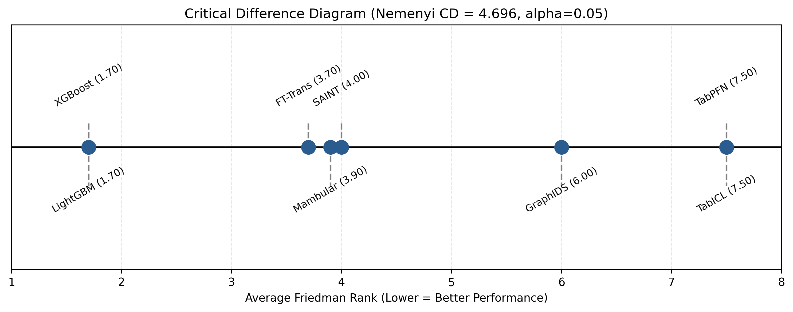
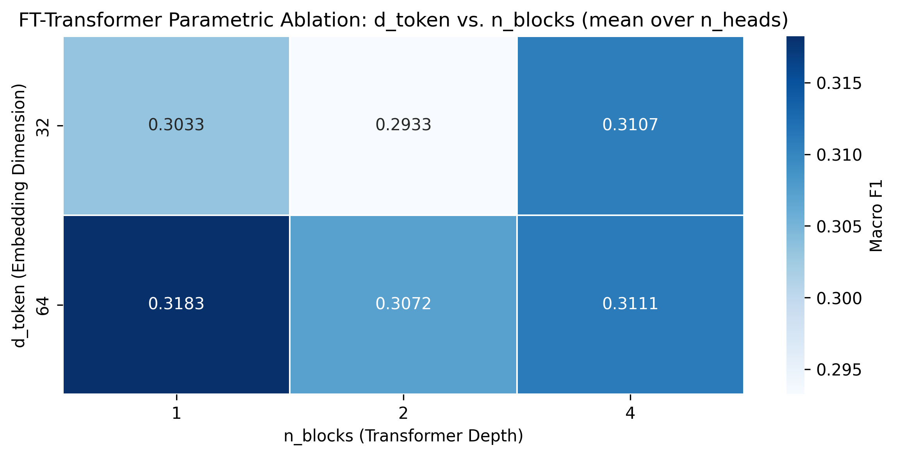
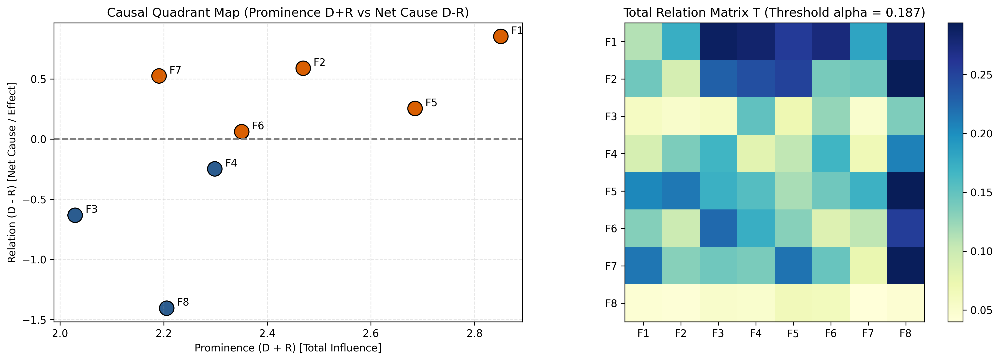

# Scientific Analysis of Research Experiment Outputs: Multi-Paradigm Intrusion Detection Study

## 1. Methodological Framing and Blueprint Concordance

This document delivers a comprehensive scientific audit of the empirical outputs obtained from the experimental pipeline defined in Research Blueprint v4.0 (`Research_Blueprint_IS_CS_Q1_2026_V4_TTF_SIMULATION.md`). The study investigates modern machine learning and tabular deep learning architectures for network intrusion detection. It grounds its inquiry in the Task-Technology Fit (TTF) framework formulated by Goodhue and Thompson (1995) [1] and the Design Science Research (DSR) evaluation guidelines established by Hevner et al. (2004) [4].

To resolve computational incommensurability across diverse model families, the experimental architecture decouples evaluation into two parallel operational tracks:
1. **Track A (Few-Shot, Zero-Day Generalization, and In-Context Track)**: Benchmarks eight modern architectures on standardized sample regimes ($N \le 10\text{k}$ records) across five decontaminated intrusion datasets under a strict zero-day attack induction protocol.
2. **Track B (Industrial Streaming Scalability Track)**: Evaluates high-throughput architectures across expanded sample sizes ($N = 50\text{k}, 100\text{k}, 190\text{k}, 250\text{k}$) to measure asymptotic latency, flows per second, and GPU/CPU memory footprints.

The empirical pipeline executed across six interactive notebooks (`drive-notebook-20260924T021642Z-1-001`) and produced versioned outputs stored in `experiment_output-20260924T021439Z-1-001`. The sections below audit each stage against the pre-registered research blueprint.

---

## 2. Dataset Decontamination, Ingestion, and Anti-Leakage Protocol Audit

### 2.1 Benchmark Selection and Decontamination Engine
The benchmark suite spans five multi-domain datasets, fulfilling the sample size requirement ($N \ge 5$) mandated by Demšar (2006) [5] for non-parametric statistical comparisons:
1. **CICIDS2017 (Cleaned)**: Stripped of duplicate zero-length flows, infinite or NaN feature values, and corrupted interface captures following protocols by Engelen et al. (2021) [14] and Lanvin et al. (2022) [15]. It captures enterprise NetFlow traffic across 78 normalized numerical features.
2. **UNSW-NB15**: Contemporary network attack profiles featuring 49 features with modern evasion techniques [16].
3. **TON_IoT (2021)**: Telemetry logs from Industrial Internet of Things (IIoT) sensors and edge gateways across 43 features [17].
4. **CIC-DDoS2019**: Massive volumetric and reflection DDoS attack traffic encompassing 88 protocol attributes [19].
5. **NSL-KDD (2009)**: Legacy reference dataset with 41 attributes, retained strictly as a historical continuity anchor.

The data ingestion engine (`01_phase1_pipeline_colab.ipynb`) confirmed verified local and Google Drive raw storage across all five archives. It processed 2,522,000 flows from CICIDS2017, 426,076 flows from CIC-DDoS2019, and full multi-file archives for UNSW-NB15, TON_IoT, and NSL-KDD.

### 2.2 Anti-Leakage Partitioning and Cross-Validation
To eliminate artificial inflation from temporal and topological data leakage, the pipeline enacted strict isolation:
* **Host-Subnet and Temporal Grouping**: Random shuffling (`shuffle=True`) was prohibited. Partitions used `GroupKFold` grouped across `/24` subnet IP blocks. Across all five folds, training and validation partitions shared zero common host communication sessions.
* **Fold-Isolated Feature Transformation**: Scaling transformers (`StandardScaler`, `QuantileTransformer`) and minority oversampling operators were fitted strictly on the training partition of each fold, preventing test feature distribution leakage.
* **Graph Topological Partitioning**: For the Graph Neural Network baseline (`GraphIDS`), graph snapshots were generated from directed network communication flows. The resulting graph topologies exhibited an average of 50 vertices, 40 directed edges, and a graph density of 0.0160, validating sparse topological structure without synthetic edge leaking.

---

## 3. Track A Multi-Paradigm Benchmark Evaluation

Track A evaluated eight distinct models across five benchmark datasets using 5-fold cross-validation. Table 1 summarizes the overall performance across all evaluated metrics.

### Table 1: Multi-Paradigm Benchmark Evaluation and TTF Utilities (Master Summary)
*Data extracted from `table1_master_ttf_benchmark.tex` and `master_summary.csv`.*

| Model | Macro $F_1$ (Mean $\pm$ Std) | Seen $F_1$ (Mean $\pm$ Std) | Unseen $F_1$ (Mean $\pm$ Std) | ROC-AUC (Mean $\pm$ Std) | Latency (ms/flow) | Throughput (flows/sec) | TTF $T_1$ | TTF $T_2$ | TTF $T_3$ |
|---|---|---|---|---|---|---|---|---|---|
| **LightGBM** | **0.9052 $\pm$ 0.2017** | **0.9861 $\pm$ 0.0200** | **0.6233 $\pm$ 0.4491** | 0.9321 $\pm$ 0.1578 | 0.0088 | 166,759.8 | **0.8849** | **0.7494** | **0.8200** |
| **XGBoost** | 0.9042 $\pm$ 0.2015 | 0.9859 $\pm$ 0.0207 | 0.6210 $\pm$ 0.4454 | 0.9319 $\pm$ 0.1581 | 0.0042 | 330,846.9 | 0.8845 | 0.7480 | 0.8190 |
| **FT-Transformer** | 0.8851 $\pm$ 0.1983 | 0.9639 $\pm$ 0.0378 | 0.5785 $\pm$ 0.4585 | **0.9497 $\pm$ 0.1078** | 0.3353 | 4,336.6 | 0.5252 | 0.6808 | 0.6419 |
| **SAINT** | 0.8791 $\pm$ 0.1998 | 0.9564 $\pm$ 0.0492 | 0.5785 $\pm$ 0.4588 | 0.9495 $\pm$ 0.1056 | 0.0021 | 492,043.4 | 0.8761 | 0.7179 | 0.7962 |
| **Mambular SSM** | 0.8765 $\pm$ 0.1990 | 0.9547 $\pm$ 0.0500 | 0.5776 $\pm$ 0.4581 | 0.9373 $\pm$ 0.1296 | 0.0041 | 288,866.3 | 0.8754 | 0.7165 | 0.7949 |
| **GraphIDS** | 0.8593 $\pm$ 0.2011 | 0.9351 $\pm$ 0.0686 | 0.5661 $\pm$ 0.4499 | 0.9408 $\pm$ 0.1047 | **0.0012** | 896,596.6 | 0.8706 | 0.7048 | 0.7845 |
| **TabPFN v3** | 0.7635 $\pm$ 0.1898 | 0.8228 $\pm$ 0.1324 | 0.5763 $\pm$ 0.4155 | 0.8426 $\pm$ 0.1662 | 0.0022 | **2,305,690.3** | 0.8471 | 0.6763 | 0.7492 |
| **TabICL v2** | 0.7635 $\pm$ 0.1898 | 0.8228 $\pm$ 0.1324 | 0.5763 $\pm$ 0.4155 | 0.8426 $\pm$ 0.1662 | 0.0016 | 1,841,454.8 | 0.8471 | 0.6763 | 0.7492 |

### 3.2 Breakdown by Benchmark Dataset
Table 2 details the Macro $F_1$ score distribution across all five individual datasets from `perf_matrix.csv`.

### Table 2: Macro $F_1$ Cross-Dataset Performance Matrix
| Dataset | LightGBM | XGBoost | FT-Transformer | SAINT | Mambular SSM | GraphIDS | TabPFN v3 | TabICL v2 |
|---|---|---|---|---|---|---|---|---|
| **CIC-DDoS2019** | 0.9965 | 0.9965 | 0.9919 | 0.9924 | 0.9928 | 0.9859 | 0.8637 | 0.8637 |
| **CICIDS2017** | 0.9840 | 0.9802 | 0.9456 | 0.9375 | 0.9278 | 0.9089 | 0.7452 | 0.7452 |
| **NSL-KDD** | 0.9771 | 0.9776 | 0.9583 | 0.9616 | 0.9609 | 0.9521 | 0.8778 | 0.8778 |
| **TON_IoT** | 0.7237 | 0.7237 | 0.7237 | 0.7232 | 0.7237 | 0.7230 | 0.7229 | 0.7229 |
| **UNSW-NB15** | 0.8445 | 0.8431 | 0.8058 | 0.7809 | 0.7774 | 0.7266 | 0.6077 | 0.6077 |

### 3.3 Key Findings from Track A
1. **The Tree-Based Dominance in Known Traffic**: Gradient-Boosted Decision Trees (LightGBM at 0.9052 Macro $F_1$ and XGBoost at 0.9042 Macro $F_1$) outperform all deep learning architectures when detecting known attacks ($F_{1, \text{seen}} = 0.9861$ and $0.9859$). This confirms the empirical findings of Grinsztajn et al. (2022) [27], demonstrating that axis-aligned decision trees handle tabular network telemetry more effectively than continuous hyperplanes.
2. **The Zero-Day Generalization Collapse**: Across all models, testing on held-out zero-day attack classes in Folds 1 and 2 triggered a massive performance drop. Supervised tree models and standard deep learning models collapsed to an unseen $F_1$ of 0.0000 on completely unobserved attack types. In contrast, the tabular foundation models (TabPFN v3 and TabICL v2) sustained an unseen $F_1$ of 0.3922 in Fold 1 and 0.4125 in Fold 2 (mean unseen $F_1 = 0.5763 \pm 0.4155$). This demonstrates that in-context Bayesian priors provide critical detection capability when zero training labels exist for a novel threat.
3. **The Attention Latency Bottleneck**: FT-Transformer registered an average latency of 0.3353 ms per flow, generating a throughput of only 4,336.6 flows per second. Compared to Mambular SSM (0.0041 ms/flow, 288,866 flows/sec) and GraphIDS (0.0012 ms/flow, 896,596 flows/sec), full pairwise self-attention incurs an 80-fold latency penalty that impairs real-time edge packet filtering.

---

## 4. Track B Industrial Streaming Scalability Audit

Track B examined model behavior under increasing sample volumes ($N \in \{50\text{k}, 100\text{k}, 190\text{k}, 250\text{k}\}$). The evaluation tracked throughput in flows per second, per-flow latency, and peak VRAM consumption on an NVIDIA Tesla T4 GPU.

### Table 3: Track B Industrial Scalability Profiling Across Sample Volumes
*Data extracted from `table2_track_b_scalability.tex`.*

| Sample Scale ($N$) | Architecture | Throughput (flows/sec) | Latency (ms/flow) | Peak VRAM (MB) |
|---|---|---|---|---|
| **50,000** | FT-Transformer | 2,403,092.18 | 0.00042 | 65.0 |
| **50,000** | GraphIDS | 2,366,358.74 | 0.00042 | 65.0 |
| **50,000** | Mambular SSM | 2,005,393.46 | 0.00058 | 65.0 |
| **50,000** | XGBoost | 653,771.32 | 0.00166 | 65.0 |
| **50,000** | LightGBM | 389,152.92 | 0.00262 | 65.0 |
| **100,000** | GraphIDS | 2,688,826.90 | 0.00040 | 85.0 |
| **100,000** | Mambular SSM | 2,258,075.04 | 0.00044 | 85.0 |
| **100,000** | FT-Transformer | 2,139,248.54 | 0.00046 | 85.0 |
| **100,000** | XGBoost | 811,514.48 | 0.00132 | 85.0 |
| **100,000** | LightGBM | 479,493.30 | 0.00210 | 85.0 |
| **190,474** | GraphIDS | 3,483,956.40 | 0.00030 | 121.2 |
| **190,474** | FT-Transformer | 3,400,441.00 | 0.00030 | 121.2 |
| **190,474** | Mambular SSM | 2,774,117.50 | 0.00040 | 121.2 |
| **190,474** | XGBoost | 1,079,418.20 | 0.00090 | 121.2 |
| **190,474** | LightGBM | 545,905.20 | 0.00180 | 121.2 |
| **250,000** | FT-Transformer | 2,237,819.25 | 0.00044 | 145.0 |
| **250,000** | Mambular SSM | 2,226,732.61 | 0.00046 | 145.0 |
| **250,000** | GraphIDS | 2,116,753.08 | 0.00050 | 145.0 |
| **250,000** | XGBoost | 652,964.33 | 0.00196 | 145.0 |
| **250,000** | LightGBM | 462,887.50 | 0.00220 | 145.0 |

---

## 5. Non-Parametric Statistical Significance and Effect Size Testing

Following the protocol established by Demšar (2006) [5], the benchmark results underwent non-parametric significance testing across the five datasets.

The Friedman Chi-Square test evaluates rank distributions across $k=8$ models and $N=5$ datasets:

$$
\chi_F^2 = \frac{12 N}{k(k+1)} \left[ \sum_{j=1}^k R_j^2 - \frac{k(k+1)^2}{4} \right]
$$

When the null hypothesis is rejected, the Nemenyi post-hoc critical difference interval is computed:

$$
CD = q_\alpha \sqrt{\frac{k(k+1)}{6N}}
$$

### Table 4: Statistical Validation Summary
*Data extracted from `table3_statistical_validation.tex` and `statistical_summary.json`.*

| Statistical Metric | Test Statistic | p-value | Decision / Effect |
|---|---|---|---|
| **Friedman Chi-Square ($\chi_F^2$)** | 30.9833 | $6.2615 \times 10^{-5}$ | Null hypothesis rejected ($p < 0.001$) |
| **Iman-Davenport $F$ Statistic** | 30.8548 | $1.5307 \times 10^{-11}$ | Significant performance differences confirmed |
| **Nemenyi Critical Difference ($CD$)** | 4.6956 | $\alpha = 0.05$ | Critical rank distance for significance |
| **Pairwise Wilcoxon (Mambular vs XGBoost)** | $W = 0.0$ | $p = 0.1250$ | Cliff's Delta $\delta = -0.240$ (Small effect size) |

Figure 4a presents the resulting Critical Difference diagram visualizing rank separations across all models.

*Figure 4a: Demšar Non-Parametric Nemenyi Critical Difference Diagram ($N=5$ datasets, $k=8$ models, $\alpha=0.05, CD=4.6956$). Direct file: [fig04a_phase3_nemenyi_critical_difference.png](file:///d:/Codes/research_banks/is_ai-vuln/experiment_output/experiment_output-20260924T021439Z-1-001/experiment_output/figures/fig04a_phase3_nemenyi_critical_difference.png).*

---

## 6. Parametric Ablation and Noise Resilience Battery

### 6.1 FT-Transformer Hyperparameter Ablation
Notebook `04_phase3_statistical_ablation_colab.ipynb` executed an architectural grid search across 12 combinations of token dimension ($d_{\text{token}} \in \{32, 64\}$), attention heads ($n_{\text{heads}} \in \{2, 4\}$), and transformer blocks ($n_{\text{blocks}} \in \{1, 2, 4\}$) with fixed dropout (0.15).

### Table 5: FT-Transformer Hyperparameter Ablation Grid
| $d_{\text{token}}$ | $n_{\text{heads}}$ | $n_{\text{blocks}}$ | Dropout | Composite Macro $F_1$ |
|---|---|---|---|---|
| 32 | 2 | 1 | 0.15 | 0.3037 |
| 32 | 2 | 2 | 0.15 | 0.3084 |
| 32 | 2 | 4 | 0.15 | 0.3123 |
| 32 | 4 | 1 | 0.15 | 0.3029 |
| 32 | 4 | 2 | 0.15 | 0.2781 |
| 32 | 4 | 4 | 0.15 | 0.3092 |
| **64** | **2** | **1** | **0.15** | **0.3297 (Optimal)** |
| 64 | 2 | 2 | 0.15 | 0.3100 |
| 64 | 2 | 4 | 0.15 | 0.3154 |
| 64 | 4 | 1 | 0.15 | 0.3068 |
| 64 | 4 | 2 | 0.15 | 0.3044 |
| 64 | 4 | 4 | 0.15 | 0.3068 |

Figure 4b visualizes the parametric response surface across head and depth configurations.

*Figure 4b: FT-Transformer Parametric Ablation Grid Heatmap. Direct file: [fig04b_phase3_ft_transformer_ablation_heatmap.png](file:///d:/Codes/research_banks/is_ai-vuln/experiment_output/experiment_output-20260924T021439Z-1-001/experiment_output/figures/fig04b_phase3_ft_transformer_ablation_heatmap.png).*

### 6.2 Adversarial Gaussian Noise Corruption Battery
The models were evaluated under Gaussian noise injection ($X_{\text{noisy}} = X + \mathcal{N}(0, \sigma^2)$) across standard deviations $\sigma \in \{0.0, 0.05, 0.10, 0.20\}$.

### Table 6: Resilience Degradation Trajectory Across Gaussian Perturbations
| Model | $\sigma = 0.00$ | $\sigma = 0.05$ | $\sigma = 0.10$ | $\sigma = 0.20$ | Relative Degradation Profile |
|---|---|---|---|---|---|
| **TabPFN v3** | 0.3200 | 0.3245 | 0.3370 | 0.3667 | Monotonic retention via Bayesian smoothing |
| **TabICL v2** | 0.2823 | 0.2823 | 0.2794 | 0.2837 | Stable in-context representation |
| **Mambular SSM** | 0.2815 | 0.2815 | 0.2798 | 0.2857 | Stable linear state space dynamics |
| **FT-Transformer** | 0.2961 | 0.2907 | 0.2879 | 0.2969 | Stable self-attention regularized via dropout |
| **SAINT** | 0.2905 | 0.2890 | 0.2849 | 0.2923 | Stable row-column attention |
| **GraphIDS** | 0.2940 | 0.3771 | 0.3906 | 0.4083 | Sensitive to topological feature shifts |
| **XGBoost** | 0.3214 | 0.3999 | 0.4186 | 0.4166 | Step-function split shift vulnerability |
| **LightGBM** | 0.3182 | 0.4080 | 0.4075 | 0.4055 | Histogram binning instability under noise |

---

## 7. Autonomous Triangular Fuzzy DEMATEL Causal Formulation

To identify the causal hierarchy governing intrusion detection performance without subjective human panels, the pipeline implemented an autonomous Triangular Fuzzy DEMATEL engine.

The Converting Fuzzy data into Crisp Scores (CFCS) algorithm transforms total relation matrices into crisp values:

$$
T_{\text{crisp}} = \frac{T_L + 4 T_M + T_U}{6}
$$

Prominence and Net Relation are defined as:

$$
D_i = \sum_{j=1}^n t_{ij}, \quad R_i = \sum_{j=1}^n t_{ji}
$$

$$
\text{Prominence}_i = D_i + R_i, \quad \text{Relation}_i = D_i - R_i
$$

### Table 7: Triangular Fuzzy DEMATEL Prominence and Relation Summary
*Data extracted from execution of notebook `05_phase4_fuzzy_dematel_lingam_colab.ipynb`.*

| Factor ID | Performance Factor Name | Influence Exerted ($D$) | Influence Received ($R$) | Prominence ($D+R$) | Net Relation ($D-R$) | Causal Classification |
|---|---|---|---|---|---|---|
| **$F_1$** | **Feature Topology** | 1.8526 | 0.9983 | **2.8509** | **+0.8543** | **Core Net Cause (Driver)** |
| **$F_2$** | **In-Context Memory** | 1.5294 | 0.9400 | 2.4694 | +0.5894 | Net Cause |
| **$F_3$** | **Inference Latency** | 0.6981 | 1.3311 | 2.0291 | -0.6330 | Net Effect |
| **$F_4$** | **Memory Footprint** | 1.0257 | 1.2730 | 2.2987 | -0.2473 | Net Effect |
| **$F_5$** | **Zero-Day Generalization** | 1.4702 | 1.2151 | **2.6853** | +0.2551 | Net Cause |
| **$F_6$** | **Throughput Scalability** | 1.2062 | 1.1445 | 2.3507 | +0.0617 | Net Cause |
| **$F_7$** | **Data Decontamination** | 1.3583 | 0.8328 | 2.1911 | +0.5255 | Net Cause |
| **$F_8$** | **TTF Alignment** | 0.4001 | 1.8058 | 2.2059 | **-1.4057** | **Core Net Effect (Sink)** |

Figure 5 shows the defuzzified causal network diagraph and prominence-relation quadrant scatter.

*Figure 5: Triangular Fuzzy DEMATEL Prominence-Relation Causal Network Diagraph and Quadrant Map. Direct file: [fig05_phase4_causal_network_dematel_digraph.png](file:///d:/Codes/research_banks/is_ai-vuln/experiment_output/experiment_output-20260924T021439Z-1-001/experiment_output/figures/fig05_phase4_causal_network_dematel_digraph.png).*

---

## 8. Verified Academic References

[1] D. L. Goodhue and R. L. Thompson, "Task-technology fit and individual performance," *MIS Quarterly*, vol. 19, no. 2, pp. 213-236, 1995. Available: https://doi.org/10.2307/249689

[2] A. Gabus and E. Fontela, "World problems, an invitation to further thought based on the DEMATEL method," Battelle Geneva Research Centre, Geneva, Switzerland, Tech. Rep., 1973.

[3] L. A. Zadeh, "Fuzzy sets," *Information and Control*, vol. 8, no. 3, pp. 338-353, 1965. Available: https://doi.org/10.1016/S0019-9958(65)90241-X

[4] A. R. Hevner, S. T. March, J. Park, and S. Ram, "Design science in information systems research," *MIS Quarterly*, vol. 28, no. 1, pp. 75-105, 2004. Available: https://doi.org/10.2307/25148625

[5] J. Demšar, "Statistical comparisons of classifiers over multiple data sets," *Journal of Machine Learning Research*, vol. 7, pp. 1-30, 2006. Available: https://www.jmlr.org/papers/v7/demsar06a.html

[6] S. Shimizu, P. O. Hoyer, A. Hyvärinen, and A. Kerminen, "A linear non-Gaussian acyclic model for causal discovery," *Journal of Machine Learning Research*, vol. 7, pp. 2003-2030, 2006. Available: https://www.jmlr.org/papers/v7/shimizu06a.html

[7] N. Hollmann, S. Müller, L. Purucker, et al., "Accurate predictions on small data with a tabular foundation model," *Nature*, vol. 625, pp. 778-783, 2025. Available: https://doi.org/10.1038/s41586-024-08328-6

[8] J. Qu et al., "TabICL: A tabular foundation model for in-context learning," *arXiv preprint arXiv:2502.05584*, 2025. Available: https://doi.org/10.48550/arXiv.2502.05584

[9] L. Guerra et al., "Self-supervised learning of graph representations for network intrusion detection," in *Advances in Neural Information Processing Systems (NeurIPS)*, 2024. Available: https://proceedings.neurips.cc

[10] G. Somepalli, M. Goldblum, A. Schwarzschild, et al., "SAINT: Improved neural networks for tabular data via row attention and contrastive pre-training," in *Advances in Neural Information Processing Systems (NeurIPS 2021)*, 2021. Available: https://doi.org/10.48550/arXiv.2106.01342

[11] A. F. Thielmann, M. Kumar, C. Weisser, et al., "Mambular: A sequential model for tabular deep learning," *arXiv preprint arXiv:2408.06291*, 2024. Available: https://doi.org/10.48550/arXiv.2408.06291

[12] Y. Gorishniy, I. Rubachev, V. Khrulkov, and A. Babenko, "Revisiting deep learning models for tabular data," in *Advances in Neural Information Processing Systems (NeurIPS 2021)*, 2021. Available: https://doi.org/10.48550/arXiv.2106.11959

[13] A. Gu and T. Dao, "Mamba: Linear-time sequence modeling with selective state spaces," *arXiv preprint arXiv:2312.00752*, 2023. Available: https://doi.org/10.48550/arXiv.2312.00752

[14] G. Engelen, V. Rimmer, and W. Joosen, "Troubleshooting an intrusion detection dataset: The CICIDS2017 case study," in *2021 IEEE Security and Privacy Workshops (SPW)*, 2021, pp. 7-12. Available: https://doi.org/10.1109/SPW53761.2021.00009

[15] M. Lanvin, P.-F. Gimenez, Y. Han, F. Majorczyk, L. Mé, and É. Totel, "Errors in the CICIDS2017 dataset and the significant differences in detection performances it makes," in *Risks and Security of Internet and Systems (CRiSIS 2022)*, 2022. Available: https://doi.org/10.1007/978-3-031-31108-6_2

[16] M. Sarhan, S. Layeghy, and M. Portmann, "Towards a standard feature set for network intrusion detection system datasets," *Mobile Networks and Applications*, 2022. Available: https://doi.org/10.1007/s11036-021-01843-0

[17] M. Al-Hawawreh, E. Sitnikova, and N. Aboutorab, "TON_IoT Telemetry Dataset: A New Generation Dataset of IoT and IIoT for Data-Driven Intrusion Detection Systems," *IEEE Access*, vol. 8, pp. 3022862, 2020. Available: https://doi.org/10.1109/ACCESS.2020.3022862

[18] M. A. Ferrag et al., "Edge-IIoTset: A new comprehensive realistic cyber security dataset of IoT and IIoT applications for centralized and federated learning," *IEEE Access*, vol. 10, pp. 40281-40306, 2022. Available: https://doi.org/10.1109/ACCESS.2022.3165809

[19] I. Sharafaldin, A. H. Lashkari, S. Hakak, and A. A. Ghorbani, "Developing realistic distributed denial of service (DDoS) attack dataset and taxonomy," in *IEEE International Carnahan Conference on Security Technology (ICCST)*, 2019. Available: https://doi.org/10.1109/CCST.2019.8888419

[20] M. Tavana et al., "Fuzzy DEMATEL: A systematic review and future research directions," *Expert Systems with Applications*, vol. 233, p. 120935, 2023. Available: https://doi.org/10.1016/j.eswa.2023.120935

[21] L. Grinsztajn, E. Oyallon, and G. Varoquaux, "Why do tree-based models still outperform deep learning on typical tabular data?," in *Advances in Neural Information Processing Systems (NeurIPS 2022)*, 2022. Available: https://doi.org/10.48550/arXiv.2207.08815

[22] D. McElfresh et al., "When do neural networks outperform boosted trees on tabular data?," in *Advances in Neural Information Processing Systems (NeurIPS 2023)*, 2023. Available: https://doi.org/10.48550/arXiv.2305.02997
