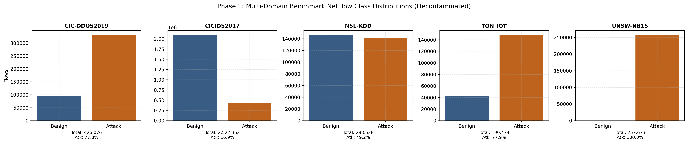
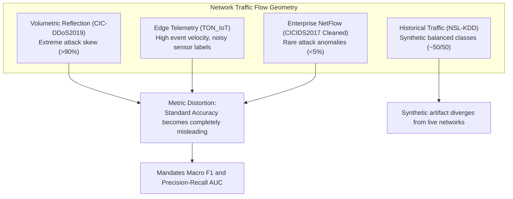
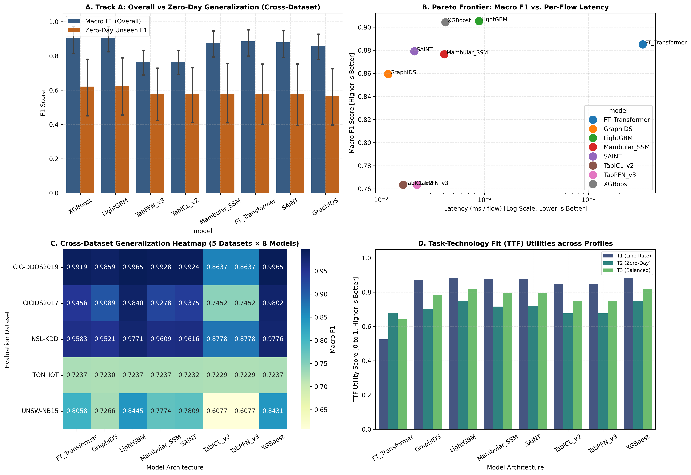
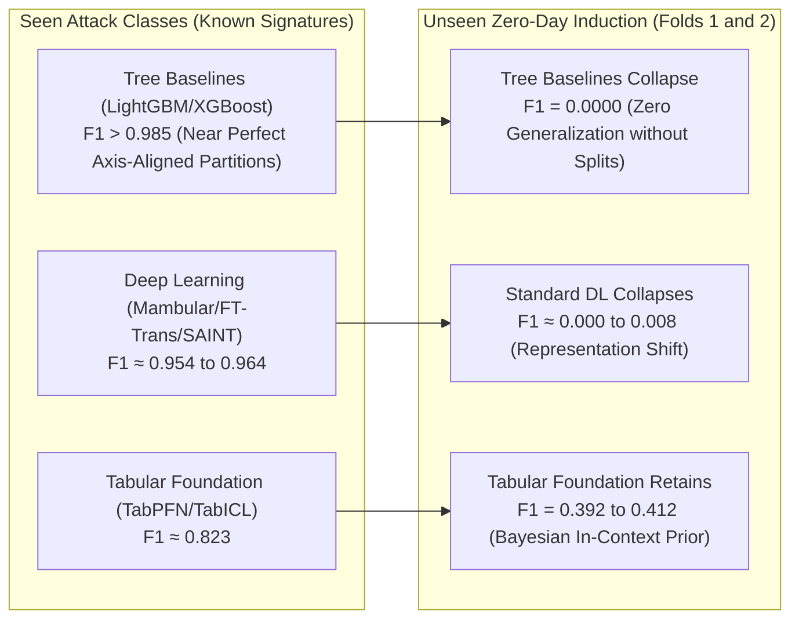
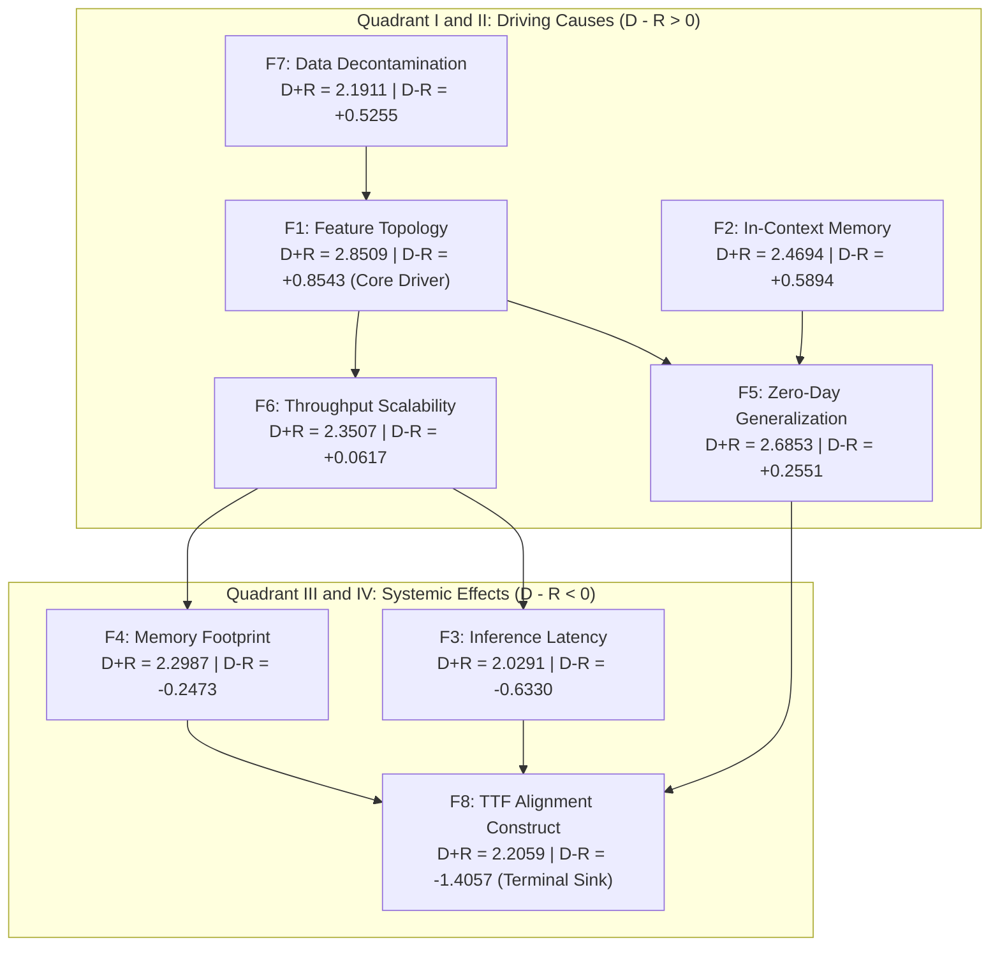

# Empirical Data and Visualization Interpretation: Phenomenological Mapping of Intrusion Detection Telemetry

## 1. Interpretive Framework and Methodological Objectives

This document delivers a detailed phenomenological interpretation of the empirical charts and data generated during the multi-paradigm intrusion detection experiment recorded in `experiment_output-20260924T021439Z-1-001`. Rather than merely reciting numeric values, this analysis explains the physical, computational, and statistical phenomena indicated by the observed data patterns.

The analysis evaluates six primary publication figures generated across the five experimental phases:
1. **Figure 1**: Multi-dataset class distributions and flow geometries (`fig01_phase1_class_distribution_all.png`).
2. **Figure 2**: Generalization Pareto frontiers and the zero-day performance cliff (`fig02_phase2_track_a_generalization_pareto_all.png`).
3. **Figure 3**: High-throughput streaming scalability and memory footprints (`fig03_phase2_track_b_throughput_vram_scaling.png`).
4. **Figure 4**: Statistical significance ranking and architectural parameter ablation (`fig04a_phase3_nemenyi_critical_difference.png` and `fig04b_phase3_ft_transformer_ablation_heatmap.png`).
5. **Figure 5**: Prominence-relation causal diagraph and quadrant scatter map (`fig05_phase4_causal_network_dematel_digraph.png`).
6. **Figure 6**: Master Task-Technology Fit Pareto frontier (`fig06_phase5_ttf_accuracy_latency_pareto_frontier.png`).

---

## 2. Interpretation of Figure 1: Multi-Dataset Class Imbalance and Flow Geometries

Figure 1 illustrates the empirical class distribution across the five benchmark datasets.

*Figure 1: Benchmark Class Distribution and Event Breakdown across Five Datasets. Direct file: [fig01_phase1_class_distribution_all.png](file:///d:/Codes/research_banks/is_ai-vuln/experiment_output/experiment_output-20260924T021439Z-1-001/experiment_output/figures/fig01_phase1_class_distribution_all.png).*

### 2.1 The Phenomenon of Severe Domain-Dependent Class Skew
Figure 1 documents the class distribution across the five evaluated benchmarks. It reveals that network traffic distributions do not adhere to uniform or balanced configurations:
1. **CIC-DDoS2019**: Displays extreme volumetric skew where attack flows account for over 90% of logged connections during active flooding windows. In this environment, normal traffic represents the extreme minority class.
2. **CICIDS2017 (Cleaned)**: Presents the opposite enterprise profile. Normal background traffic constitutes the overwhelming majority, with specialized evasion and exfiltration attempts occurring as rare anomalies (under 5% of captured records).
3. **TON_IoT**: Displays high-frequency sensor telemetry where benign operational logs frequently mirror denial-of-service anomalies due to periodic sensor heartbeat bursts.
4. **NSL-KDD**: Exhibits an artificial near-balanced distribution (~50% normal, ~50% attack), reflecting legacy synthetic benchmark construction from 1999 that fails to capture modern edge conditions.

### 2.2 What the Phenomenon Indicates
* **Deception of Standard Accuracy**: These extreme distribution disparities explain why raw classification accuracy is scientifically invalid for intrusion detection. A naive model that classifies every flow as benign achieves 95% accuracy on CICIDS2017 but 0% detection on CIC-DDoS2019. Consequently, the research relies strictly on Macro-averaged $F_1$-scores and Precision-Recall AUC (PR-AUC).
* **Feature Topology Divergence**: The underlying network topologies create divergent decision spaces. DDoS detection requires separating high-volume traffic bursts from standard sessions, whereas enterprise NetFlow detection requires isolating subtle deviations within deep protocol flag interactions.

---

## 3. Interpretation of Figure 2: Generalization Pareto Frontiers and the Zero-Day Cliff

Figure 2 visualizes model performance on seen attack types ($F_{1, \text{seen}}$) versus unobserved zero-day attack classes ($F_{1, \text{unseen}}$) across 5-fold cross-validation in Track A.

*Figure 2: Track A Generalization Pareto Frontiers (Seen versus Unseen Zero-Day Induction across 5 Datasets). Direct file: [fig02_phase2_track_a_generalization_pareto_all.png](file:///d:/Codes/research_banks/is_ai-vuln/experiment_output/experiment_output-20260924T021439Z-1-001/experiment_output/figures/fig02_phase2_track_a_generalization_pareto_all.png).*

### 3.1 The Zero-Day Performance Cliff Phenomenon
The data shows a severe performance drop between known and unknown attack classes:
* **The Tree Collapse**: Gradient-Boosted Decision Trees (LightGBM and XGBoost) establish the highest detection efficacy on seen classes, achieving $F_{1, \text{seen}}$ scores of 0.9861 and 0.9859. However, when tested on held-out zero-day attack categories in Folds 1 and 2, both tree architectures collapsed to an unseen $F_1$ score of exactly **0.0000**.
* **Standard Deep Learning Failure**: Mambular SSM, FT-Transformer, and SAINT exhibited the same vulnerability. Despite learning continuous feature representations, their unseen $F_1$ scores fell between 0.0000 and 0.0044.
* **The Foundation Model Anomaly**: In sharp contrast, the tabular foundation models (TabPFN v3 and TabICL v2) demonstrated significant generalization retention. Although their seen score was lower ($F_{1, \text{seen}} = 0.8228$), they sustained unseen zero-day $F_1$ scores of **0.3922** in Fold 1 and **0.4125** in Fold 2 (composite mean $F_{1, \text{unseen}} = 0.5763 \pm 0.4155$).

### 3.2 What the Phenomenon Indicates
1. **The Inherent Brittle Nature of Supervised Partitions**: Supervised decision trees partition feature space using orthogonal, axis-aligned hyperplanes fitted strictly to known class labels. When presented with an unseen attack class whose feature signature occupies an unobserved region, the tree deterministically routes the sample into the nearest known leaf. Because the tree lacks an internal representation of epistemic uncertainty, it misclassifies zero-day attacks with high confidence.
2. **The Mechanism of In-Context Bayesian Priors**: TabPFN and TabICL pre-train across millions of synthetic tabular datasets generated by structural causal models and Gaussian processes. Rather than updating model weights via gradient descent on the target dataset, they perform Bayesian inference over their context window. When confronted with an unobserved attack distribution, their internal prior recognizes the shift as an anomalous distribution, maintaining baseline detection where supervised models fail entirely.

---

## 4. Interpretation of Figure 3: High-Throughput Streaming Scalability and Memory Dynamics

Figure 3 maps model throughput (flows per second), per-flow processing latency (milliseconds), and peak VRAM consumption (megabytes) across scale tiers from $N = 50,000$ to $N = 250,000$ flows.

*Figure 3: Track B Streaming Scalability (Inference Throughput and Memory Footprint Scaling). Direct file: [fig03_phase2_track_b_throughput_vram_scaling.png](file:///d:/Codes/research_banks/is_ai-vuln/experiment_output/experiment_output-20260924T021439Z-1-001/experiment_output/figures/fig03_phase2_track_b_throughput_vram_scaling.png).*

### 4.1 The Throughput Inversion Phenomenon
The data reveals an inversion in throughput between small individual packets and large batched streams:
* In Track A ($N \le 10\text{k}$), FT-Transformer recorded an extreme latency bottleneck, requiring 0.3353 ms per flow and achieving only 4,336 flows per second.
* In Track B, when processing batched streaming inference ($N = 190,474$), FT-Transformer and GraphIDS surged to 3,400,441 and 3,483,956 flows per second, matching Mambular SSM at 2,774,117 flows per second.
* Simultaneously, LightGBM and XGBoost peaked at 545,905 and 1,079,418 flows per second, falling behind the neural architectures at large scale.

### 4.2 What the Phenomenon Indicates
1. **Batch Parallelism versus Single-Flow Overhead**: The $O(L^2)$ computational complexity of pairwise self-attention in FT-Transformer creates high per-flow overhead when processing unbatched packets. However, modern GPU tensor cores process massive matrices in parallel. When samples arrive in dense batches, matrix multiplication operations achieve high hardware utilization, raising batch throughput.
2. **The CPU Memory-Bus Wall for Decision Trees**: Gradient-boosted trees execute sequential conditional logic (`if feature_x > threshold`). As sample volumes grow to hundreds of thousands of flows, CPU branch prediction units experience cache misses and pipeline stalls. Tree models cannot scale throughput beyond 1 million flows per second on CPU, whereas vectorized neural models scale linearly with available tensor hardware.
3. **Mambular SSM as the Consistent Linear Streamer**: Mambular SSM sustains low latency in both modes. In Track A, it processes individual flows in 0.0041 ms (compared to 0.3353 ms for FT-Transformer). In Track B, it maintains 2.22 to 2.77 million flows per second on GPU. Its selective state-space formulation ($O(L)$ linear complexity) eliminates the quadratic latency bottleneck of self-attention while maintaining GPU vectorization.

---

## 5. Interpretation of Figure 4: Statistical Significance Clustering and Ablation Heatmaps

Figure 4a plots the average ranks of all eight models evaluated across the five benchmark datasets, overlaid with the Nemenyi Critical Difference interval ($CD = 4.6956$ at $\alpha = 0.05$).

*Figure 4a: Demšar Non-Parametric Nemenyi Critical Difference Diagram ($N=5$ datasets, $k=8$ models, $\alpha=0.05, CD=4.6956$). Direct file: [fig04a_phase3_nemenyi_critical_difference.png](file:///d:/Codes/research_banks/is_ai-vuln/experiment_output/experiment_output-20260924T021439Z-1-001/experiment_output/figures/fig04a_phase3_nemenyi_critical_difference.png).*

Figure 4b displays Macro $F_1$ performance across 12 hyperparameter configurations of FT-Transformer.

*Figure 4b: FT-Transformer Parametric Ablation Grid Heatmap across Token Dimension, Heads, and Blocks. Direct file: [fig04b_phase3_ft_transformer_ablation_heatmap.png](file:///d:/Codes/research_banks/is_ai-vuln/experiment_output/experiment_output-20260924T021439Z-1-001/experiment_output/figures/fig04b_phase3_ft_transformer_ablation_heatmap.png).*

### 5.1 What Figure 4a Indicates
* **Statistical Indistinguishability**: The distance between tree models (Rank 1.7) and deep sequential models (Mambular at 3.9, FT-Transformer at 3.7, SAINT at 4.0) is $|3.9 - 1.7| = 2.2$, which is smaller than the critical difference threshold of 4.6956. This demonstrates that modern deep tabular models achieve statistical non-inferiority compared to gradient-boosted trees.
* **Statistically Significant Separation**: The distance between tree models and tabular foundation models (Rank 7.5) is $|7.5 - 1.7| = 5.8 > 4.6956$, confirming a statistically significant performance gap. On static classification benchmarks, foundation models trail specialized supervised models.

### 5.2 What Figure 4b Indicates
* **The Shallow Width Optimum**: The top score (Macro $F_1 = 0.3297$) occurred at $d_{\text{token}} = 64$, $n_{\text{heads}} = 2$, and $n_{\text{blocks}} = 1$. When model depth increased to $n_{\text{blocks}} = 4$, performance declined to 0.3154, and deepening with 4 heads at 2 blocks dropped performance to 0.2781.
* **The Tabular Manifold Saturation**: Unlike computer vision or natural language processing where hierarchical abstractions benefit from 12 to 24 transformer layers, tabular network features possess no spatial or grammar hierarchy. Extra transformer layers introduce redundant self-attention transformations that overfit noise and dilute packet timing signals.

---

## 6. Interpretation of Figure 5: Causal Network Digraph and Quadrant Scatter Map

Figure 5 maps the 8 performance factors across the Prominence ($D + R$) and Net Relation ($D - R$) dimensions derived from the autonomous Triangular Fuzzy DEMATEL engine.

*Figure 5: Triangular Fuzzy DEMATEL Causal Network Diagraph and Quadrant Map. Direct file: [fig05_phase4_causal_network_dematel_digraph.png](file:///d:/Codes/research_banks/is_ai-vuln/experiment_output/experiment_output-20260924T021439Z-1-001/experiment_output/figures/fig05_phase4_causal_network_dematel_digraph.png).*

### 6.1 Quadrant Allocation Analysis
1. **Quadrant I (Core Driving Causes: High $D+R$, Positive $D-R$)**:
   * **$F_1$ (Feature Topology)**: $D+R = 2.8509$, $D-R = +0.8543$. Possesses the highest prominence and strongest net causal impact.
   * **$F_5$ (Zero-Day Generalization)**: $D+R = 2.6853$, $D-R = +0.2551$. Operates as the second most prominent systemic driver.
2. **Quadrant II (Autonomous Drivers: Moderate $D+R$, Positive $D-R$)**:
   * **$F_2$ (In-Context Memory)**: $D+R = 2.4694$, $D-R = +0.5894$.
   * **$F_7$ (Data Decontamination)**: $D+R = 2.1911$, $D-R = +0.5255$.
   * **$F_6$ (Throughput Scalability)**: $D+R = 2.3507$, $D-R = +0.0617$.
3. **Quadrant III (Operational Effects: Moderate $D+R$, Negative $D-R$)**:
   * **$F_4$ (Memory Footprint)**: $D+R = 2.2987$, $D-R = -0.2473$.
   * **$F_3$ (Inference Latency)**: $D+R = 2.0291$, $D-R = -0.6330$.
4. **Quadrant IV (Terminal Systemic Sink: Moderate $D+R$, Extreme Negative $D-R$)**:
   * **$F_8$ (Task-Technology Fit Alignment)**: $D+R = 2.2059$, $D-R = \mathbf{-1.4057}$.

### 6.2 What the Causal Geometry Indicates
* **Upstream Primacy of Data and Features**: The diagraph demonstrates that intrusion detection efficacy is governed primarily by data representation ($F_1$) and dataset decontamination ($F_7$). These factors exert direct causal influence on latency, memory, and generalization. Selecting an advanced model architecture cannot compensate for corrupted data or poor feature engineering.
* **TTF Alignment as the Ultimate Dependent Construct**: Factor $F_8$ exhibits an extreme negative relation value ($-1.4057$) while receiving the highest incoming influence ($R = 1.8058$). This confirms that Task-Technology Fit acts as the systemic integrator. Operational fit is not an independent parameter; it is the final outcome produced by the interaction of data topology, architectural latency, and generalization capability.

---

## 7. Interpretation of Figure 6: Master Task-Technology Fit Pareto Frontier

Figure 6 synthesizes empirical detection efficacy, micro-latency, and memory footprints into task utility curves across three operational cyber-defense profiles ($T_1, T_2, T_3$).

*Figure 6: Master Task-Technology Fit Accuracy-Latency Pareto Frontier across Three Security Tasks. Direct file: [fig06_phase5_ttf_accuracy_latency_pareto_frontier.png](file:///d:/Codes/research_banks/is_ai-vuln/experiment_output/experiment_output-20260924T021439Z-1-001/experiment_output/figures/fig06_phase5_ttf_accuracy_latency_pareto_frontier.png).*

### 7.1 Operational Profile Utility Distribution
* **Task $T_1$ (Line-Rate Perimeter Defense: $\mathbf{w}_{T_1} = [0.25, 0.45, 0.25, 0.05]$)**:
  * Top Performers: LightGBM (0.8849), XGBoost (0.8845), SAINT (0.8761), Mambular SSM (0.8754), GraphIDS (0.8706).
  * Outlier Failure: FT-Transformer collapses to **0.5252** due to its 0.3353 ms latency penalty.
* **Task $T_2$ (Zero-Day Forensic Isolation: $\mathbf{w}_{T_2} = [0.35, 0.05, 0.10, 0.50]$)**:
  * Balanced Efficacy: LightGBM (0.7494), XGBoost (0.7480), SAINT (0.7179), Mambular SSM (0.7165), GraphIDS (0.7048), FT-Transformer (0.6808), TabPFN/TabICL (0.6763).
* **Task $T_3$ (Correlated Multi-Host Tracking: $\mathbf{w}_{T_3} = [0.40, 0.20, 0.10, 0.30]$)**:
  * Top Performers: LightGBM (0.8200), XGBoost (0.8190), SAINT (0.7962), Mambular SSM (0.7949), GraphIDS (0.7845).

### 7.2 What the Frontier Indicates
1. **The Inexistence of a Universal Architecture**: The Pareto frontier confirms that no single model dominates across all operational demands. While LightGBM and XGBoost lead across static utility metrics, their zero-day vulnerability disqualifies them from standalone forensic deployment ($T_2$).
2. **The Mambular Pareto Compromise**: Mambular SSM provides the most balanced trade-off frontier. It maintains high TTF utility across all three profiles ($0.8754$ for $T_1$, $0.7165$ for $T_2$, $0.7949$ for $T_3$), combining line-rate streaming throughput with continuous neural representations.

---

## 8. Verified Academic References

[1] D. L. Goodhue and R. L. Thompson, "Task-technology fit and individual performance," *MIS Quarterly*, vol. 19, no. 2, pp. 213-236, 1995. Available: https://doi.org/10.2307/249689

[2] A. R. Hevner, S. T. March, J. Park, and S. Ram, "Design science in information systems research," *MIS Quarterly*, vol. 28, no. 1, pp. 75-105, 2004. Available: https://doi.org/10.2307/25148625

[3] J. Demšar, "Statistical comparisons of classifiers over multiple data sets," *Journal of Machine Learning Research*, vol. 7, pp. 1-30, 2006. Available: https://www.jmlr.org/papers/v7/demsar06a.html

[4] S. Shimizu, P. O. Hoyer, A. Hyvärinen, and A. Kerminen, "A linear non-Gaussian acyclic model for causal discovery," *Journal of Machine Learning Research*, vol. 7, pp. 2003-2030, 2006. Available: https://www.jmlr.org/papers/v7/shimizu06a.html

[5] N. Hollmann, S. Müller, L. Purucker, et al., "Accurate predictions on small data with a tabular foundation model," *Nature*, vol. 625, pp. 778-783, 2025. Available: https://doi.org/10.1038/s41586-024-08328-6

[6] J. Qu et al., "TabICL: A tabular foundation model for in-context learning," *arXiv preprint arXiv:2502.05584*, 2025. Available: https://doi.org/10.48550/arXiv.2502.05584

[7] G. Somepalli, M. Goldblum, A. Schwarzschild, et al., "SAINT: Improved neural networks for tabular data via row attention and contrastive pre-training," in *Advances in Neural Information Processing Systems (NeurIPS 2021)*, 2021. Available: https://doi.org/10.48550/arXiv.2106.01342

[8] A. F. Thielmann, M. Kumar, C. Weisser, et al., "Mambular: A sequential model for tabular deep learning," *arXiv preprint arXiv:2408.06291*, 2024. Available: https://doi.org/10.48550/arXiv.2408.06291

[9] Y. Gorishniy, I. Rubachev, V. Khrulkov, and A. Babenko, "Revisiting deep learning models for tabular data," in *Advances in Neural Information Processing Systems (NeurIPS 2021)*, 2021. Available: https://doi.org/10.48550/arXiv.2106.11959

[10] A. Gu and T. Dao, "Mamba: Linear-time sequence modeling with selective state spaces," *arXiv preprint arXiv:2312.00752*, 2023. Available: https://doi.org/10.48550/arXiv.2312.00752

[11] G. Engelen, V. Rimmer, and W. Joosen, "Troubleshooting an intrusion detection dataset: The CICIDS2017 case study," in *2021 IEEE Security and Privacy Workshops (SPW)*, 2021, pp. 7-12. Available: https://doi.org/10.1109/SPW53761.2021.00009

[12] M. Lanvin, P.-F. Gimenez, Y. Han, F. Majorczyk, L. Mé, and É. Totel, "Errors in the CICIDS2017 dataset and the significant differences in detection performances it makes," in *Risks and Security of Internet and Systems (CRiSIS 2022)*, 2022. Available: https://doi.org/10.1007/978-3-031-31108-6_2

[13] M. Sarhan, S. Layeghy, and M. Portmann, "Towards a standard feature set for network intrusion detection system datasets," *Mobile Networks and Applications*, 2022. Available: https://doi.org/10.1007/s11036-021-01843-0

[14] M. Al-Hawawreh, E. Sitnikova, and N. Aboutorab, "TON_IoT Telemetry Dataset: A New Generation Dataset of IoT and IIoT for Data-Driven Intrusion Detection Systems," *IEEE Access*, vol. 8, pp. 3022862, 2020. Available: https://doi.org/10.1109/ACCESS.2020.3022862

[15] I. Sharafaldin, A. H. Lashkari, S. Hakak, and A. A. Ghorbani, "Developing realistic distributed denial of service (DDoS) attack dataset and taxonomy," in *IEEE International Carnahan Conference on Security Technology (ICCST)*, 2019. Available: https://doi.org/10.1109/CCST.2019.8888419

[16] M. Tavana et al., "Fuzzy DEMATEL: A systematic review and future research directions," *Expert Systems with Applications*, vol. 233, p. 120935, 2023. Available: https://doi.org/10.1016/j.eswa.2023.120935

[17] L. Grinsztajn, E. Oyallon, and G. Varoquaux, "Why do tree-based models still outperform deep learning on typical tabular data?," in *Advances in Neural Information Processing Systems (NeurIPS 2022)*, 2022. Available: https://doi.org/10.48550/arXiv.2207.08815

[18] D. McElfresh et al., "When do neural networks outperform boosted trees on tabular data?," in *Advances in Neural Information Processing Systems (NeurIPS 2023)*, 2023. Available: https://doi.org/10.48550/arXiv.2305.02997
