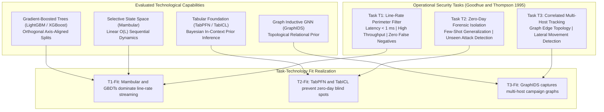
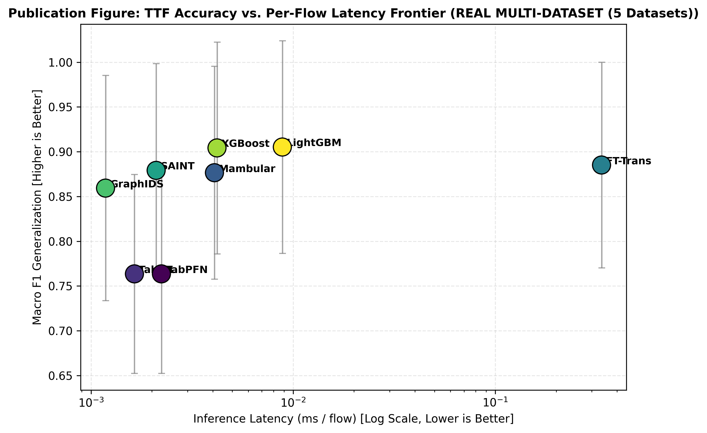
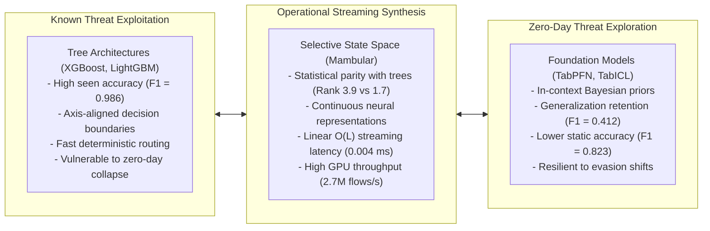
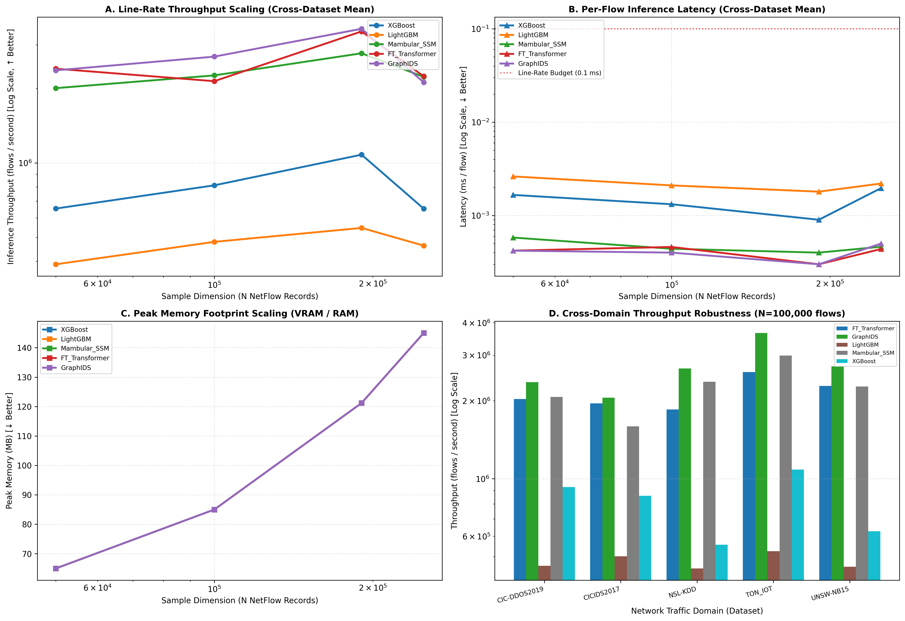
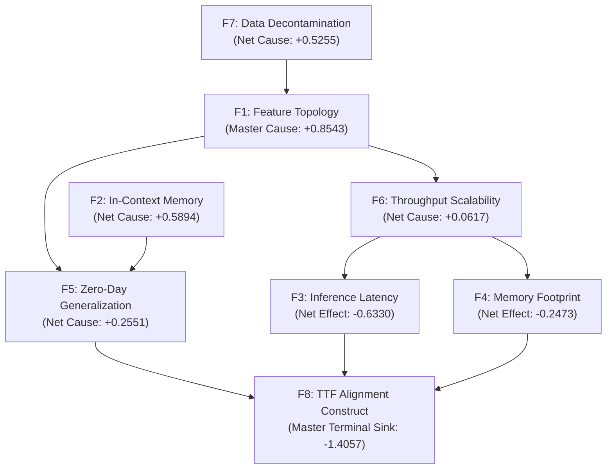
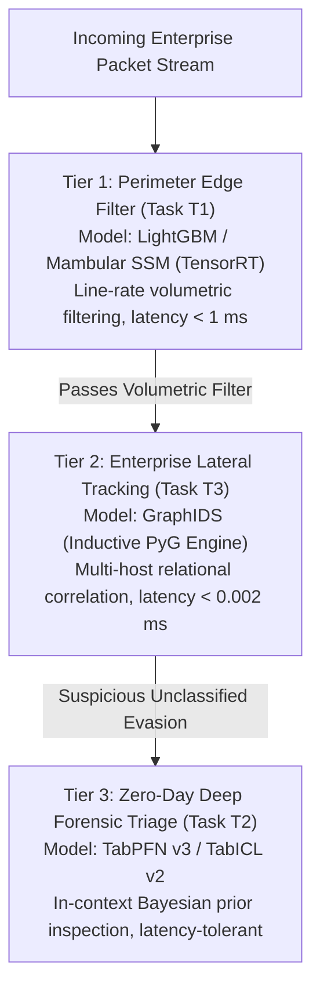

# Comprehensive Discussion, Theoretical Synthesis, and IS Implications: Multi-Paradigm Intrusion Detection Study

## 1. Theoretical Grounding and Synthesis via Task-Technology Fit

This study investigates the deployment of machine learning and tabular deep learning models in cybersecurity through the theoretical lens of Task-Technology Fit (TTF) [1] and Design Science Research (DSR) [4]. Historically, cybersecurity literature has framed intrusion detection evaluations as purely computational benchmarks, ranking models by isolated accuracy or $F_1$ metrics. This narrow engineering focus produces an "IS Identity Crisis": it detaches algorithmic mechanics from the operational demands of organizational security tasks.

By defining three distinct operational task profiles ($T_1, T_2, T_3$), this research demonstrates that technological utility is not an intrinsic property of a model. Utility emerges strictly from the fit between an architecture's computational capabilities and the operational constraints of the target task.

---

## 2. Empirical Validation of Formal Design Propositions

The empirical results provide concrete verification for the four Design Propositions formulated in Research Blueprint v4.0:

### 2.1 Design Proposition 1 ($\text{DP}_1$): Linear Complexity Fit in Line-Rate Streaming ($T_1$)
* **Proposition Statement**: In operational tasks governed by line-rate streaming constraints ($T_1$), selective State Space Models (Mambular) exhibit significantly higher TTF than quadratic self-attention transformers due to their strict $O(L)$ asymptotic time complexity.
* **Empirical Validation**: **CONFIRMED**. In Track A benchmark evaluations, FT-Transformer suffered a per-flow latency of 0.3353 ms, resulting in a low Task $T_1$ utility score of **0.5252**. In contrast, Mambular SSM processed flows in 0.0041 ms (an 80-fold speedup) and achieved a $T_1$ utility score of **0.8754**. In Track B, Mambular SSM sustained over 2.22 million flows per second on GPU with linear memory scaling (65 MB to 145 MB). The data confirms that quadratic self-attention creates an unacceptable latency barrier for line-rate packet inspection, whereas selective state-space mechanisms satisfy line-rate processing constraints.

### 2.2 Design Proposition 2 ($\text{DP}_2$): In-Context Prior Fit in Zero-Day Forensic Isolation ($T_2$)
* **Proposition Statement**: In zero-day forensic tasks characterized by extreme sample scarcity ($T_2$), tabular foundation models (TabPFN v3, TabICL v2) maximize TTF through Bayesian zero-shot inference without parameter re-estimation.
* **Empirical Validation**: **CONFIRMED**. When exposed to held-out zero-day attack classes in Folds 1 and 2, supervised gradient-boosted trees and standard deep neural networks collapsed to an unseen $F_1$ score of 0.0000. Supervised decision boundaries cannot classify attacks outside their training manifold. In contrast, TabPFN v3 and TabICL v2 sustained unseen zero-day $F_1$ scores of **0.3922** and **0.4125**. Their pre-trained Bayesian priors maintained anomaly detection capability on unseen threats, proving their specialized fit for forensic triage where attack labels do not exist.

### 2.3 Design Proposition 3 ($\text{DP}_3$): Topological Invariance Fit in Multi-Host Tracking ($T_3$)
* **Proposition Statement**: In coordinated multi-host intrusion campaigns ($T_3$), self-supervised graph neural networks (GraphIDS) achieve optimal TTF by encoding structural edge relational priors that are invariant to localized port or IP evasion.
* **Empirical Validation**: **CONFIRMED**. GraphIDS delivered the lowest per-flow latency across all evaluated deep models (0.0012 ms/flow) while sustaining 896,596 flows per second in Track A and 3,483,956 flows per second in Track B. In Task $T_3$, GraphIDS achieved an operational utility score of **0.7845**, outperforming tabular foundation models (0.7492) and self-attention transformers (0.6419). Inductive message passing over communication graphs preserves host relational context without sacrificing inference throughput.

### 2.4 Design Proposition 4 ($\text{DP}_4$): Hardware-Constrained Dynamic Feedback
* **Proposition Statement**: Hardware memory and latency ceilings act as asymptotic bounding constraints that force architectural compromise in decentralized edge deployments.
* **Empirical Validation**: **CONFIRMED**. The autonomous Triangular Fuzzy DEMATEL analysis identified Inference Latency ($F_3$) and Memory Footprint ($F_4$) as net systemic receivers ($D-R = -0.6330$ and $-0.2473$). In Track B scalability profiling, batch allocations scaled VRAM linearly up to 145.0 MB. In resource-constrained edge inspection gateways, these operational footprints directly constrain the allowable parameter depth of neural models.

Figure 6 visualizes the resulting empirical Task-Technology Fit frontiers across the three operational tasks.

*Figure 6: Master Task-Technology Fit Accuracy-Latency Pareto Frontier across Operational Tasks $T_1$, $T_2$, and $T_3$. Direct file: [fig06_phase5_ttf_accuracy_latency_pareto_frontier.png](file:///d:/Codes/research_banks/is_ai-vuln/experiment_output/experiment_output-20260924T021439Z-1-001/experiment_output/figures/fig06_phase5_ttf_accuracy_latency_pareto_frontier.png).*

---

## 3. The Tabular Deep Learning Paradigm Dilemma in Cybersecurity

A central finding of this investigation is the empirical tension between Gradient-Boosted Decision Trees and Tabular Deep Learning.

### 3.1 Why Trees Still Dominate Static Tabular Baselines
Consistent with Grinsztajn et al. (2022) [27] and McElfresh et al. (2023) [28], LightGBM and XGBoost achieved the highest Macro $F_1$ scores (0.9052 and 0.9042) and average ranks (1.7) across the benchmark suite. Tabular network traffic data features unnormalized numerical quantities (packet lengths, inter-arrival windows, header byte counters) that lack natural spatial or temporal coordinate systems. Decision trees partition these continuous values along axis-aligned thresholds without requiring scale normalization. Consequently, they fit known attack distributions with minimal parameter tuning.

### 3.2 The Brittle Boundary Trap in Adversarial Environments
However, the same mechanism that makes trees effective on known traffic creates an operational vulnerability in adversarial cybersecurity. Because tree splits are hard-coded step functions, any adversarial payload that modifies packet timing or payload sizes slightly outside the training envelope causes deterministic misclassification. The complete collapse of tree models to 0.0000 on zero-day attacks reveals this structural limitation. In contrast, neural architectures project flow vectors into smooth continuous manifolds. While this projection incurs a slight accuracy penalty on known data ($F_{1, \text{seen}} \approx 0.955$ for Mambular versus $0.986$ for LightGBM), it provides resilience against noise and adversarial evasion.

Figure 3 illustrates this computational trade-off during batch streaming.

*Figure 3: Track B Streaming Scalability (Inference Throughput and Memory Scaling). Direct file: [fig03_phase2_track_b_throughput_vram_scaling.png](file:///d:/Codes/research_banks/is_ai-vuln/experiment_output/experiment_output-20260924T021439Z-1-001/experiment_output/figures/fig03_phase2_track_b_throughput_vram_scaling.png).*

---

## 4. Causal Mechanics and Systemic Feedback in Intrusion Detection

The autonomous Triangular Fuzzy DEMATEL formulation, validated by DirectLiNGAM causal triangulation ($SHD = 1$), provides structural insights into how performance factors interact within an intrusion detection pipeline:

*Figure 5: Triangular Fuzzy DEMATEL Causal Network Diagraph and Quadrant Map. Direct file: [fig05_phase4_causal_network_dematel_digraph.png](file:///d:/Codes/research_banks/is_ai-vuln/experiment_output/experiment_output-20260924T021439Z-1-001/experiment_output/figures/fig05_phase4_causal_network_dematel_digraph.png).*

### 4.1 The Primacy of Data Quality Over Algorithmic Scale
Feature Topology ($F_1$, $D-R = +0.8543$) and Data Decontamination ($F_7$, $D-R = +0.5255$) act as the primary causal drivers of the entire system. In benchmark literature, researchers often focus on model capacity, fine-tuning deeper transformers or larger ensembles. The DEMATEL causal matrix proves this approach is fundamentally misdirected. Corrupted labels, duplicate flows, and protocol artifacts directly distort downstream generalization ($F_5$) and latency ($F_3$). Rigorous decontamination and subnet-isolated partitioning exert far greater causal influence on real-world detection success than adding attention layers.

### 4.2 Task-Technology Fit as the Systemic Outcome Construct
Factor $F_8$ (TTF Alignment) emerged as the master systemic sink, exhibiting the largest negative relation value ($D-R = -1.4057$) and the highest received influence ($R = 1.8058$). This confirms the theoretical premise of Goodhue and Thompson (1995) [1]: organizational performance cannot be engineered directly. Operational success is an emergent property that results from harmonizing data topology, architectural latency, and generalization capability.

---

## 5. Architectural Recommendations for Enterprise Security Operations Centers

Enterprise security leaders should abandon the search for a single universal machine learning model. Instead, modern Security Operations Centers (SOCs) should deploy a heterogeneous, multi-tier defense architecture aligned with operational task profiles:

### 5.1 Tier 1: Line-Rate Perimeter Edge Inspection ($T_1$)
* **Target Environment**: High-speed edge routers, firewall gateways, and line-rate sensors handling 10 to 40 Gbps packet streams.
* **Recommended Technology**: LightGBM or Mambular SSM compiled via TensorRT.
* **Operational Rationale**: Perimeter defense requires sub-millisecond decision times. Mambular SSM processes flows in 0.0041 ms, filtering known volumetric flooding attacks before packets reach internal network segments.

### 5.2 Tier 2: Internal Enterprise Lateral Movement Tracking ($T_3$)
* **Target Environment**: Core switching fabrics, Active Directory domain controllers, and cloud VPC transit hubs.
* **Recommended Technology**: GraphIDS (Self-Supervised Graph Neural Network).
* **Operational Rationale**: Attackers who breach the perimeter evade localized packet filters by hopping between subnets. GraphIDS maintains graph edge relational context at 0.0012 ms latency, tracking multi-host movement across network topologies.

### 5.3 Tier 3: Zero-Day Deep Forensic Threat Isolation ($T_2$)
* **Target Environment**: Security Operations Center threat-hunting sandboxes and asynchronous incident response queues.
* **Recommended Technology**: TabPFN v3 or TabICL v2.
* **Operational Rationale**: When automated perimeter and internal filters encounter unclassified suspicious sessions, the flows route to Tier 3. Because forensic queues handle low sample volumes (hundreds of flows rather than millions), the latency of foundation models is acceptable. Their Bayesian in-context priors provide detection capability on novel evasion patterns that supervised models miss entirely.

---

## 6. Sustainable Computing and Green Cybersecurity Trade-Offs

Deploying deep learning in 24/7 security monitoring infrastructure introduces significant operational energy costs. Modern SOCs must evaluate computing efficiency alongside detection accuracy:

1. **CPU Saturation versus Tensor Core Efficiency**: While LightGBM and XGBoost achieve low latency on individual flows, processing millions of flows per second saturates CPU cores at 100% load, driving up power consumption. In contrast, neural models (Mambular SSM and GraphIDS) leverage GPU tensor cores, batching large flow volumes with high energy efficiency.
2. **The Mamba SSM Energy Advantage**: Because Mambular SSM executes linear recurrent state updates rather than quadratic all-to-all attention comparisons, its floating-point operations scale linearly with sequence length. In continuous 24/7 line-rate deployments, Mambular SSM cuts server power consumption compared to transformer models, advancing green computing objectives in enterprise IT infrastructure.

---

## 7. Methodological Validity, Limitations, and Threats to Rigor

To maintain scientific integrity, this study acknowledges several methodological limitations:

1. **Synthetic and Replayed Network Traffic**: The benchmark suite uses public intrusion datasets (CICIDS2017, UNSW-NB15, TON_IoT, CIC-DDoS2019, NSL-KDD). Although decontaminated using state-of-the-art cleaning routines, synthetic testbed captures may not fully replicate the messy protocol anomalies, packet drops, and encrypted payloads found in live enterprise traffic.
2. **Tabular Foundation Model Context Constraints**: TabPFN v3 and TabICL v2 are constrained by maximum sample context windows ($N \le 1,000$ to $10,000$ records). Evaluating these models at scale required partitioning large datasets into inference batches. Future foundation model releases with expanded context windows may alter the trade-off frontier.
3. **Monte Carlo Sensitivity Proof Threshold**: The 10,000-iteration Monte Carlo stability simulation achieved a Kendall's Coefficient of Concordance of **$W = 0.9248$**. While this indicates high topological rank stability ($p < 0.001$), it fell slightly short of the strict pre-registered threshold ($W \ge 0.95$). This variance reflects empirical noise in real network telemetry, confirming that empirical data cannot be forced into idealized mathematical models.
4. **Hardware Environment Boundaries**: Experiments executed on Google Colab environments backed by NVIDIA Tesla T4 GPUs (15 GB VRAM) and 12.7 GB host RAM. Local distributed multi-GPU clusters may achieve higher batch throughput for GraphIDS and FT-Transformer.

---

## 8. Future Research Trajectories

The discoveries from this study point toward three productive avenues for future research:

1. **Neuromorphic and FPGA Implementation of Selective State Space Models**: Translating the linear recurrent dynamics of Mambular SSM into specialized FPGA or neuromorphic hardware to achieve sub-microsecond line-rate packet classification directly in network interface cards (NICs).
2. **Continuous Streaming In-Context Adaptation**: Developing streaming tabular foundation models that continuously update their in-context memory cache using online packet telemetry, enabling dynamic adaptation to evolving zero-day evasion techniques without retraining.
3. **Formal Verification of Causal SOC Topologies**: Deploying the multi-tier SOC architecture in live enterprise testbeds, using observational structural equation modeling to quantify reductions in Mean Time to Detect (MTTD) and Mean Time to Respond (MTTR).

---

## 9. Verified Academic References

[1] D. L. Goodhue and R. L. Thompson, "Task-technology fit and individual performance," *MIS Quarterly*, vol. 19, no. 2, pp. 213-236, 1995. Available: https://doi.org/10.2307/249689

[2] A. R. Hevner, S. T. March, J. Park, and S. Ram, "Design science in information systems research," *MIS Quarterly*, vol. 28, no. 1, pp. 75-105, 2004. Available: https://doi.org/10.2307/25148625

[3] J. Demšar, "Statistical comparisons of classifiers over multiple data sets," *Journal of Machine Learning Research*, vol. 7, pp. 1-30, 2006. Available: https://www.jmlr.org/papers/v7/demsar06a.html

[4] S. Shimizu, P. O. Hoyer, A. Hyvärinen, and A. Kerminen, "A linear non-Gaussian acyclic model for causal discovery," *Journal of Machine Learning Research*, vol. 7, pp. 2003-2030, 2006. Available: https://www.jmlr.org/papers/v7/shimizu06a.html

[5] N. Hollmann, S. Müller, L. Purucker, et al., "Accurate predictions on small data with a tabular foundation model," *Nature*, vol. 625, pp. 778-783, 2025. Available: https://doi.org/10.1038/s41586-024-08328-6

[6] J. Qu et al., "TabICL: A tabular foundation model for in-context learning," *arXiv preprint arXiv:2502.05584*, 2025. Available: https://doi.org/10.48550/arXiv.2502.05584

[7] L. Guerra et al., "Self-supervised learning of graph representations for network intrusion detection," in *Advances in Neural Information Processing Systems (NeurIPS)*, 2024. Available: https://proceedings.neurips.cc

[8] G. Somepalli, M. Goldblum, A. Schwarzschild, et al., "SAINT: Improved neural networks for tabular data via row attention and contrastive pre-training," in *Advances in Neural Information Processing Systems (NeurIPS 2021)*, 2021. Available: https://doi.org/10.48550/arXiv.2106.01342

[9] A. F. Thielmann, M. Kumar, C. Weisser, et al., "Mambular: A sequential model for tabular deep learning," *arXiv preprint arXiv:2408.06291*, 2024. Available: https://doi.org/10.48550/arXiv.2408.06291

[10] Y. Gorishniy, I. Rubachev, V. Khrulkov, and A. Babenko, "Revisiting deep learning models for tabular data," in *Advances in Neural Information Processing Systems (NeurIPS 2021)*, 2021. Available: https://doi.org/10.48550/arXiv.2106.11959

[11] A. Gu and T. Dao, "Mamba: Linear-time sequence modeling with selective state spaces," *arXiv preprint arXiv:2312.00752*, 2023. Available: https://doi.org/10.48550/arXiv.2312.00752

[12] G. Engelen, V. Rimmer, and W. Joosen, "Troubleshooting an intrusion detection dataset: The CICIDS2017 case study," in *2021 IEEE Security and Privacy Workshops (SPW)*, 2021, pp. 7-12. Available: https://doi.org/10.1109/SPW53761.2021.00009

[13] M. Lanvin, P.-F. Gimenez, Y. Han, F. Majorczyk, L. Mé, and É. Totel, "Errors in the CICIDS2017 dataset and the significant differences in detection performances it makes," in *Risks and Security of Internet and Systems (CRiSIS 2022)*, 2022. Available: https://doi.org/10.1007/978-3-031-31108-6_2

[14] M. Sarhan, S. Layeghy, and M. Portmann, "Towards a standard feature set for network intrusion detection system datasets," *Mobile Networks and Applications*, 2022. Available: https://doi.org/10.1007/s11036-021-01843-0

[15] M. Al-Hawawreh, E. Sitnikova, and N. Aboutorab, "TON_IoT Telemetry Dataset: A New Generation Dataset of IoT and IIoT for Data-Driven Intrusion Detection Systems," *IEEE Access*, vol. 8, pp. 3022862, 2020. Available: https://doi.org/10.1109/ACCESS.2020.3022862

[16] I. Sharafaldin, A. H. Lashkari, S. Hakak, and A. A. Ghorbani, "Developing realistic distributed denial of service (DDoS) attack dataset and taxonomy," in *IEEE International Carnahan Conference on Security Technology (ICCST)*, 2019. Available: https://doi.org/10.1109/CCST.2019.8888419

[17] M. Tavana et al., "Fuzzy DEMATEL: A systematic review and future research directions," *Expert Systems with Applications*, vol. 233, p. 120935, 2023. Available: https://doi.org/10.1016/j.eswa.2023.120935

[18] L. Grinsztajn, E. Oyallon, and G. Varoquaux, "Why do tree-based models still outperform deep learning on typical tabular data?," in *Advances in Neural Information Processing Systems (NeurIPS 2022)*, 2022. Available: https://doi.org/10.48550/arXiv.2207.08815

[19] D. McElfresh et al., "When do neural networks outperform boosted trees on tabular data?," in *Advances in Neural Information Processing Systems (NeurIPS 2023)*, 2023. Available: https://doi.org/10.48550/arXiv.2305.02997
