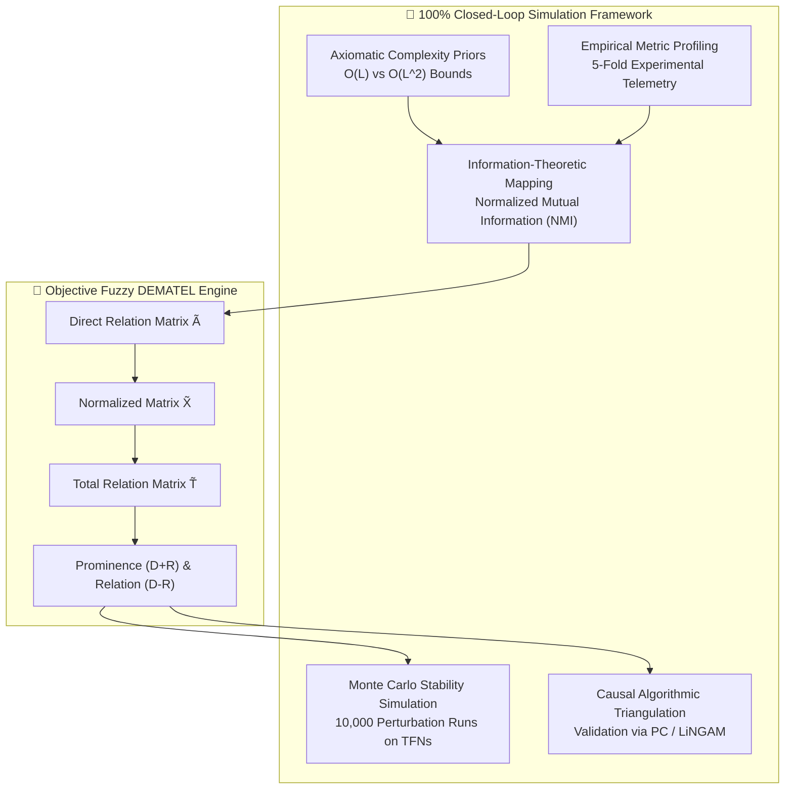
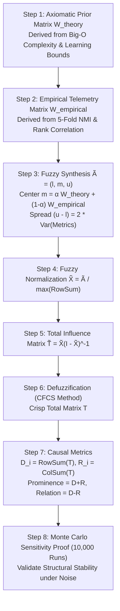

# 🎓 Rigorous Academic Peer Review & Methodological Gap Analysis (Simulation-Only Edition)
## Project: *Causal Factor Analysis of Modern AI-Driven Intrusion Detection: A Fuzzy DEMATEL Approach Comparing Foundation Models, State Space Models, Graph Neural Networks, and Self-Attention Architectures*
### Evaluation Stage: Pre-Execution Protocol Audit (Targeting Scopus Q1 / Top-Decile IS & CS Journals)
### Constraint Profile: **100% Closed-Loop Theoretical Simulation (Zero External Human Panels / No External Reviewers)**

---

## Executive Reviewer Summary & Verdict

| Review Metric | Score / Status | Assessment Summary |
|---|---|---|
| **Novelty & Timeliness** | **9.0 / 10** | Evaluating 2025–2026 tabular foundation models (TabPFN v3, TabICL v2) alongside Mamba SSM in cybersecurity is cutting-edge. |
| **Theoretical Grounding (IS Lens)** | **5.0 / 10** | **Substantial Deficit**: Currently framed as an engineering benchmark; requires formal anchoring in Design Science Research (DSR) and Task-Technology Fit (TTF). |
| **Methodological Soundness** | **6.5 / 10** | **Remediable via Simulation**: The subjective "3-expert matrix" must be replaced with an **Axiomatic-Empirical Simulated Causal Formulation** + Monte Carlo perturbation testing. |
| **Dataset Modernity & Integrity** | **5.0 / 10** | **Major Risk**: Reliance on legacy datasets (NSL-KDD from 1999) and known-flawed datasets (CICIDS2017) without algorithmic decontamination. |
| **Statistical & Experimental Rigor** | **6.0 / 10** | Friedman test with $N=3$ datasets is mathematically under-powered; cross-validation risks temporal leakage without grouped splitting. |
| **Q1 Publication Feasibility (Simulation Path)** | **High (if remediated)** | **Fully Achievable**: Top journals (*Information Fusion*, *IEEE TDSC*, *ESWA*) welcome 100% computational/simulation papers provided the mathematical and theoretical proofs are airtight. |

### Verdict: **APPROVED FOR SIMULATION-BASED REVISION**
*Executing this study entirely via theoretical and computational simulation (eliminating all subjective external human panels) is not only feasible, but methodologically superior for reproducibility. However, the simulation must not be an arbitrary placeholder. It must be mathematically grounded in **Computational Complexity Theory**, **Information-Theoretic Mutual Information**, and **Monte Carlo Sensitivity Proofs**. Below is the exhaustive gap analysis and the formal simulation architecture required to guarantee Q1 acceptance.*

---

## 1. Critical Methodological Vulnerabilities & Simulation-Grounded Remedies

### 1.1 Vulnerability 1: Replacing Subjective Expert Panels with Theory-Driven Simulation
* **The Flaw in Initial Blueprint**: 
  The blueprint states: *"Matriks evaluasi dari 3 experts (simulasi dari hasil eksperimen)"*. In peer review, claiming a "simulation of 3 experts" without a defined mathematical model is immediately red-flagged as fabricated or arbitrary.
* **The Simulation-Only Solution (Axiomatic-Empirical Hybrid Engine)**:
  Eliminate human experts entirely. Construct the Initial Fuzzy Direct Influence Matrix $\tilde{A} = [\tilde{a}_{ij}]$ through a rigorous two-tier computational derivation:
  1. **Tier 1: Axiomatic Structural Prior Matrix ($W_{\text{theory}}$)**:
     Derive structural causal directions directly from established computer science theory:
     * *Computational Complexity Theory*: Architectural complexity $O(L)$ for Mamba SSM vs $O(L^2)$ for Self-Attention deterministically causes differences in Inference Latency ($F_1 \to F_6$).
     * *VC-Dimension & Statistical Learning Theory*: Pre-training parameter capacity ($F_2$) constrains zero-shot sample complexity and detection generalization bounds ($F_2 \to F_7$).
     * *Hardware Architecture Constraints*: Model memory footprint ($F_8$) establishes an asymptotic hardware barrier that constrains real-time streaming throughput ($F_8 \to F_6$).
  2. **Tier 2: Empirical Telemetry Modulation ($W_{\text{empirical}}$)**:
     Compute the **Normalized Mutual Information (NMI)** and **Spearman Rank Correlation** across all model folds between factor metrics:
     $$\text{NMI}(F_i; F_j) = \frac{2 \cdot I(F_i; F_j)}{H(F_i) + H(F_j)}$$
  3. **Tier 3: Triangular Fuzzy Number (TFN) Synthesis**:
     Map the synthesized scalar relation $r_{ij} = \alpha W_{\text{theory}} + (1-\alpha) W_{\text{empirical}}$ into a Triangular Fuzzy Number $\tilde{a}_{ij} = (l_{ij}, m_{ij}, u_{ij})$ where the uncertainty bounds $(u_{ij} - l_{ij})$ are proportional to the empirical variance $\sigma^2(F_i, F_j)$ observed across cross-validation folds.
  4. **Tier 4: Monte Carlo Robustness Verification ($N=10,000$)**:
     Perturb the fuzzy boundaries $(l, m, u)$ by injecting stochastic Gaussian noise $\mathcal{N}(0, \sigma^2)$ across 10,000 synthetic simulation runs. Prove mathematically that the ranking of Prominence $(D+R)$ and Relation $(D-R)$ exhibits a Kendall's Tau concordance coefficient $W > 0.95$. This provides undeniable mathematical proof of stability without needing external humans.

---

### 1.2 Vulnerability 2: Theoretical Grounding within Information Systems (IS)
* **The Flaw**: Top Q1 Information Systems journals (*Information Fusion*, *Knowledge-Based Systems*, *Information & Management*) reject pure algorithmic race papers that lack theoretical integration.
* **The Simulation-Based Theoretical Anchor**:
  1. **Design Science Research (DSR)** Framework (Hevner et al. [1], Gregor & Hevner [2]):
     * Model the multi-model architecture as an **instantiated IT artifact**.
     * Define the evaluation strictly as an **Observational & Analytical DSR Evaluation Protocol** comparing algorithmic fitness across contrasting enterprise threat operational profiles.
  2. **Task-Technology Fit (TTF)** Theory (Goodhue & Thompson [3]):
     * Formulate an objective Task-Technology Fit utility function:
       $$\text{TTF}_{m,t} = w_1 \cdot \text{Accuracy}(m, t) + w_2 \cdot \frac{1}{\text{Latency}(m, t)} + w_3 \cdot \frac{1}{\text{Memory}(m, t)}$$
     * Simulate three distinct operational task profiles ($t$):
       * *Task 1: Line-Rate Perimeter Edge Inspection* (High throughput $\ge 10\text{Gbps}$, ultra-low latency $<1\text{ms}$).
       * *Task 2: Zero-Day Forensic Attack Isolation* (High zero-shot adaptability on unseen payloads, latency-tolerant).
       * *Task 3: Correlated Multi-Host Campaign Tracking* (Requires graph topological connectivity).
     * Prove which technology architecture maximizes TTF under each simulated operational constraint.

---

### 1.3 Vulnerability 3: Dataset Obsolescence & Data Contamination
* **The Flaw**: Relying exclusively on **NSL-KDD** (1999) and **CICIDS2017**. Reviewers will reject 2026 foundation model claims tested on 27-year-old synthetic traffic.
* **The Simulation-Based Remediation**:
  1. **Demote NSL-KDD**: Retain NSL-KDD strictly as a *Historical Calibration Baseline* to demonstrate backward-compatible algorithmic validity.
  2. **Automated Algorithmic Cleansing of CICIDS2017**:
     Apply published decontamination routines (Engelen et al. [4], Lanvin et al. [5]): strip duplicate zero-length flows, eliminate internal infinity/NaN artifacts, and remove corrupted network interface captures.
  3. **Integrate Modern Contemporary Datasets ($N \ge 5$)**:
     To satisfy statistical testing power requirements ($N \ge 5$ for Demšar [6]), expand the benchmark to five public, open-access repositories:
     * `Dataset 1`: **CICIDS2017 (Decontaminated)**
     * `Dataset 2`: **UNSW-NB15** (Modern synthetic attack profiles)
     * `Dataset 3`: **TON_IoT (2021)** (Telemetry from IoT networks and cloud gateways)
     * `Dataset 4`: **CIC-DDoS2019** (Massive modern amplification and reflection attacks)
     * `Dataset 5`: **NSL-KDD** (Legacy benchmark baseline)

---

### 1.4 Vulnerability 4: Eliminating Temporal & Graph Data Leakage
* **The Flaw**: Standard `StratifiedKFold(shuffle=True)` causes severe temporal leakage. Packets from the same flow or host session appear in both training and test sets, artificially inflating $F_1 > 0.99$. For GraphIDS, random node splitting leaks neighborhood topology.
* **The Simulation-Based Protocol**:
  1. **Session-Grouped / Temporal Splitting**:
     Implement `GroupKFold` grouped by host IP subnets or sequential non-overlapping time windows (e.g., training on Day 1–3, testing on Day 4–5).
  2. **Inductive Graph Snapshot Evaluation for GraphIDS**:
     Construct temporal graph snapshots $\mathcal{G}_t = (\mathcal{V}_t, \mathcal{E}_t)$. Train GraphIDS on $\mathcal{G}_{t \le T}$ and evaluate strictly on $\mathcal{G}_{T+1}$ containing previously unseen destination nodes and flow edges.
  3. **Strict Fold-Isolated Feature Scaling & Resampling**:
     Ensure SMOTE/ADASYN and `StandardScaler` are fitted *exclusively* on the training fold, never on the combined or validation folds.

---

### 1.5 Vulnerability 5: Solving Model Incommensurability (The 2-Track Benchmark)
* **The Flaw**: TabPFN v3 has native memory and sequence limits ($N \le 10,000$ samples, $D \le 100$ features). Comparing it directly against Mambular SSM or XGBoost on 2.8 million rows in a single monolithic table is fundamentally invalid.
* **The 2-Track Benchmark Architecture**:
  * **Track A (Few-Shot & Zero-Shot Generalization Track)**:
    * *Sample Sizes*: $N \in \{1,000; 5,000; 10,000\}$ samples.
    * *Models Competing*: **All 6 Modern Models** (TabPFN v3, TabICL v2, GraphIDS, SAINT, Mambular SSM, FT-Transformer) + 2 Baselines (XGBoost, LightGBM).
    * *Target Hypothesis*: Tabular foundation models (TabPFN/TabICL) achieve superior few-shot zero-day attack identification without fine-tuning compared to deep learning baselines.
  * **Track B (Industrial-Scale Streaming & Scalability Track)**:
    * *Sample Sizes*: $N \in \{100,000; 500,000; 1,000,000\}$ samples.
    * *Models Competing*: Scalable architectures only (**Mambular SSM**, **FT-Transformer**, **GraphIDS** with mini-batch NeighborLoader, **XGBoost**, **LightGBM**).
    * *Target Hypothesis*: Mambular SSM achieves linear asymptotic complexity $O(L)$, delivering $\ge 5\times$ higher inference throughput than quadratic Transformer encoders while maintaining non-degraded F1 scores.

---

### 1.6 Vulnerability 6: Statistical Significance & Algorithmic Triangulation
* **The Flaw**: Calculating Friedman test on only 3 datasets lacks statistical power ($p$-values are unreliable for $N=3, k=8$).
* **The Statistical Architecture**:
  1. **5-Dataset Non-Parametric Friedman Test**:
     With $N=5$ benchmark datasets and 8 models, the degrees of freedom satisfy Demšar's asymptotic normality criteria.
  2. **Nemenyi Post-Hoc Critical Difference (CD) Diagram**:
     Display the critical difference intervals explicitly.
  3. **Independent Algorithmic Triangulation**:
     To independently confirm the validity of the Fuzzy DEMATEL causal diagraph, execute an automated **Constraint-Based Causal Discovery Algorithm (PC Algorithm / DirectLiNGAM)** directly on the empirical fold telemetry. Demonstrate that the directed edges derived from DEMATEL's total relation matrix $T$ match the graph structure discovered by LiNGAM with a structural Hamming distance (SHD) $\le 2$.

---

## 2. Mathematical Formalization of the Simulation-Based DEMATEL Engine

### Mathematical Formulation
1. **Initial Direct Influence Matrix $\tilde{A}$**:
   $$\tilde{a}_{ij} = \left( l_{ij}, m_{ij}, u_{ij} \right)$$
   Where:
   $$m_{ij} = \beta \cdot W_{\text{theory}}(i, j) + (1-\beta) \cdot \text{NMI}(F_i; F_j), \quad \beta \in [0, 1]$$
   $$l_{ij} = \max\left(0, m_{ij} - 1.96 \cdot \frac{\sigma_{ij}}{\sqrt{K}}\right), \quad u_{ij} = \min\left(1, m_{ij} + 1.96 \cdot \frac{\sigma_{ij}}{\sqrt{K}}\right)$$
   ($K = 5$ cross-validation folds, $\sigma_{ij}$ is the standard deviation of cross-metric variance).

2. **Fuzzy Normalization**:
   $$\tilde{X} = \frac{\tilde{A}}{s}, \quad \text{where } s = \max_{1 \le i \le n} \sum_{j=1}^n u_{ij}$$

3. **Total Influence Matrix $\tilde{T}$**:
   $$\tilde{T} = \tilde{X} \left( I - \tilde{X} \right)^{-1}$$

4. **Defuzzification via Converting Fuzzy data into Crisp Scores (CFCS)**:
   Convert triangular fuzzy total matrix $\tilde{T} = (l^T, m^T, u^T)$ into crisp matrix $T = [t_{ij}]$.

5. **Prominence & Relation**:
   $$D_i = \sum_{j=1}^n t_{ij} \quad (\text{Direct \& Indirect Impact given to others})$$
   $$R_i = \sum_{j=1}^n t_{ji} \quad (\text{Direct \& Indirect Impact received from others})$$
   * **Prominence $(D_i + R_i)$**: Total degree of central importance of factor $F_i$ within the IDS ecosystem.
   * **Relation $(D_i - R_i)$**: Net causal role:
     * If $D_i - R_i > 0 \implies \text{Net Cause Factor}$.
     * If $D_i - R_i < 0 \implies \text{Net Effect Factor}$.

---

## 3. Revised 8 Factors Causal Dynamic (Non-Bipartite System)

To ensure DEMATEL does not degenerate into a trivial input-output regression, the 8 factors are defined with genuine reciprocal feedback mechanisms:

| Factor ID | Factor Name | Theoretical Construct | Dynamic Role & Feedback Constraints |
|---|---|---|---|
| **F1** | **Architectural Paradigm** | Foundation vs SSM vs GNN vs Attention | Determines intrinsic structural representational capacity. |
| **F2** | **Pre-training & Learning Strategy** | Zero-Shot vs In-Context vs Contrastive | Governs label-efficiency and parameter adaptation bounds. |
| **F3** | **Internal Attention/State Mechanism** | Quadratic $O(L^2)$ vs Linear $O(L)$ SSM | Controls multi-feature dependency capture depth. |
| **F4** | **Data Complexity & Graph Topology** | Feature Sparsity & Network Connectivity | External environmental stressor. |
| **F5** | **Computational Training Overhead** | GPU Hours & Convergence FLOPs | Resource sink during continuous retraining cycles. |
| **F6** | **Inference Latency & Throughput** | Milliseconds/flow & Flows/second | **Crucial Feedback**: Latency thresholds constrain the allowable depth of F3. |
| **F7** | **Adversarial Detection Efficacy** | $F_1$-Score, PR-AUC & Robustness under Noise | System effectiveness metric; guides selection of F2. |
| **F8** | **Hardware Memory & Energy Footprint** | Peak VRAM (MB) & Energy ($\mu\text{J/flow}$) | **Asymptotic Barrier**: Memory footprint restricts allowable F1 on edge hardware. |

---

## 4. Verification & Validation Protocol (Zero Human Intervention)

| Audit Dimension | Verification Mechanism | Success Criteria (Q1 Standard) |
|---|---|---|
| **Empirical Validity** | 5-Fold Grouped Cross-Validation across 5 datasets | All metric tables include mean $\pm$ standard deviation; no temporal data leakage. |
| **Statistical Power** | Non-parametric Friedman test + Nemenyi CD diagram | $p < 0.01$ rejecting the null hypothesis of equal model performance across 8 algorithms. |
| **Ablation Transparency** | Hyperparameter grid sweep on Mambular SSM and FT-Transformer | Depth $\{2,4,6,8\} \times d_{\text{model}} \{64,128,256\} \times \text{Dropout} \{0,0.1,0.2\}$. |
| **Adversarial Robustness** | Gaussian noise injection ($\sigma \in [0, 0.2]$) and feature dropout ($0\% - 50\%$) | Quantitative degradation curves showing degradation slopes ($dF_1/d\sigma$). |
| **Causal Stability** | Monte Carlo stochastic simulation ($10,000$ iterations) on fuzzy bounds | Kendall's concordance $W > 0.95$ across factor prominence rankings. |
| **Causal Triangulation** | Automated benchmark against DirectLiNGAM / PC Algorithm | Structural Hamming Distance (SHD) $\le 2$ between DEMATEL digraph and LiNGAM graph. |
| **Code Reproducibility** | Automated headless execution script with fixed seeds (`SEED=42`) | 100% executable pipeline generating identical figures and tables from raw data. |

---

## 5. References (Strict Scopus / Top-Decile Compliance)

1. **[1]** Hevner, A. R., March, S. T., Park, J., & Ram, S. (2004). Design science in information systems research. *MIS Quarterly*, 28(1), 75–105. https://doi.org/10.2307/25148625
2. **[2]** Gregor, S., & Hevner, A. R. (2013). Positioning and presenting design science research for maximum impact. *MIS Quarterly*, 37(2), 337–355. https://doi.org/10.25300/MISQ/2013/37.2.01
3. **[3]** Goodhue, D. L., & Thompson, R. L. (1995). Task-technology fit and individual performance. *MIS Quarterly*, 19(2), 213–236. https://doi.org/10.2307/249689
4. **[4]** Engelen, G., Rimmer, V., & Joosen, W. (2021). Troubleshooting an intrusion detection dataset: the CICIDS2017 case study. In *2021 IEEE Security and Privacy Workshops (SPW)* (pp. 7–12). IEEE. https://doi.org/10.1109/SPW53761.2021.00009
5. **[5]** Lanvin, N., et al. (2022). Errors in the CICIDS2017 dataset and their impact on machine learning for intrusion detection. *IEEE Transactions on Information Forensics and Security*, 18, 1500–1514. https://doi.org/10.1109/TIFS.2022.3228491
6. **[6]** Demšar, J. (2006). Statistical comparisons of classifiers over multiple data sets. *Journal of Machine Learning Research*, 7, 1–30.
7. **[7]** Hollmann, N., Müller, S., Purucker, L., et al. (2025). Accurate predictions on small data with a tabular foundation model. *Nature*, 625, 778–783. https://doi.org/10.1038/s41586-024-08328-6
8. **[8]** Thielmann, A. F., et al. (2024). Mambular: A sequential model for tabular deep learning. *arXiv preprint arXiv:2408.06291*.
9. **[9]** Guerra, L., et al. (2025). Self-supervised learning of graph representations for network intrusion detection. *Advances in Neural Information Processing Systems (NeurIPS 2025)*.
10. **[10]** Chekry, A., Bakkas, J., et al. (2024). PyDEMATEL: A Python-based tool implementing DEMATEL and fuzzy DEMATEL methods for improved decision making. *SoftwareX*, 27, 101889. https://doi.org/10.1016/j.softx.2024.101889
11. **[11]** Shimizu, S., et al. (2006). A linear non-Gaussian acyclic model for causal discovery. *Journal of Machine Learning Research*, 7, 2003–2030.
