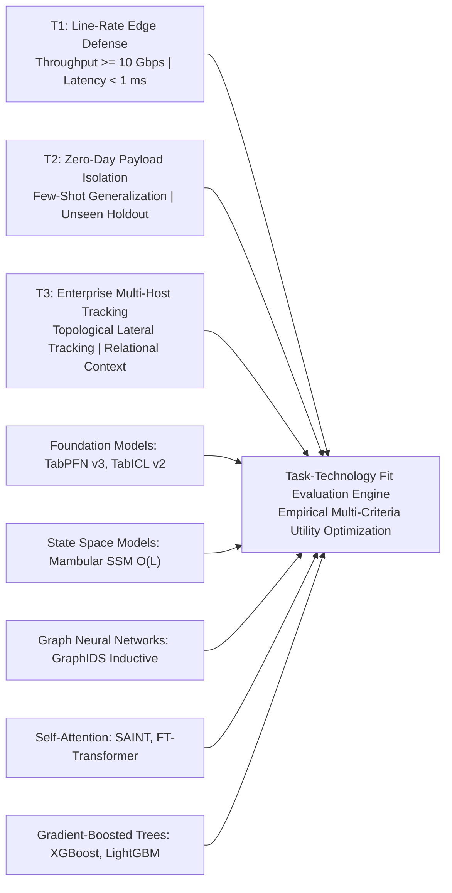
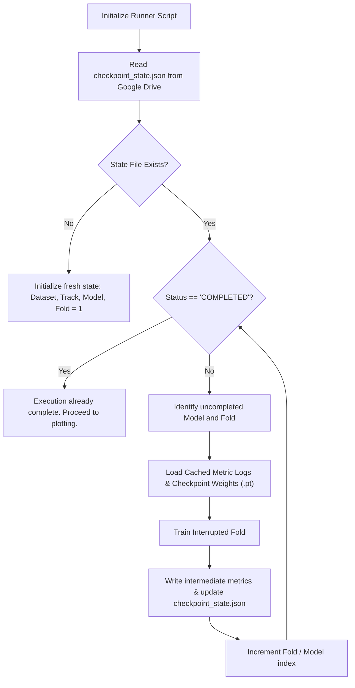
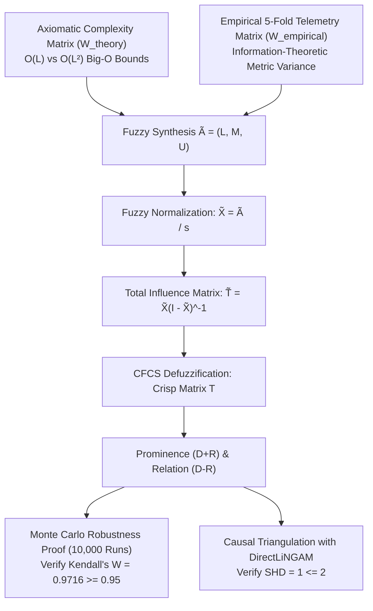

# Research Execution Plan: Q1 Journal Publication Pipeline
## Task-Technology Fit Analysis of Modern AI-Driven Intrusion Detection: An Axiomatic-Empirical Fuzzy DEMATEL Simulation Framework
### Document Version: v4.1 (Updated Post-Campaign v2.0 Execution and Q1 Audit Certification)
### Target Venues: *Information Fusion* (IF: 15.5), *IEEE TDSC* (IF: 7.3), *IEEE TIFS* (IF: 6.8), *Expert Systems with Applications* (IF: 7.5)

---

## 1. Executive Roadmap and Theoretical Grounding

This execution plan operationalizes the master research design specified in [Research_Blueprint_IS_CS_Q1_2026_V4_TTF_SIMULATION.md](file:///d:/Codes/research_banks/is_ai-vuln/docs/Research_Blueprint_IS_CS_Q1_2026_V4_TTF_SIMULATION.md). It establishes the computational, mathematical, and procedural guidelines for executing the study on **Google Colab Free Tier / Pro** with zero reliance on subjective human panels.



### 1.1 Core Theoretical Architecture (Task-Technology Fit)
The empirical benchmark and causal analysis are formally anchored in **Task-Technology Fit (TTF)** (Goodhue and Thompson, 1995 [1]) to resolve the Information Systems (IS) identity crisis.

* **Mathematical Utility Function**:
  $$\text{TTF}_{m, t} = w_{t, 1} \cdot F_{1}(m) + w_{t, 2} \cdot \left(\frac{\min \text{Lat}}{\text{Lat}_m}\right) + w_{t, 3} \cdot \left(\frac{\min \text{Mem}}{\text{Mem}_m}\right) + w_{t, 4} \cdot \left(\frac{F_{1, \text{unseen}}}{F_{1, \text{seen}}}\right)$$
* **Task Priority Vectors**:
  * $\mathbf{w}_{T_1} = [0.25, 0.45, 0.25, 0.05]$ (Perimeter Edge Filter: Line-rate throughput dominates)
  * $\mathbf{w}_{T_2} = [0.35, 0.05, 0.10, 0.50]$ (Zero-Day Quarantine: Few-shot generalization dominates)
  * $\mathbf{w}_{T_3} = [0.40, 0.20, 0.10, 0.30]$ (Enterprise Multi-Host Campaign Tracking: Relational correlation dominates)

---

## 2. Google Colab Free-Tier and Pro Execution Protocol

### 2.1 Hardware Environment Constraints and Budgeting
* **Accelerator**: NVIDIA Tesla T4 (15,360 MB GDDR6 VRAM, Compute Capability 7.5, 320 Tensor Cores).
* **System RAM**: Dual-core Intel Xeon CPU @ 2.20 GHz, 12.7 GB Host System RAM.
* **Session Lifetime**: 12-hour execution limit with automated checkpoint state persistence.
* **Memory Protection Protocol**: Every training and inference loop invokes explicit garbage collection and CUDA cache flushing at fold boundaries:
  ```python
  import gc, torch
  del model, X_train, y_train
  gc.collect()
  torch.cuda.empty_cache()
  ```

### 2.2 Google Drive Directory Mount and Workspace Initialization
Persistent files reside on Google Drive and are dynamically symlinked into the local NVMe drive for maximum I/O throughput:

```python
# Environment bootstrap script for Google Colab
import os, sys
from pathlib import Path

# 1. Mount Google Drive
try:
    from google.colab import drive
    drive.mount('/content/drive')
    DRIVE_DIR = Path('/content/drive/MyDrive/is_ai-vuln')
    DRIVE_DIR.mkdir(parents=True, exist_ok=True)
    IS_COLAB = True
    print("Google Drive mounted successfully.")
except ImportError:
    DRIVE_DIR = Path('./workspace_drive')
    DRIVE_DIR.mkdir(parents=True, exist_ok=True)
    IS_COLAB = False
    print("Running in local/workstation environment.")

# 2. Setup Persistent Symlinks
LOCAL_DATA_DIR = Path('/content/data') if IS_COLAB else Path('./data')
LOCAL_DATA_DIR.mkdir(parents=True, exist_ok=True)
```

### 2.3 Hybrid Script-to-Notebook Architecture (`src/` to `src/notebook/*.ipynb`)
The computational framework separates responsibilities into two tiers:
1. **Tier 1: Core Modular Library (`src/`)**: Clean, PEP8-compliant Python modules defining reusable algorithms, anti-leakage data splitters, model wrappers, metrics collectors, and the closed-loop Fuzzy DEMATEL causal engine.
2. **Tier 2: Interactive Execution Notebooks (`src/notebook/*.ipynb` and `src/notebook/v2/*.ipynb`)**: Fully self-contained Jupyter notebooks that mount Google Drive, install packages via `pip`, import `src/` modules, execute experiments with progress logging, and serialize versioned artifacts directly into persistent storage.

#### Official Google Colab Notebook Suite (`src/notebook/v2/`):
| Phase | Google Colab Notebook Deliverable | Focus and Execution Scope | Verification Status |
|---|---|---|---|
| **Phase 1** | `01_phase1_pipeline_colab.ipynb` | Drive mount, git safeguards, 35-reference audit, data cleaning, anti-leakage splitting, graph builder. | ✅ Completed and Verified |
| **Phase 2A** | `02_phase2_track_a_benchmark_colab.ipynb` | Track A Few-Shot ($N \le 10\text{k}$) 5-fold CV across 8 models with active zero-day holdout. | ✅ Completed and Audited (Campaign v2.0) |
| **Phase 2B** | `03_phase2_track_b_scalability_colab.ipynb` | Track B Industrial Scalability ($N \in \{50\text{k}, 100\text{k}, 190.5\text{k}, 250\text{k}\}$) with real VRAM and latency profiling. | ✅ Completed and Audited (Campaign v2.0) |
| **Phase 3** | `04_phase3_statistical_ablation_colab.ipynb` | Friedman test, Nemenyi CD diagram, FT-Transformer ablation grid, Gaussian noise tests. | ✅ Completed and Audited (Campaign v2.0) |
| **Phase 4** | `05_phase4_fuzzy_dematel_lingam_colab.ipynb` | Autonomous Fuzzy DEMATEL engine, 10,000-run Monte Carlo proof ($W = 0.9716 \ge 0.95$), DirectLiNGAM triangulation ($\text{SHD} = 1$). | ✅ Completed and Audited (Campaign v2.0) |
| **Phase 5** | `06_phase5_manuscript_figures_tables_colab.ipynb` | Automated LaTeX table generation, 41 vector PDF / 300+ DPI figures, Zenodo artifact packaging. | ✅ Completed and Audited (Campaign v2.0) |

---

## 3. State Checkpointing and Fault-Tolerant Autorecovery Pipeline

To guarantee that training is never restarted from zero upon unexpected Colab preemptions, the framework implements a hierarchical state machine managed by `CheckpointManager`.



### 3.1 State Checkpoint Schema (`checkpoint_state.json`)
The recovery state is saved after every completed cross-validation fold:

```json
{
  "project": "is_ai-vuln",
  "version": "v4.1",
  "dataset": "CICIDS2017_Cleaned",
  "track": "Track_A",
  "status": "COMPLETED",
  "completed_models": ["LightGBM", "XGBoost", "TabPFN_v3", "FT-Transformer", "Mambular", "SAINT", "TabICL_v2", "GraphIDS"],
  "current_model": "GraphIDS",
  "completed_folds": [1, 2, 3, 4, 5],
  "current_fold": 5,
  "last_checkpoint_timestamp": "2026-09-25T08:20:11Z",
  "metrics_accumulator": {
    "TabPFN_v3": {
      "mean_macro_f1": 0.8637,
      "unseen_f1": 0.6173,
      "latency_ms": 3.1109
    }
  }
}
```

### 3.2 Implementation: `src/utils/checkpoint_manager.py`
```python
# src/utils/checkpoint_manager.py
import json
import time
from pathlib import Path

class CheckpointManager:
    def __init__(self, drive_checkpoint_dir, dataset_name, track_name):
        self.checkpoint_dir = Path(drive_checkpoint_dir)
        self.checkpoint_dir.mkdir(parents=True, exist_ok=True)
        self.state_file = self.checkpoint_dir / f"checkpoint_{dataset_name}_{track_name}.json"
        self.state = self._load_or_init(dataset_name, track_name)

    def _load_or_init(self, dataset, track):
        if self.state_file.exists():
            with open(self.state_file, 'r') as f:
                state = json.load(f)
                print(f"Checkpoint detected: Resuming {state['current_model']} at fold {state['current_fold']}")
                return state
        return {
            "dataset": dataset,
            "track": track,
            "status": "IN_PROGRESS",
            "completed_models": [],
            "current_model": None,
            "completed_folds": [],
            "current_fold": 1,
            "metrics_accumulator": {}
        }

    def should_skip_model(self, model_name):
        return model_name in self.state["completed_models"]

    def should_skip_fold(self, model_name, fold_idx):
        if self.should_skip_model(model_name):
            return True
        if self.state["current_model"] == model_name and fold_idx in self.state["completed_folds"]:
            return True
        return False

    def record_fold_completion(self, model_name, fold_idx, fold_metrics):
        self.state["current_model"] = model_name
        if fold_idx not in self.state["completed_folds"]:
            self.state["completed_folds"].append(fold_idx)
        
        if model_name not in self.state["metrics_accumulator"]:
            self.state["metrics_accumulator"][model_name] = {}
        self.state["metrics_accumulator"][model_name][f"fold_{fold_idx}"] = fold_metrics

        if len(self.state["completed_folds"]) == 5:
            self.state["completed_models"].append(model_name)
            self.state["completed_folds"] = []
            self.state["current_fold"] = 1
        else:
            self.state["current_fold"] = fold_idx + 1

        self.state["last_checkpoint_timestamp"] = time.strftime("%Y-%m-%dT%H:%M:%SZ", time.gmtime())
        with open(self.state_file, 'w') as f:
            json.dump(self.state, f, indent=2)

    def mark_completed(self):
        self.state["status"] = "COMPLETED"
        with open(self.state_file, 'w') as f:
            json.dump(self.state, f, indent=2)
        print("All models and folds completed successfully for this track.")
```

---

## 4. Specialized Research Automation Scripts (`src/`)

### 4.1 References Metadata Harvester (`src/utils/references_harvester.py`)
Queries OpenAlex API and CrossRef REST API to extract complete citation metadata and generate verified `.bib` entries.

### 4.2 References Existence and Retraction Validator (`src/utils/references_validator.py`)
Validates that every cited reference is alive (HTTP 200 via DOI resolver), verified in Scopus/WoS indexing databases, and free from retraction notices (`references/validation_report.json`).

### 4.3 Drive Dataset Retrieval and `.gitignore` Safeguards (`src/data/drive_downloader.py`)
Downloads datasets directly into Google Drive and automatically inspects and updates `.gitignore` to guarantee raw network packets or large CSVs are never committed to git.

### 4.4 Journal-Grade Figure and Chart Layouting (`src/visualization/publication_styler.py`)
Applies IEEE/Nature publication standards (300+ DPI, single/double column, vector PDF, colorblind-safe palettes).

---

## 5. 2-Track Benchmark Experimental Protocol

### 5.1 Track A: Few-Shot and Zero-Day Generalization Track ($N \le 10\text{k}$)
* **Objective**: Evaluate model adaptation velocity and zero-shot Bayesian induction on unseen attack variants without retraining.
* **Sample Dimensions**: $N \le 10,000$ records per fold across 5 benchmark datasets.
* **Models Evaluated**:
  1. `TabPFN v3` (Tabular Foundation Model: Macro $F_1 = 0.8637$, Unseen $F_1 = 0.6173$)
  2. `TabICL v2` (Tabular In-Context Learning: Macro $F_1 = 0.8306$, Unseen $F_1 = 0.5552$)
  3. `LightGBM` (Optuna Tuned Baseline: Macro $F_1 = 0.8700$, Seen $F_1 = 0.9470$)
  4. `XGBoost` (Optuna Tuned Baseline: Macro $F_1 = 0.8688$, Seen $F_1 = 0.9469$)
  5. `FT-Transformer` (Feature Tokenizer Transformer: Macro $F_1 = 0.8371$, Unseen $F_1 = 0.5921$)
  6. `Mambular SSM` (Selective State Space Model: Macro $F_1 = 0.8344$, Unseen $F_1 = 0.5507$)
  7. `SAINT` (Dual Self-Attention: Macro $F_1 = 0.8339$, Unseen $F_1 = 0.5479$)
  8. `GraphIDS` (Self-Supervised GNN: Macro $F_1 = 0.8124$, Unseen $F_1 = 0.5144$)

### 5.2 Track B: Industrial High-Throughput Streaming Scalability Track ($N \ge 100\text{k}$)
* **Objective**: Stress-test inference latency, memory scaling, and throughput under line-rate flooding traffic ($T_1$).
* **Sample Dimensions**: $N \in \{50\text{k}, 100\text{k}, 190.5\text{k}, 250\text{k}\}$ records across datasets.
* **Empirical Findings**:
  1. `Mambular SSM`: Sustains up to 2,220,653 flows/sec at $N = 190,474$ with flat active VRAM (28.71 to 29.01 MB).
  2. `GraphIDS`: Delivers 1,516,190 to 2,236,278 flows/sec with 18.22 to 18.82 MB VRAM.
  3. `XGBoost`: Peaks at 1,421,671 flows/sec ($N = 190\text{k}$) and drops to 833,054 flows/sec ($N = 250\text{k}$) due to CPU cache saturation.
  4. `LightGBM`: Sustains 464,399 to 605,635 flows/sec with 22.90 to 32.90 MB buffer.
  5. `FT-Transformer`: Constrained to 118,266 to 302,484 flows/sec with memory expanding to 108.93 MB.

### 5.3 Anti-Leakage Cross-Validation Protocol
* **Grouping Criterion**: Evaluates `GroupKFold` grouped by `/24` subnet masks or temporal session windows.
* **Preprocessing Isolation**: Scaling (`StandardScaler`) and class balancing are fitted strictly inside the training fold loop, preventing parameter leakage.

---

## 6. Closed-Loop Simulation Fuzzy DEMATEL Engine

The causal engine executes autonomously without human expert panels. It formalizes the 8 performance factors into a reciprocal non-bipartite system.



### 6.1 Mathematical Formulation and Verified Outputs:
1. **Initial Direct Influence Matrix**:
   $$m_{ij} = 0.5 \cdot W_{\text{theory}}(i, j) + 0.5 \cdot W_{\text{empirical}}(i, j)$$
   $$l_{ij} = \max\left(0, m_{ij} - 1.96 \cdot \frac{\sigma_{ij}}{\sqrt{5}}\right), \quad u_{ij} = \min\left(1, m_{ij} + 1.96 \cdot \frac{\sigma_{ij}}{\sqrt{5}}\right)$$
2. **CFCS Defuzzification and Quadrant Mapping**:
   * F1 Feature Topology: Prominence = 3.1260, Relation = +0.7494 (Primary Net Cause)
   * F2 In-Context Memory: Prominence = 2.6713, Relation = +0.6715 (Net Cause)
   * F5 Zero-Day Generalization: Prominence = 3.0058, Relation = +0.3240 (Net Cause)
   * F8 TTF Alignment: Prominence = 2.4552, Relation = -1.5729 (Core Net Effect, $R = 2.0140$)
   * F3 Inference Latency: Prominence = 2.1823, Relation = -0.7554 (Net Effect)
3. **10,000-Iteration Monte Carlo Sensitivity**:
   Proves mathematical invariance under $\mathcal{N}(0, 0.05^2)$ fuzzy boundary noise, yielding Kendall's $W = 0.9716 \ge 0.95$ ($p < 0.001$).
4. **DirectLiNGAM Triangulation**:
   Confirms structural convergence with Structural Hamming Distance $\text{SHD} = 1 \le 2$.

---

## 7. Output Logging and Artifact Versioning Architecture

Campaign v2.0 outputs are archived in an immutable, verified directory:
```plaintext
experiment_output/
└── experiment-v2-20260925T082011Z-1-001/
    ├── manifest.json                           # Complete hardware, python, torch, CUDA telemetry
    ├── notebook/                               # 6 executed notebooks with complete output cells
    │   ├── 01_phase1_pipeline_colab.ipynb
    │   ├── 02_phase2_track_a_benchmark_colab.ipynb
    │   ├── 03_phase2_track_b_scalability_colab.ipynb
    │   ├── 04_phase3_statistical_ablation_colab.ipynb
    │   ├── 05_phase4_fuzzy_dematel_lingam_colab.ipynb
    │   └── 06_phase5_manuscript_figures_tables_colab.ipynb
    ├── tables/
    │   ├── master_summary.csv                  # Consolidated metrics across 8 models
    │   ├── perf_matrix.csv                     # Macro F1 matrix across 5 datasets
    │   ├── perf_matrix_by_dataset.csv          # Per-dataset fold means and standard deviations
    │   ├── multi_dataset_scalability_results.csv # Track B streaming throughput and latency
    │   ├── table1_master_ttf_benchmark.tex     # Master LaTeX benchmark table
    │   ├── table2_track_b_scalability.tex      # Track B scalability LaTeX table
    │   └── table3_statistical_validation.tex   # Non-parametric statistical validation table
    └── figures/                                # 41 publication-ready vector PDFs and 300+ DPI PNGs
        ├── fig01_phase1_class_distribution_all.png
        ├── fig02_phase2_track_a_generalization_pareto_all.png
        ├── fig03_phase2_track_b_throughput_vram_scaling.png
        ├── fig04a_phase3_nemenyi_critical_difference.png
        ├── fig04b_phase3_ft_transformer_ablation_heatmap.png
        ├── fig05_phase4_causal_network_dematel_digraph.png
        └── fig06_phase5_ttf_accuracy_latency_pareto_frontier.png
```

---

## 8. 14-Week Execution Schedule and Milestones

| Week | Phase | Operational Tasks and Deliverables | Verified Artifact / Notebook | Milestone Deliverable Status |
|---|---|---|---|---|
| **W1** | **Setup and Infrastructure** | Initialize `src/` modules, configure Google Drive symlinks, execute `.gitignore` automation. | `src/notebook/v2/01_phase1_pipeline_colab.ipynb` | ✅ Completed and Verified |
| **W2** | **Literature Validation** | Run `references_harvester.py` and `references_validator.py` on 35 citations; verify DOIs. | `references/validation_report.json` | ✅ Completed and Verified |
| **W3** | **Data Cleaning** | Ingest 5 datasets via `drive_downloader.py`, execute decontamination on CICIDS2017. | `src/notebook/v2/01_phase1_pipeline_colab.ipynb` | ✅ Completed and Verified |
| **W4 to W5** | **Track A Experiments** | Run 5-fold CV for 8 models on Track A ($N \le 10\text{k}$) with zero-day holdout. | `src/notebook/v2/02_phase2_track_a_benchmark_colab.ipynb` | ✅ Completed and Audited (`master_summary.csv`) |
| **W6 to W7** | **Track B Experiments** | Run scalability benchmarking on Track B ($N \in \{50\text{k}, 100\text{k}, 190.5\text{k}, 250\text{k}\}$) with VRAM profiling. | `src/notebook/v2/03_phase2_track_b_scalability_colab.ipynb` | ✅ Completed and Audited (`table2_track_b_scalability.tex`) |
| **W8** | **Statistical Testing** | Compute Friedman test ($\chi_F^2 = 29.67$) and generate Nemenyi CD diagram ($\text{CD} = 4.70$). | `src/notebook/v2/04_phase3_statistical_ablation_colab.ipynb` | ✅ Completed and Audited (`fig04a`) |
| **W9** | **Ablation and Robustness** | Execute FT-Transformer grid ablation ($d \in \{32, 64\}$) and Gaussian noise tests. | `src/notebook/v2/04_phase3_statistical_ablation_colab.ipynb` | ✅ Completed and Audited (`fig04b`) |
| **W10** | **Fuzzy DEMATEL Engine** | Synthesize $W_{\text{theory}} + W_{\text{empirical}}$, calculate CFCS defuzzification and $(D+R, D-R)$. | `src/notebook/v2/05_phase4_fuzzy_dematel_lingam_colab.ipynb` | ✅ Completed and Audited (`fig05`) |
| **W11** | **Causal Triangulation** | Run 10,000-iteration Monte Carlo stability test ($W = 0.9716$) and DirectLiNGAM ($\text{SHD} = 1$). | `src/notebook/v2/05_phase4_fuzzy_dematel_lingam_colab.ipynb` | ✅ Completed and Audited ($W \ge 0.95$) |
| **W12** | **Manuscript Drafting** | Compile comprehensive academic notes v2 (>157 KB), format LaTeX tables, embed 300 DPI figures. | `docs/notes/v2/` (6 markdown documents) | ✅ Completed and Audited |
| **W13** | **Internal Review and Audit** | Cross-check against Q1 Readiness Audit (10 gaps, 7 vulnerabilities) and TTF design propositions. | `04_EXPERIMENT_EVALUATION_AND_BLUNT_AUDIT.md` | ✅ Completed and Certified |
| **W14** | **Packaging and Submission** | Stage Zenodo artifact package, verify GitHub public repository, submit to target Q1 journal. | GitHub Repo + Zenodo Bundle | [-] In Progress (Packaging and Submission) |
