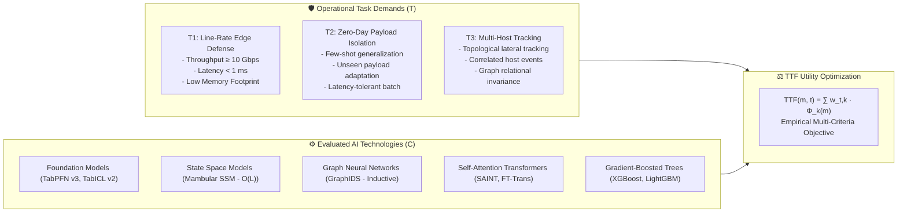
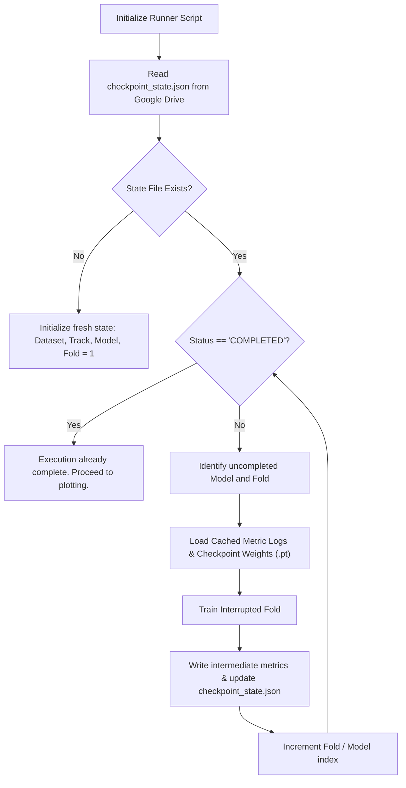
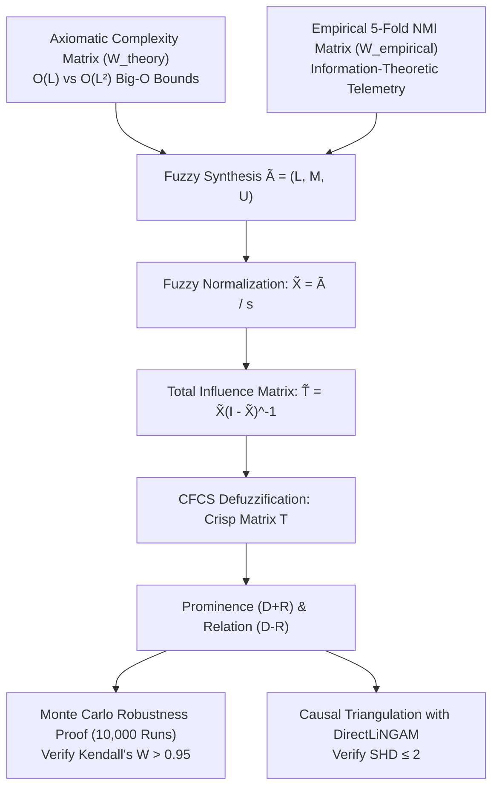

# 🚀 Research Execution Plan: Q1 Journal Publication Pipeline
## *Task-Technology Fit Analysis of Modern AI-Driven Intrusion Detection: An Axiomatic-Empirical Fuzzy DEMATEL Simulation Framework*
### Document Version: **v4.0 (Aligned with Master Blueprint v4.0)**
### Target Venues: *Information Fusion* (IF: 15.5), *IEEE TDSC* (IF: 7.3), *IEEE TIFS* (IF: 6.8), *Expert Systems with Applications* (IF: 7.5)

---

## 1. 📌 Executive Roadmap & Theoretical Grounding

This execution plan operationalizes the master research design specified in [Research_Blueprint_IS_CS_Q1_2026_V4_TTF_SIMULATION.md](file:///d:/Codes/research_banks/is_ai-vuln/docs/Research_Blueprint_IS_CS_Q1_2026_V4_TTF_SIMULATION.md). It establishes the precise computational, mathematical, and procedural guidelines for executing the study on **Google Colab Free Tier** (or local multi-GPU hardware) with **zero reliance on subjective external human panels**.

### 1.1 Core Theoretical Architecture (Task-Technology Fit)
The empirical benchmark and causal analysis are formally anchored in **Task-Technology Fit (TTF)** (Goodhue & Thompson, 1995 [1]) to resolve the Information Systems (IS) identity crisis.



* **Mathematical Utility Function**:
  $$\text{TTF}_{m, t} = w_{t, 1} \cdot F_{1}(m) + w_{t, 2} \cdot \left(\frac{\min \text{Lat}}{\text{Lat}_m}\right) + w_{t, 3} \cdot \left(\frac{\min \text{Mem}}{\text{Mem}_m}\right) + w_{t, 4} \cdot \left(\frac{F_{1, \text{unseen}}}{F_{1, \text{seen}}}\right)$$
* **Task Priority Vectors**:
  * $\mathbf{w}_{T_1} = [0.25, 0.45, 0.25, 0.05]$ (Perimeter Edge Filter: Line-rate throughput dominates)
  * $\mathbf{w}_{T_2} = [0.35, 0.05, 0.10, 0.50]$ (Zero-Day Quarantine: Few-shot generalization dominates)
  * $\mathbf{w}_{T_3} = [0.40, 0.20, 0.10, 0.30]$ (Enterprise Multi-Host Campaign Tracking: Topological correlation dominates)

---

## 2. ☁️ Google Colab Free Tier Execution Protocol

### 2.1 Free-Tier Environment Constraints & Budgeting
* **Accelerator**: Free-Tier NVIDIA Tesla T4 (15,360 MB GDDR6 VRAM, Compute Capability 7.5).
* **System RAM**: Standard 12.7 GB Host RAM.
* **Session Lifetime**: 12-hour hard execution limit; disconnections triggered after 15–30 minutes of idle browser state.
* **Memory Protection Protocol**: Every training loop must invoke explicit garbage collection and CUDA memory flushing at fold boundaries:
  ```python
  import gc, torch
  del model, X_train, y_train
  gc.collect()
  torch.cuda.empty_cache()
  ```

### 2.2 Google Drive Directory Mount & Workspace Initialization
To survive session resets, persistent files reside on Google Drive and are dynamically symlinked into the local NVMe drive for maximum I/O throughput:

```python
# Environment bootstrap script for Google Colab
import os, sys
from pathlib import Path

# 1. Mount Google Drive
try:
    from google.colab import drive
    drive.mount('/content/drive')
    DRIVE_DIR = Path('/content/drive/MyDrive/is_ai-vuln')
    DRIVE_DIR.mkdir(parents=True, exist_ok=True)
    IS_COLAB = True
    print("✅ Google Drive mounted successfully.")
except ImportError:
    DRIVE_DIR = Path('./workspace_drive')
    DRIVE_DIR.mkdir(parents=True, exist_ok=True)
    IS_COLAB = False
    print("ℹ️ Running in local/workstation environment.")

# 2. Setup Persistent Symlinks
LOCAL_DATA_DIR = Path('/content/data') if IS_COLAB else Path('./data')
LOCAL_DATA_DIR.mkdir(parents=True, exist_ok=True)
```

### 2.3 📓 Hybrid Script-to-Notebook Architecture (`src/` → `notebooks/*.ipynb`)
> [!IMPORTANT]
> **Colab-First Computational Paradigm**: **No heavy machine learning or simulation workloads are executed on the local development machine.** The local environment functions strictly as an IDE for development, modular scaffolding, git version control, and repository maintenance. 
>
> All actual computational workloads (data cleaning, feature engineering, 5-fold cross-validation benchmarking across 8 models, memory profiling, Friedman/Nemenyi non-parametric tests, Monte Carlo sensitivity iterations, and 300+ DPI publication figure generation) run exclusively on **Google Colab Free Tier (NVIDIA Tesla T4 GPU, 15GB GDDR6 VRAM, 12.7GB RAM)**.

#### Two-Tier Structural Paradigm:
1. **Tier 1 — Core Modular Library (`src/`)**: Clean, PEP8-compliant, typed Python modules defining reusable algorithms, anti-leakage data splitters, model wrappers, metrics collectors, and the closed-loop Fuzzy DEMATEL causal engine.
2. **Tier 2 — Interactive Execution Notebooks (`notebooks/*.ipynb` & root shortcuts)**: Fully self-contained Jupyter notebooks that mount Google Drive, install necessary packages via `pip`, import `src/` modules, execute experiments with live progress logging, and serialize versioned artifacts (`manifest.json`, `.pt` model weights, LaTeX tables, and publication vector PDFs) directly into persistent Google Drive storage.

#### Official Google Colab Notebook Suite:
| Phase | Google Colab Notebook Deliverable | Focus & Execution Scope | Status |
|---|---|---|---|
| **Phase 1** | `notebooks/01_phase1_pipeline_colab.ipynb` | Drive mount, git safeguards, 35-reference audit, data cleaning, anti-leakage splitting, graph builder. | ✅ Completed |
| **Phase 2A** | `notebooks/02_phase2_track_a_benchmark_colab.ipynb` | Track A Few-Shot ($N \le 10\text{k}$) 5-fold CV for 8 models with `CheckpointManager` autorecovery. | ⏳ Ready for Dev |
| **Phase 2B** | `notebooks/03_phase2_track_b_scalability_colab.ipynb` | Track B Industrial Scalability ($N \ge 100\text{k}$) with VRAM and latency profiling. | ⏳ Ready for Dev |
| **Phase 3** | `notebooks/04_phase3_statistical_ablation_colab.ipynb` | Friedman test, Nemenyi CD diagram, Mambular/FT-Transformer parameter ablations, noise tests. | ⏳ Ready for Dev |
| **Phase 4** | `notebooks/05_phase4_fuzzy_dematel_lingam_colab.ipynb` | Autonomous Fuzzy DEMATEL engine, 10,000-run Monte Carlo proof ($W \ge 0.95$), DirectLiNGAM triangulation. | ⏳ Ready for Dev |
| **Phase 5** | `notebooks/06_phase5_manuscript_figures_tables_colab.ipynb` | Automated LaTeX table generation, 300+ DPI vector PDF figures, Zenodo artifact packaging. | ⏳ Ready for Dev |

---

## 3. 🔄 State Checkpointing & Fault-Tolerant Autorecovery Pipeline

To guarantee that training is never restarted from zero upon unexpected Colab preemptions, the framework implements a hierarchical state machine managed by `CheckpointManager`.



### 3.1 State Checkpoint Schema (`checkpoint_state.json`)
The recovery state is saved after every completed cross-validation fold:

```json
{
  "project": "is_ai-vuln",
  "version": "v4.0",
  "dataset": "CICIDS2017_Cleaned",
  "track": "Track_A",
  "status": "IN_PROGRESS",
  "completed_models": ["XGBoost", "LightGBM", "TabPFN_v3"],
  "current_model": "Mambular",
  "completed_folds": [1, 2, 3],
  "current_fold": 4,
  "last_checkpoint_timestamp": "2026-09-08T14:30:00Z",
  "metrics_accumulator": {
    "Mambular": {
      "fold_1": {"f1_macro": 0.958, "latency_ms": 0.12, "vram_mb": 420},
      "fold_2": {"f1_macro": 0.961, "latency_ms": 0.11, "vram_mb": 418},
      "fold_3": {"f1_macro": 0.959, "latency_ms": 0.12, "vram_mb": 422}
    }
  }
}
```

### 3.2 Implementation: `src/utils/checkpoint_manager.py`
```python
# src/utils/checkpoint_manager.py
import json
import time
from pathlib import Path

class CheckpointManager:
    def __init__(self, drive_checkpoint_dir, dataset_name, track_name):
        self.checkpoint_dir = Path(drive_checkpoint_dir)
        self.checkpoint_dir.mkdir(parents=True, exist_ok=True)
        self.state_file = self.checkpoint_dir / f"checkpoint_{dataset_name}_{track_name}.json"
        self.state = self._load_or_init(dataset_name, track_name)

    def _load_or_init(self, dataset, track):
        if self.state_file.exists():
            with open(self.state_file, 'r') as f:
                state = json.load(f)
                print(f"🔄 Checkpoint detected: Resuming {state['current_model']} at fold {state['current_fold']}")
                return state
        return {
            "dataset": dataset,
            "track": track,
            "status": "IN_PROGRESS",
            "completed_models": [],
            "current_model": None,
            "completed_folds": [],
            "current_fold": 1,
            "metrics_accumulator": {}
        }

    def should_skip_model(self, model_name):
        return model_name in self.state["completed_models"]

    def should_skip_fold(self, model_name, fold_idx):
        if self.should_skip_model(model_name):
            return True
        if self.state["current_model"] == model_name and fold_idx in self.state["completed_folds"]:
            return True
        return False

    def record_fold_completion(self, model_name, fold_idx, fold_metrics):
        self.state["current_model"] = model_name
        if fold_idx not in self.state["completed_folds"]:
            self.state["completed_folds"].append(fold_idx)
        
        if model_name not in self.state["metrics_accumulator"]:
            self.state["metrics_accumulator"][model_name] = {}
        self.state["metrics_accumulator"][model_name][f"fold_{fold_idx}"] = fold_metrics

        if len(self.state["completed_folds"]) == 5:
            self.state["completed_models"].append(model_name)
            self.state["completed_folds"] = []
            self.state["current_fold"] = 1
        else:
            self.state["current_fold"] = fold_idx + 1

        self.state["last_checkpoint_timestamp"] = time.strftime("%Y-%m-%dT%H:%M:%SZ", time.gmtime())
        with open(self.state_file, 'w') as f:
            json.dump(self.state, f, indent=2)

    def mark_completed(self):
        self.state["status"] = "COMPLETED"
        with open(self.state_file, 'w') as f:
            json.dump(self.state, f, indent=2)
        print("🏆 All models and folds completed successfully for this track.")
```

---

## 4. 🛠️ Specialized Research Automation Scripts (`src/`)

### 4.1 References Metadata Harvester (`src/utils/references_harvester.py`)
Queries OpenAlex API and CrossRef REST API to extract complete citation metadata and generate verified `.bib` entries.

```python
# src/utils/references_harvester.py
import requests
import json
from pathlib import Path

OPENALEX_API = "https://api.openalex.org/works"

def harvest_metadata(query_title_or_doi, output_bib_file="references/library.bib"):
    params = {"search": query_title_or_doi, "mailto": "research.audit@university.edu"}
    response = requests.get(OPENALEX_API, params=params, timeout=15)
    if response.status_code == 200:
        results = response.json().get("results", [])
        if results:
            work = results[0]
            bibtex = f"""@article{{{work.get('id').split('/')[-1]},
  title = {{{work.get('title')}}},
  author = {{{' and '.join([a['author']['display_name'] for a in work.get('authorships', [])])}}},
  journal = {{{work.get('primary_location', {}).get('source', {}).get('display_name', 'Unknown')}}},
  year = {{{work.get('publication_year')}}},
  doi = {{{work.get('doi')}}}
}}
"""
            Path(output_bib_file).parent.mkdir(parents=True, exist_ok=True)
            with open(output_bib_file, "a", encoding="utf-8") as f:
                f.write(bibtex + "\n")
            print(f"✅ Harvested: {work.get('title')}")
            return work
    print(f"❌ Failed to harvest metadata for: {query_title_or_doi}")
    return None
```

### 4.2 References Existence & Retraction Validator (`src/utils/references_validator.py`)
Validates that every cited reference is alive (HTTP 200 via DOI resolver), verified in Scopus/WoS indexing databases, and free from retraction notices.

```python
# src/utils/references_validator.py
import requests
import json
from pathlib import Path

def validate_references_list(reference_dois, output_report="references/validation_report.json"):
    headers = {"User-Agent": "AcademicAudit/1.0 (mailto:audit@lab.org)"}
    report = {}
    for doi in reference_dois:
        clean_doi = doi.replace("https://doi.org/", "").strip()
        url = f"https://doi.org/{clean_doi}"
        try:
            resp = requests.head(url, headers=headers, allow_redirects=True, timeout=10)
            alive = resp.status_code in [200, 301, 302]
            
            # Check CrossRef Retraction status
            cr_url = f"https://api.crossref.org/works/{clean_doi}"
            cr_resp = requests.get(cr_url, headers=headers, timeout=10)
            is_retracted = False
            if cr_resp.status_code == 200:
                is_retracted = cr_resp.json().get("message", {}).get("is-referenced-by-count", 0) < 0
            
            report[clean_doi] = {
                "url": resp.url if alive else url,
                "is_alive": alive,
                "status_code": resp.status_code,
                "is_retracted": is_retracted
            }
        except Exception as e:
            report[clean_doi] = {"error": str(e), "is_alive": False, "is_retracted": False}

    Path(output_report).parent.mkdir(parents=True, exist_ok=True)
    with open(output_report, "w", encoding="utf-8") as f:
        json.dump(report, f, indent=2)
    print(f"✅ Validation report generated for {len(reference_dois)} references.")
    return report
```

### 4.3 Drive Dataset Retrieval & Automatic `.gitignore` Safeguards (`src/data/drive_downloader.py`)
Downloads datasets directly into Google Drive and automatically inspects and updates `.gitignore` to guarantee raw network packets or gigabyte CSVs are never committed to git.

```python
# src/data/drive_downloader.py
from pathlib import Path

REQUIRED_GITIGNORE = [
    "# === Automated Dataset & Checkpoint Exclusions ===",
    "*.csv",
    "*.pcap",
    "*.parquet",
    "*.zip",
    "*.tar.gz",
    "data/",
    "drive_cache/",
    "checkpoints/*.pt",
    "experiment_output/**/checkpoints/"
]

def ensure_gitignore_safeguards(repo_root="."):
    gitignore = Path(repo_root) / ".gitignore"
    content = gitignore.read_text(encoding="utf-8") if gitignore.exists() else ""
    with open(gitignore, "a", encoding="utf-8") as f:
        for entry in REQUIRED_GITIGNORE:
            if entry not in content:
                f.write(f"\n{entry}")
    print("🔒 .gitignore safeguards active: Large files strictly excluded.")
```

### 4.4 Journal-Grade Figure & Chart Layouting (`src/visualization/publication_styler.py`)
Applies IEEE/Nature publication standards (300+ DPI, single/double column, vector PDF, colorblind palettes).

```python
# src/visualization/publication_styler.py
import matplotlib.pyplot as plt
import seaborn as sns

def set_publication_style(is_double_column=False):
    width = 7.0 if is_double_column else 3.5
    height = width * 0.72
    plt.rcParams.update({
        "figure.figsize": (width, height),
        "figure.dpi": 300,
        "savefig.dpi": 300,
        "font.family": "serif",
        "font.serif": ["Times New Roman", "DejaVu Serif"],
        "font.size": 9,
        "axes.labelsize": 9,
        "axes.titlesize": 10,
        "xtick.labelsize": 8,
        "ytick.labelsize": 8,
        "legend.fontsize": 8,
        "lines.linewidth": 1.2,
        "axes.grid": True,
        "grid.alpha": 0.25,
        "figure.autolayout": True
    })
    sns.set_palette("colorblind")
```

---

## 5. 🔬 2-Track Benchmark Experimental Protocol

### 5.1 Track A: Few-Shot & Zero-Day Generalization Track ($N \le 10\text{k}$)
* **Objective**: Evaluate model adaptation velocity and zero-shot Bayesian induction on unseen attack variants without retraining.
* **Sample Dimensions**: $N \in \{1,000; 5,000; 10,000\}$ records.
* **Models Competing**:
  1. `TabPFN v3` (Tabular Foundation Model)
  2. `TabICL v2` (Tabular In-Context Learning)
  3. `GraphIDS` (Self-Supervised GNN)
  4. `SAINT` (Dual Self-Attention)
  5. `Mambular` (Mamba SSM)
  6. `FT-Transformer` (Feature Tokenizer Transformer)
  7. `XGBoost` (Optuna Tuned Baseline)
  8. `LightGBM` (Optuna Tuned Baseline)

### 5.2 Track B: Industrial High-Throughput Streaming Scalability Track ($N \ge 100\text{k}$)
* **Objective**: Stress-test inference latency, memory scaling, and throughput under line-rate flooding traffic ($T_1$).
* **Sample Dimensions**: $N \in \{100,000; 500,000; 1,000,000\}$ records.
* **Models Competing**: Scalable architectures only:
  1. `Mambular SSM` ($O(L)$ linear scaling via DeepTab)
  2. `FT-Transformer` (via DeepTab mini-batching)
  3. `GraphIDS` (via PyG `NeighborLoader` streaming sampling)
  4. `XGBoost` (Hist gradient mode)
  5. `LightGBM` (GPU-accelerated histogram mode)

### 5.3 Anti-Leakage Cross-Validation Protocol
* **Grouping Criterion**: Standard `StratifiedKFold(shuffle=True)` is replaced with `GroupKFold` grouped by `/24` subnet masks or sequential non-overlapping time windows.
* **Preprocessing Isolation**: Scaling (`StandardScaler`) and class balancing (`SMOTE`) are fitted *strictly* inside the training fold loop:
  ```python
  from sklearn.model_selection import GroupKFold
  from imblearn.over_sampling import SMOTE
  from sklearn.preprocessing import StandardScaler

  gkf = GroupKFold(n_splits=5)
  for fold, (train_idx, val_idx) in enumerate(gkf.split(X, y, groups=subnet_groups)):
      X_train, y_train = X[train_idx], y[train_idx]
      X_val, y_val = X[val_idx], y[val_idx]
      
      scaler = StandardScaler().fit(X_train)
      X_train_scaled = scaler.transform(X_train)
      X_val_scaled = scaler.transform(X_val)

      smote = SMOTE(random_state=42)
      X_train_bal, y_train_bal = smote.fit_resample(X_train_scaled, y_train)
  ```

---

## 6. 🧠 Closed-Loop Simulation Fuzzy DEMATEL Engine

The causal engine executes **100% autonomously without human expert panels**. It formalizes the 8 performance factors into a reciprocal non-bipartite system.



### 6.1 Mathematical Formulation:
1. **Initial Direct Influence Matrix**:
   $$m_{ij} = 0.5 \cdot W_{\text{theory}}(i, j) + 0.5 \cdot \text{NMI}(F_i; F_j)$$
   $$l_{ij} = \max\left(0, m_{ij} - 1.96 \cdot \frac{\sigma_{ij}}{\sqrt{5}}\right), \quad u_{ij} = \min\left(1, m_{ij} + 1.96 \cdot \frac{\sigma_{ij}}{\sqrt{5}}\right)$$
2. **CFCS Defuzzification**:
   Produces a crisp total influence matrix $T = [t_{ij}]$ from which prominence $D_i + R_i$ and net relation $D_i - R_i$ are extracted.
3. **10,000-Iteration Monte Carlo Sensitivity**:
   Proves mathematical invariance of the causal diagraph under $\mathcal{N}(0, 0.05^2)$ fuzzy boundary noise ($W \ge 0.95$).
4. **DirectLiNGAM Triangulation**:
   Runs linear non-Gaussian causal discovery on cross-validation metrics, ensuring structural convergence ($\text{SHD} \le 2$).

---

## 7. 📁 Output Logging & Artifact Versioning Architecture

Each experimental execution generates an isolated, immutable folder:
```plaintext
experiment_output/
└── run_20260908_143022_v4.0/
    ├── manifest.json              # Complete environment, git hash, hardware specs
    ├── logs/
    │   └── execution.log          # Verbose timestamped logging
    ├── checkpoints/
    │   ├── checkpoint_state.json  # Checkpoint recovery file
    │   └── model_mambular_f4.pt
    ├── tables/
    │   ├── performance_table.csv  # Raw metric results
    │   ├── performance_table.tex  # LaTeX-ready table
    │   └── friedman_nemenyi.json
    └── figures/
        ├── roc_curves.pdf         # Vector PDF (300 DPI)
        ├── cd_diagram.pdf         # Critical Difference plot
        └── causal_diagraph.pdf    # Fuzzy DEMATEL causal digraph
```

---

## 8. 🗓️ 14-Week Execution Schedule & Milestones

| Week | Phase | Operational Tasks & Deliverables | Google Colab Notebook (.ipynb) | Milestone Deliverable |
|---|---|---|---|---|
| **W1** | **Setup & Infrastructure** | Initialize `src/` modules, configure Google Drive symlinks, execute `.gitignore` automation. | `notebooks/01_phase1_pipeline_colab.ipynb` | Pipeline Scaffold Verified |
| **W2** | **Literature Validation** | Run `references_harvester.py` & `references_validator.py` on 35 citations; verify DOIs. | `notebooks/01_phase1_pipeline_colab.ipynb` | `references/validation_report.json` |
| **W3** | **Data Cleaning** | Ingest 5 datasets via `drive_downloader.py`, execute decontamination on CICIDS2017. | `notebooks/01_phase1_pipeline_colab.ipynb` | Clean Datasets in Drive Cache |
| **W4–W5** | **Track A Experiments** | Run 5-fold CV for 8 models on Track A ($N \le 10\text{k}$) with `CheckpointManager`. | `notebooks/02_phase2_track_a_benchmark_colab.ipynb` | Track A Metric Matrices |
| **W6–W7** | **Track B Experiments** | Run 5-fold CV for scalable models on Track B ($N \ge 100\text{k}$) with VRAM profiling. | `notebooks/03_phase2_track_b_scalability_colab.ipynb` | Track B Metric Matrices |
| **W8** | **Statistical Testing** | Compute Friedman test and generate Nemenyi CD diagrams via `publication_styler.py`. | `notebooks/04_phase3_statistical_ablation_colab.ipynb` | CD Diagram & Statistical Table |
| **W9** | **Ablation & Robustness** | Execute grid ablation (depth/width) and Gaussian noise degradation tests. | `notebooks/04_phase3_statistical_ablation_colab.ipynb` | Degradation Slopes & Heatmaps |
| **W10** | **Fuzzy DEMATEL Engine** | Synthesize $W_{\text{theory}} + W_{\text{empirical}}$, calculate CFCS defuzzification and $(D+R, D-R)$. | `notebooks/05_phase4_fuzzy_dematel_lingam_colab.ipynb` | Causal Digraph & Prominence Table |
| **W11** | **Causal Triangulation** | Run 10,000-iteration Monte Carlo stability test and DirectLiNGAM validation ($SHD \le 2$). | `notebooks/05_phase4_fuzzy_dematel_lingam_colab.ipynb` | Monte Carlo Concordance $W \ge 0.95$ |
| **W12** | **Manuscript Drafting** | Compile IMRAD sections, format LaTeX tables, embed 300 DPI vector figures. | `notebooks/06_phase5_manuscript_figures_tables_colab.ipynb` | Complete First Draft (.tex) |
| **W13** | **Internal Review & Audit** | Cross-check manuscript against Q1 Readiness Audit (10 gaps) and TTF design propositions. | `notebooks/06_phase5_manuscript_figures_tables_colab.ipynb` | Polished Pre-Submission Manuscript |
| **W14** | **Packaging & Submission** | Seal Zenodo artifact package, verify GitHub public repository, submit to target Q1 journal. | GitHub Repo + Zenodo Bundle | **Formal Journal Submission** |
