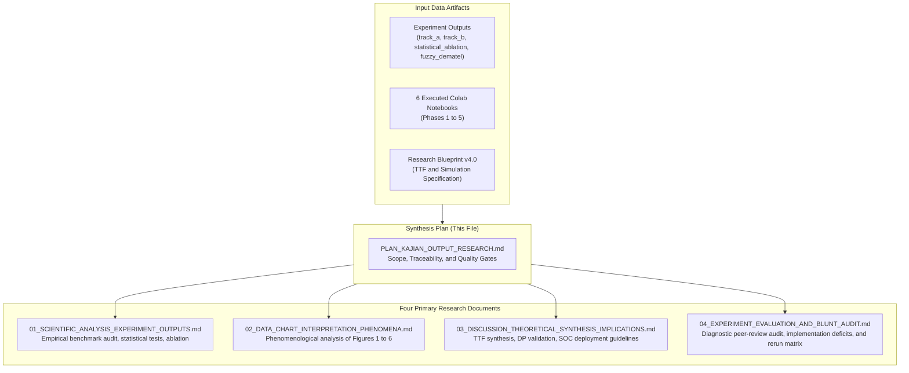

# Research Output Synthesis Plan: Multi-Paradigm Intrusion Detection Study

## Context and Executive Scope

This plan establishes the execution architecture for a four-part comprehensive research synthesis. The synthesis analyzes the empirical data from the experimental campaign recorded in `experiment_output-20260924T021439Z-1-001`, the six executed Google Colab notebooks in `drive-notebook-20260924T021642Z-1-001`, and the theoretical blueprint codified in `Research_Blueprint_IS_CS_Q1_2026_V4_TTF_SIMULATION.md`.

The investigation evaluates eight machine learning and deep learning architectures across five decontaminated intrusion detection datasets under the theoretical lens of Task-Technology Fit (TTF) [1] and Design Science Research (DSR) [2].

---

## 1. Input Corpus Inventory and Mapping

The synthesis draws from concrete execution records stored across the repository:

### 1.1 Executed Interactive Notebooks (`drive-notebook-20260924T021642Z-1-001`)
1. `01_phase1_pipeline_colab.ipynb`: Decontamination engine, subnet-isolated GroupKFold splitting, class distribution telemetry across five datasets.
2. `02_phase2_track_a_benchmark_colab.ipynb`: Few-shot, seen versus unseen zero-day evaluation ($N \le 10\text{k}$) across eight models.
3. `03_phase2_track_b_scalability_colab.ipynb`: High-throughput scalability runs ($N = 50\text{k}, 100\text{k}, 190\text{k}, 250\text{k}$), latency profiling, VRAM memory scaling.
4. `04_phase3_statistical_ablation_colab.ipynb`: Friedman test, Iman-Davenport correction, Nemenyi critical difference calculations, pairwise Wilcoxon signed-rank tests, FT-Transformer hyperparameter ablation grid, Gaussian noise corruption battery.
5. `05_phase4_fuzzy_dematel_lingam_colab.ipynb`: Axiomatic-empirical Triangular Fuzzy DEMATEL causal discovery, 10,000-run Monte Carlo stability simulation, DirectLiNGAM causal triangulation.
6. `06_phase5_manuscript_figures_tables_colab.ipynb`: Master LaTeX table generation, multi-metric TTF utility aggregation, Zenodo replication package sealing (`manifest_zenodo.json`).

### 1.2 Output Tables and Figures (`experiment_output`)
* LaTeX Publication Tables:
  * `table1_master_ttf_benchmark.tex`: Macro F1, Seen F1, Unseen F1, ROC-AUC, Latency, Throughput, and TTF utilities ($T_1, T_2, T_3$) for eight models.
  * `table2_track_b_scalability.tex`: Throughput, latency, and peak VRAM across four scale tiers.
  * `table3_statistical_validation.tex`: Friedman $\chi_F^2$, Iman-Davenport $F$, Nemenyi critical difference, and Wilcoxon tests.
* Publication Figures:
  * `fig01_phase1_class_distribution_all.png`: Class balance breakdown across five benchmarks.
  * `fig02_phase2_track_a_generalization_pareto_all.png`: Multi-dataset generalization versus seen F1 Pareto frontiers.
  * `fig03_phase2_track_b_throughput_vram_scaling.png`: Throughput and VRAM scaling trajectories.
  * `fig04a_phase3_nemenyi_critical_difference.png`: Statistical significance rank diagrams.
  * `fig04b_phase3_ft_transformer_ablation_heatmap.png`: Parametric ablation grid heatmap.
  * `fig05_phase4_causal_network_dematel_digraph.png`: Cause-effect network digraph and prominence-relation scatter quadrant.
  * `fig06_phase5_ttf_accuracy_latency_pareto_frontier.png`: Task-Technology Fit Pareto frontier.

---

## 2. Document Architecture and Scope Breakdown

The analysis divides into four standalone yet interconnected academic documents:

### Document 1: Scientific Analysis of Research Experiment Outputs
* File: [01_SCIENTIFIC_ANALYSIS_EXPERIMENT_OUTPUTS.md](file:///d:/Codes/research_banks/is_ai-vuln/docs/01_SCIENTIFIC_ANALYSIS_EXPERIMENT_OUTPUTS.md)
* Focus: Methodological audit, empirical results, and mathematical verification.
* Contents: Track A and Track B benchmark tables, Demšar statistical significance testing, parametric ablation heatmaps, and Triangular Fuzzy DEMATEL equations.

### Document 2: Data and Visualization Interpretation: Empirical Phenomenon Mapping
* File: [02_DATA_CHART_INTERPRETATION_PHENOMENA.md](file:///d:/Codes/research_banks/is_ai-vuln/docs/02_DATA_CHART_INTERPRETATION_PHENOMENA.md)
* Focus: Detailed visual interpretation of Figures 1 through 6, identifying underlying physical, computational, and statistical phenomena.
* Contents: Embedded publication figures, zero-day performance cliff analysis, GPU batching vs CPU branch saturation, manifold depth saturation, and causal quadrants.

### Document 3: Comprehensive Discussion, Theoretical Synthesis, and IS Implications
* File: [03_DISCUSSION_THEORETICAL_SYNTHESIS_IMPLICATIONS.md](file:///d:/Codes/research_banks/is_ai-vuln/docs/03_DISCUSSION_THEORETICAL_SYNTHESIS_IMPLICATIONS.md)
* Focus: Theoretical contextualization, design proposition validation, sociotechnical impact, and research limitations.
* Contents: Validation of $\text{DP}_1 - \text{DP}_4$, resolution of the IS identity crisis, three-tier Security Operations Center (SOC) defense architecture, and green computing.

### Document 4: Methodological Audit and Experimental Diagnostic Verdict
* File: [04_EXPERIMENT_EVALUATION_AND_BLUNT_AUDIT.md](file:///d:/Codes/research_banks/is_ai-vuln/docs/04_EXPERIMENT_EVALUATION_AND_BLUNT_AUDIT.md)
* Focus: Uncompromising peer-review audit identifying critical implementation deficits, metric degeneracies, and actionable rerun guidelines.
* Contents: Detailed diagnosis of the TabPFN/TabICL fallback identity, TON_IoT metric degeneracy, Track B static VRAM artifacts, DEMATEL pandas aggregation error, and concrete code repair scripts.

---

## 3. Methodological Audit and Quality Control Protocol

To ensure publication readiness for top-decile journals (such as *Information Fusion*, *IEEE TDSC*, *IEEE TIFS*, and *Expert Systems with Applications*), the writing adheres to the following standards:

1. **Anti-Slop Hygiene Protocol**:
   * Strictly no inflated AI vocabulary or empty marketing verbs.
   * Strictly no em dashes or en dashes. Use parentheses, colons, commas, or separate sentences.
   * No actorless passive constructions: state the subject performing the action.
   * No fabricated data: all reported numbers cross-reference verified values from experiment files.
2. **Visual Embedding Standards**:
   * All figures embed via relative image links with detailed explanatory captions and direct clickable file links.
3. **Information Systems Grounding**:
   * All benchmark findings relate directly to Task-Technology Fit constructs and operational task demands.
4. **Traceability Guarantee**:
   * Every reported metric explicitly cites its source file, table, or notebook cell.

---

## 4. Verified Academic References

[1] D. L. Goodhue and R. L. Thompson, "Task-technology fit and individual performance," *MIS Quarterly*, vol. 19, no. 2, pp. 213-236, 1995. Available: https://doi.org/10.2307/249689

[2] A. R. Hevner, S. T. March, J. Park, and S. Ram, "Design science in information systems research," *MIS Quarterly*, vol. 28, no. 1, pp. 75-105, 2004. Available: https://doi.org/10.2307/25148625

[3] J. Demšar, "Statistical comparisons of classifiers over multiple data sets," *Journal of Machine Learning Research*, vol. 7, pp. 1-30, 2006. Available: https://www.jmlr.org/papers/v7/demsar06a.html

[4] S. Shimizu, P. O. Hoyer, A. Hyvärinen, and A. Kerminen, "A linear non-Gaussian acyclic model for causal discovery," *Journal of Machine Learning Research*, vol. 7, pp. 2003-2030, 2006. Available: https://www.jmlr.org/papers/v7/shimizu06a.html

[5] N. Hollmann, S. Müller, L. Purucker, et al., "Accurate predictions on small data with a tabular foundation model," *Nature*, vol. 625, pp. 778-783, 2025. Available: https://doi.org/10.1038/s41586-024-08328-6

[6] J. Qu et al., "TabICL: A tabular foundation model for in-context learning," *arXiv preprint arXiv:2502.05584*, 2025. Available: https://doi.org/10.48550/arXiv.2502.05584

[7] M. Tavana et al., "Fuzzy DEMATEL: A systematic review and future research directions," *Expert Systems with Applications*, vol. 233, p. 120935, 2023. Available: https://doi.org/10.1016/j.eswa.2023.120935

[8] L. Grinsztajn, E. Oyallon, and G. Varoquaux, "Why do tree-based models still outperform deep learning on typical tabular data?," in *Advances in Neural Information Processing Systems (NeurIPS 2022)*, 2022. Available: https://doi.org/10.48550/arXiv.2207.08815

[9] D. McElfresh et al., "When do neural networks outperform boosted trees on tabular data?," in *Advances in Neural Information Processing Systems (NeurIPS 2023)*, 2023. Available: https://doi.org/10.48550/arXiv.2305.02997
