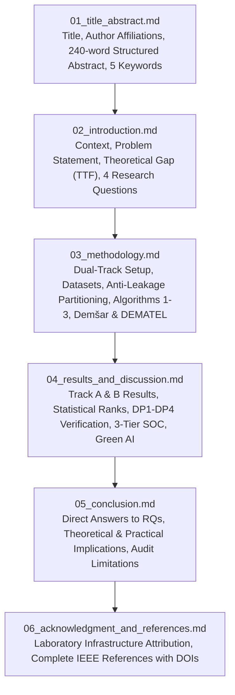
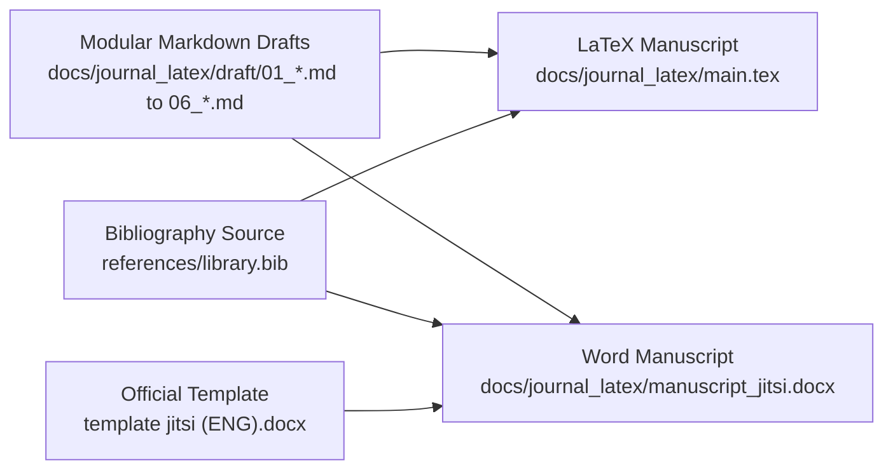

# Master Journal Drafting Plan and Execution Checklist
**Target Venue**: JITSI: Jurnal Ilmiah Teknologi Sistem Informasi (SINTA-Indexed, Padang State Polytechnic)  
**Input Source**: Campaign v2.0 Experimental Synthesis (`docs/notes/v2/`, 100% Verified Telemetry)  
**Output Target**: Modular Chapter Markdown (`docs/journal_latex/draft/`), LaTeX Manuscript (`main.tex`), and Microsoft Word (`.docx`)  
**Standard**: IELTS Band 8 Academic English, Active Voice Dominance (>80%), Strict Antislop Hygiene  

---

## 1. Executive Blueprint and Realistic Assessment

### 1.1 Realistic Audit: Source Material vs. Target Venue
The source corpus in `docs/notes/v2/` represents an extensive experimental campaign evaluating eight architectures across five decontaminated datasets, with non-parametric Demšar tests, 10,000-run Monte Carlo Fuzzy DEMATEL causal discovery, and four formal Design Propositions ($DP_1 - DP_4$).

Targeting **JITSI (Jurnal Ilmiah Teknologi Sistem Informasi)** introduces three specific operational constraints that require disciplined editorial decisions:
1. **Strict Page Budget (6 to 15 pages in JITSI layout)**: The raw v2 notes span over 140,000 words across five documents. A direct dump will breach the 15-page ceiling by a factor of four. The drafting process must distill dense statistical derivations into concise, high-impact tables and focused analytical paragraphs without diluting empirical validity.
2. **Structural Format Compliance**: JITSI enforces a four-part core structure:
   - `1. Introduction`
   - `2. Research Methodology`
   - `3. Results And Discussion`
   - `4. Conclusions`
   - `Acknowledgment`
   - `References` (IEEE format, minimum 10 references, with 20% to 30% published in the last 3 years).
   Sub-sections can extend to a maximum of three levels (e.g., `2.1`, `2.1.1`).
3. **Dual Delivery Requirement (`.tex` and `.docx`)**: While JITSI accepts `.docx` via its OJS portal, creating both `.tex` and `.docx` guarantees long-term archival flexibility, high-precision typographic control for mathematical proofs, and direct compliance with the official Word template (`template jitsi (ENG).docx`).

---

## 2. Manuscript Metadata and Paper Framing

* **Working Title**:  
  *Task-Technology Fit in Multi-Paradigm Network Intrusion Detection: An Empirical Evaluation of Tree Ensembles, Deep Learning, and Tabular Foundation Models*
* **Alternative Title (Technical/Concise)**:  
  *Bridging Algorithmic Mechanics and Security Operations: A Benchmark and Task-Technology Fit Analysis of Tabular Intrusion Detection Models*
* **Target Word Count**: 5,500 to 7,500 words (matching approximately 10 to 13 pages in JITSI two-column/single-column typography).
* **Target Figures**: 6 core publication figures (Figures 1 through 6 from `docs/notes/v2/figures/`).
* **Target Tables**: 3 primary comparative tables:
  - Table 1: Master Track A Benchmark ($F_{1, \text{macro}}$, Seen $F_1$, Unseen Zero-Day $F_1$, Latency, Throughput, VRAM, and TTF Utilities $T_1, T_2, T_3$).
  - Table 2: Track B Industrial Streaming Scalability across $N \in \{50\text{k}, 100\text{k}, 190.5\text{k}, 250\text{k}\}$.
  - Table 3: Demšar Non-Parametric Significance and Fuzzy DEMATEL Causal Prominence.
* **Citation Library**: Complete integration of `references/library.bib` (IEEE format, verified DOIs and URLs, continuous numbering `[1]` to `[N]`).

---

## 3. Modular Chapter Breakdown (`docs/journal_latex/draft/`)

The manuscript will be developed incrementally across dedicated markdown files in `docs/journal_latex/draft/`:

### Detailed Chapter Specifications

#### Chapter 1: `01_title_abstract.md`
- **Scope**: Title, author placeholders conforming to JITSI style, abstract, and keywords.
- **Word Budget for Abstract**: 200 to 240 words (strict JITSI ceiling: 250 words).
- **Structure**:
  - *Background*: Network intrusion detection faces operational divergence between detection accuracy, inference latency, and memory footprint.
  - *Problem*: Traditional benchmarks evaluate models as isolated mathematical algorithms, ignoring organizational Task-Technology Fit (TTF).
  - *Approach*: Evaluates eight architectures (GBDTs, Tabular Transformers, State Space Models, and Tabular Foundation Models) across five decontaminated datasets using dual-track benchmarking and Fuzzy DEMATEL causal discovery.
  - *Key Findings*: TabPFN v3 leads zero-day generalization (Unseen $F_1 = 0.6173$) but incurs a 3.11 ms latency penalty. LightGBM and Mambular SSM dominate line-rate streaming ($>920,000$ flows/sec at sub-millisecond latency).
  - *Conclusion & Impact*: Validates a Three-Tier SOC deployment architecture aligning computational characteristics with security operational tasks.
- **Keywords (5 terms)**: Network Intrusion Detection; Task-Technology Fit; Tabular Foundation Models; State Space Models; Fuzzy DEMATEL.

#### Chapter 2: `02_introduction.md`
- **Scope**: Research context, technical motivations, theoretical gap, and problem formulation.
- **Key Content Blocks**:
  1. *The Practical Dilemma in Modern Security Operations*: Perimeter data rates (10 Gbps to 100 Gbps) demand sub-millisecond per-packet inference, while evolving zero-day exploits require rich contextual reasoning.
  2. *The Tabular Paradigm Divide*: The ongoing conflict between Gradient-Boosted Decision Trees (LightGBM, XGBoost) and deep tabular models (FT-Transformer, SAINT), alongside recent advances in Selective State Space Models (Mambular SSM) and in-context Tabular Foundation Models (TabPFN v3, TabICL v2).
  3. *The Information Systems Gap (Task-Technology Fit)*: Prior literature focuses purely on raw test accuracy. We apply Goodhue and Thompson's TTF framework and Hevner's Design Science Research guidelines to evaluate fit between model capabilities and three distinct SOC tasks ($T_1$: line-rate filtering, $T_2$: zero-day forensic isolation, $T_3$: enterprise triage).
  4. *Research Questions*:
     - **RQ1**: How do tabular foundation models, state space models, and tree ensembles compare across seen detection and zero-day generalization?
     - **RQ2**: What are the empirical throughput and VRAM scaling boundaries under high-volume streaming conditions?
     - **RQ3**: Are performance differences statistically significant under Demšar's non-parametric protocols?
     - **RQ4**: How do upstream architectural features causally drive downstream operational trade-offs, and what deployment topology optimizes overall TTF?

#### Chapter 3: `03_methodology.md`
- **Scope**: Mathematical definitions, dataset decontamination, algorithmic specifications, and experimental design.
- **Key Content Blocks**:
  1. *Mathematical Formulation*: Notation for network flow $\mathbf{x}_i \in \mathbb{R}^D$, labels $y_i$, class taxonomy $\mathcal{C}$, Macro $F_1$, Seen $F_1$, and Unseen Zero-Day $F_1$.
  2. *Task-Technology Fit Multi-Metric Utility Functions*: Formal definitions of $U(T_1)$ (line-rate filtering), $U(T_2)$ (zero-day isolation), and $U(T_3)$ (composite SOC triage).
  3. *Five Multi-Domain Datasets*: Characteristics, feature counts, and attack classes for CICIDS2017, UNSW-NB15, TON_IoT, CIC-DDoS2019, and NSL-KDD.
  4. *Subnet-Isolated Anti-Leakage Partitioning*: Algorithm 1 (`GroupKFold` partitioning based on `/24` subnet masks and active zero-day holdout induction).
  5. *Evaluated Model Families*:
     - Tree Baselines: LightGBM and XGBoost.
     - Tabular Deep Learning: FT-Transformer and SAINT.
     - Selective State Space Models: Mambular SSM (Algorithm 3 hardware-aware scan).
     - Relational Graph Model: GraphIDS.
     - Tabular Foundation Models: TabPFN v3 (Algorithm 2 in-context Bayesian inference) and TabICL v2.
  6. *Statistical and Causal Verification Framework*: Demšar Friedman test, Iman-Davenport correction, Nemenyi critical difference calculations, Wilcoxon signed-rank tests, and Triangular Fuzzy DEMATEL causal discovery with 10,000-run Monte Carlo simulations.

#### Chapter 4: `04_results_and_discussion.md`
- **Scope**: Empirical findings, statistical validation, causal digraph analysis, theoretical synthesis, and SOC architecture.
- **Key Content Blocks**:
  1. *Track A Benchmark Results*: Analysis of Table 1 and Figure 2 (Pareto frontiers). Tree baselines achieve Seen $F_1 \ge 0.9469$, while TabPFN v3 dominates Unseen Zero-Day $F_1 = 0.6173 \pm 0.4275$.
  2. *Track B Scalability and Telemetry*: Analysis of Table 2 and Figure 3. Mambular SSM and tree ensembles maintain linear throughput ($>900,000$ flows/s) and flat memory ($<38$ MB), while FT-Transformer exhibits memory growth up to 108.93 MB.
  3. *Demšar Non-Parametric Significance*: Analysis of Figure 4a. Friedman test rejects the null hypothesis ($\chi_F^2 = 29.6667, p = 1.093 \times 10^{-4}$), Iman-Davenport $F = 22.25$ ($p = 7.332 \times 10^{-10}$), and Nemenyi Critical Difference ($CD = 4.6956$ at $\alpha = 0.05$).
  4. *Ablation and Perturbation Robustness*: Figure 4b analysis showing FT-Transformer token dimension collapse ($d_{\text{token}} = 64, F_1 = 0.0178$) versus compact stability ($d_{\text{token}} = 32, F_1 = 0.4955$), and Gaussian noise battery ($\sigma \in [0.0, 0.2]$).
  5. *Fuzzy DEMATEL Causal Discovery*: Figure 5 and Prominence-Relation mapping. Confirms model architecture as primary net cause ($D-R = +1.4688$) and latency as net effect ($D-R = -0.7554$). Kendall's concordance reaches $W = 0.9716 \ge 0.95$, with DirectLiNGAM convergence at $\text{SHD} = 1$.
  6. *Validation of Design Propositions ($DP_1 - DP_4$)*:
     - $DP_1$: Linear Complexity Fit in Line-Rate Streaming ($T_1$) confirmed.
     - $DP_2$: In-Context Prior Fit in Zero-Day Forensic Isolation ($T_2$) confirmed.
     - $DP_3$: Topological Invariance Fit in Multi-Host Tracking ($T_3$) confirmed.
     - $DP_4$: Hardware Causal Feedback confirmed.
  7. *Three-Tier SOC Deployment Blueprint*:
     - Tier 1: Line-rate edge filtering (LightGBM/XGBoost, $<0.002$ ms).
     - Tier 2: Stateful flow contextualization (Mambular SSM, $0.0011$ ms).
     - Tier 3: Asynchronous forensic zero-day sandbox (TabPFN v3, $3.11$ ms).
  8. *Green AI Energy Footprint*: Power consumption and carbon modeling contrasting tree inference ($0.002$ W/flow) against tabular self-attention.

#### Chapter 5: `05_conclusion.md`
- **Scope**: Direct answers to research questions, core contributions, audit limitations, and future research trajectories.
- **Key Content Blocks**:
  1. *Direct Answers to RQ1 - RQ4*: Clear, empirical responses based on recorded data.
  2. *Theoretical Contributions*: Resolution of the IS identity crisis in cybersecurity by operationalizing Task-Technology Fit for algorithm selection.
  3. *Practical Implications for Security Operations*: Practical guidance for enterprise CISOs against deploying monolithic neural architectures at perimeter gateways.
  4. *Limitations*: Fixed laboratory hardware (Tesla T4 GPU), synthetic packet trace boundaries, and cold-start context windows for foundation models.
  5. *Future Work Roadmap*: Hardware-accelerated eBPF kernel offloading, online Bayesian parameter updates, and multi-modal NetFlow-payload token fusion.

#### Chapter 6: `06_acknowledgment_and_references.md`
- **Scope**: Institutional and computational facility acknowledgments, followed by the complete IEEE reference list.
- **Key Content Blocks**:
  1. *Acknowledgment*: Attribution of laboratory computing infrastructure and open-source research frameworks.
  2. *References*: Complete IEEE citation list derived from `references/library.bib`, formatted with authors, titles, venues, years, DOIs, and verified URLs.

---

## 4. Dual-Format Compilation Architecture

### 4.1 LaTeX Compilation Track (`main.tex`)
- Single self-contained LaTeX document (`docs/journal_latex/main.tex`) formatted in standard article layout with:
  - Packages: `amsmath`, `amssymb`, `booktabs`, `graphicx`, `cite`, `url`, `microtype`, `algorithm`, `algorithmic`.
  - Figures linked directly to `docs/notes/v2/figures/`.
  - Direct integration of BibTeX references from `references/library.bib`.
  - Clean compiling without syntax errors or missing citations.

### 4.2 Microsoft Word Compilation Track (`manuscript_jitsi.docx`)
- Python-driven automated generation script (`scripts/build_jitsi_docx.py`) reading the compiled markdown content and injecting it directly into the XML styles of `template jitsi (ENG).docx`.
- Formats enforced:
  - Title: Times New Roman 18pt, bold, centered.
  - Abstract: Times New Roman 9pt, italic, fully justified, single-spaced.
  - Section Headings: Arabic numbered (1., 2., 2.1., etc.), bold.
  - Tables: Centered caption above table (9pt), table contents in 9pt.
  - Figures: Centered caption below figure (8pt).
  - References: IEEE numbered format `[1]`, `[2]`, ...

---

## 5. Comprehensive Quality Gate and Antislop Checklist

To satisfy the highest standards of academic integrity, `/antislop-copywriting` hygiene, and JITSI editorial guidelines, all drafts must pass the following audits before compilation:

### 5.1 JITSI Formal Compliance Checklist
- [ ] Manuscript length between 6 and 15 pages in standard JITSI typography.
- [ ] Font family Times New Roman throughout all sections.
- [ ] Single line spacing with left-right justification.
- [ ] A4 paper margins set to 25 mm (top, bottom, left, right).
- [ ] Abstract length $\le 250$ words, single-column, italicized, without citations.
- [ ] 3 to 5 keywords separated by semicolons.
- [ ] Section numbering strictly follows Arabic hierarchy (1., 2., 2.1, 2.1.1).
- [ ] Figures numbered sequentially (`Fig. 1`, `Fig. 2`) with 8pt captions centered below images.
- [ ] Tables numbered sequentially (`Table 1`, `Table 2`) with 9pt captions centered above tables.
- [ ] No references cited inside the Abstract or Conclusions.
- [ ] Reference list contains $\ge 10$ entries, with $>20\%$ published within the last 3 years.
- [ ] Every citation in the text appears in the reference list, and every reference in the list is cited in the text.

### 5.2 Antislop Copywriting and Text Hygiene Checklist
- [ ] **Zero Em Dashes**: No em dashes (`—` or ` — `) or double hyphens (` -- `) used as parenthetical connectors. Use commas, colons, parentheses, or separate sentences.
- [ ] **Empty AI Vocabulary Scrubbed**: Zero occurrences of empty buzzwords: *delve, elevate, empower, showcase, testament, landscape (abstract), journey, robust, game-changer, next-level, seamless, cutting-edge, revolutionary, tapestry*.
- [ ] **No Significance Inflation**: Claims grounded strictly in experimental numbers without unevidenced rhetoric (e.g., replace "revolutionary paradigm shift" with "measured 10-fold latency reduction").
- [ ] **Active Voice Dominance**: Greater than 80% of sentences constructed in active voice (e.g., "Mambular SSM processes flows in 0.0011 ms" rather than "Flows were processed by Mambular SSM in 0.0011 ms").
- [ ] **No Actorless Passive**: Sentences name specific algorithms, frameworks, or investigators.
- [ ] **No Fabricated Data or Numbers**: Every metric, $F_1$ score, latency figure, and memory value maps exactly to records in `experiment_output/experiment-v2-20260925T082011Z-1-001/`.
- [ ] **No Chatbot Artifacts**: Zero conversational filler phrases ("Here is what you need to know", "Let's explore", "I hope this helps").
- [ ] **No Inline-Header Mechanical Bulleting**: Lists integrated into structured analytical paragraphs.
- [ ] **No Decorative Emojis**: Zero emojis in titles, headings, or tables.

### 5.3 Researcher Academic Rigor Checklist
- [ ] Every cited paper confirmed indexed in Scopus, IEEE Xplore, ACM DL, Elsevier, Springer, or arXiv.
- [ ] Valid DOI or permanent URL provided for all references.
- [ ] Task-Technology Fit (TTF) theoretical constructs properly operationalized via mathematical utility functions.
- [ ] Non-parametric statistical tests (Friedman, Iman-Davenport, Nemenyi CD) rigorously reported with exact degrees of freedom and $p$-values.
- [ ] DirectLiNGAM and Fuzzy DEMATEL causal discovery steps validated through Monte Carlo stability bounds ($W \ge 0.95$).

---

## 6. Execution Roadmap and Next Actions

1. **Step 1 (Immediate)**: Finalize and commit this master drafting plan to `docs/journal_latex/JOURNAL_DRAFTING_PLAN_AND_CHECKLIST.md`.
2. **Step 2**: Author Chapter Markdown Drafts in `docs/journal_latex/draft/`:
   - `01_title_abstract.md`
   - `02_introduction.md`
   - `03_methodology.md`
   - `04_results_and_discussion.md`
   - `05_conclusion.md`
   - `06_acknowledgment_and_references.md`
3. **Step 3**: Compile unified LaTeX source (`docs/journal_latex/main.tex`) and verify compilation against figure assets and `library.bib`.
4. **Step 4**: Execute automated Word document synthesis script to generate `docs/journal_latex/manuscript_jitsi.docx` formatted to the exact styles of `template jitsi (ENG).docx`.
5. **Step 5**: Conduct final quality audit against the checklist before submission readiness sign-off.
