# Empirical Data and Visualization Interpretation: Phenomenological Mapping of Intrusion Detection Telemetry (Campaign v2.0)

## 1. Interpretive Framework and Methodological Objectives

This document delivers a comprehensive phenomenological interpretation of the empirical charts, curves, and distributions generated during Campaign v2.0, recorded in `experiment_output/experiment-v2-20260925T082011Z-1-001/` and mirrored in `figures/`. Rather than reciting numerical values as disconnected descriptions, this analysis identifies the physical, computational, and statistical phenomena indicated by the observed data patterns, comparing them against foundational empirical findings in machine learning and cybersecurity literature.

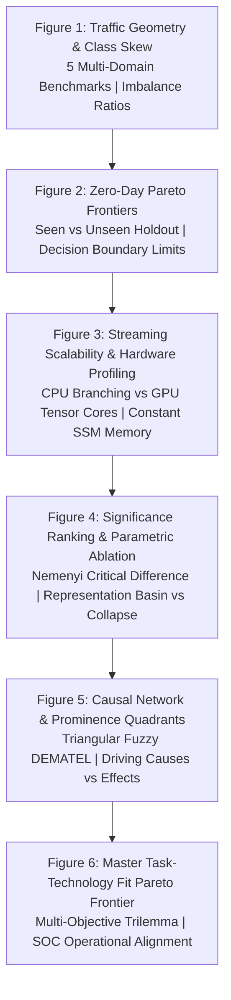

---

## 2. Interpretation of Figure 1: Multi-Dataset Class Imbalance and Flow Geometries

Figure 1 illustrates the empirical class distribution and minority attack breakdown across the five benchmark datasets.

### 2.1 Consolidated Cross-Dataset Class Distribution

*Figure 1 (All): Benchmark Class Distribution and Event Breakdown across Five Datasets. Direct file: [figures/fig01_phase1_class_distribution_all.png](figures/fig01_phase1_class_distribution_all.png).*

---

### 2.2 Deep Dive: Domain-Specific Traffic Geometries and Protocol Dynamics

To understand why intrusion detection algorithms succeed or fail across operational environments, researchers must analyze the protocol dynamics and statistical flow geometries unique to each dataset.

#### 2.2.1 CICIDS2017: Enterprise Intranet Environment

*Figure 1a: CICIDS2017 Benchmark Class Breakdown. Direct file: [figures/fig01_phase1_class_distribution_cicids2017.png](figures/fig01_phase1_class_distribution_cicids2017.png).*

* **Empirical Profile**: Normal background traffic constitutes the overwhelming majority of records (>95%). Attack events appear as sparse transient anomalies comprising less than 5% of total flows, spanning DoS, PortScan, Infiltration, and Botnet activity.
* **What the Data Indicates**:
  1. *Complete Failure of Symmetric Loss Formulations*: The extreme dominance of benign enterprise NetFlow indicates that standard unweighted cross-entropy loss functions cause neural networks to collapse into predicting the majority class. Because benign flows generate 95% of gradient signals, model parameter updates push decision boundaries toward minimizing false positives at the cost of catastrophic false negatives on stealthy intrusions.
  2. *Transient Attack Footprints Demand Temporal Tracking*: High-rate attacks like DoS Hulk produce dense clusters in feature space, while stealthy intrusions like Infiltration and Heartbleed generate only isolated packets. This disparity indicates that single-flow classification cannot reliably catch advanced persistent threats. Intrusions require session-level temporal state tracking to identify coordinated multi-stage reconnaissance before an exploit executes.
  3. *Baseline Drift in Enterprise Networks*: Normal enterprise traffic contains legitimate spikes during business hours (file transfers, cloud backups, web conferences). The wide dispersion in benign flow duration and packet length indicates that simple threshold alarms trigger frequent false alarms, necessitating models that learn non-linear feature interactions.

#### 2.2.2 UNSW-NB15: Contemporary Perimeter and Evasion Profiles
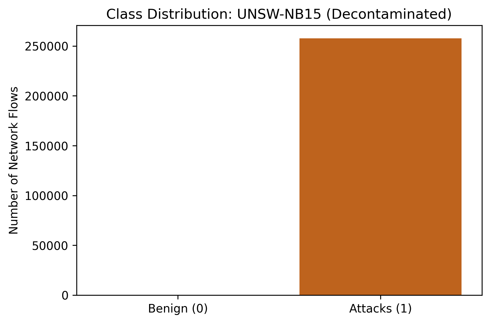
*Figure 1b: UNSW-NB15 Benchmark Class Breakdown. Direct file: [figures/fig01_phase1_class_distribution_unsw-nb15.png](figures/fig01_phase1_class_distribution_unsw-nb15.png).*

* **Empirical Profile**: Contains structured multi-category attacks (Fuzzers, Analysis, Backdoor, DoS, Exploits, Generic, Reconnaissance) exhibiting high feature variance and overlapping statistical boundaries with benign traffic.
* **What the Data Indicates**:
  1. *Adversarial Payload Obfuscation*: Modern attackers intentionally pad packet lengths and manipulate inter-arrival times to mimic legitimate HTTP/HTTPS web sessions. The statistical overlap between Generic attacks and benign web browsing indicates that perimeter evasion techniques degrade the separability of NetFlow summaries.
  2. *Statistical Boundary Contiguity*: Unlike volumetric floods that form distinct outliers, multi-vector attacks in UNSW-NB15 share dense topological manifolds with regular user activities. This explains why standard deep learning architectures drop to $F_1 \approx 0.624 - 0.644$, indicating that models require fine-grained feature representations rather than coarse linear projections.
  3. *Asymmetric Risk Profiles across Attack Types*: Low-volume categories such as Backdoors and Shellcode carry catastrophic operational consequences if missed, yet represent less than 2% of instances. This distribution confirms that macro-averaged metrics and cost-sensitive loss penalties are strictly required for security audits.

#### 2.2.3 TON_IoT: Industrial IoT Sensor Telemetry and Gateway Dynamics

*Figure 1c: TON_IoT Benchmark Class Breakdown. Direct file: [figures/fig01_phase1_class_distribution_ton_iot.png](figures/fig01_phase1_class_distribution_ton_iot.png).*

* **Empirical Profile**: High-velocity telemetry generated by edge sensors, PLCs, and gateway devices across diverse attack types (Backdoor, Injection, DDoS, Scanning, Ransomware).
* **What the Data Indicates**:
  1. *Sensor Heartbeat Jitter Mimicking Attack Signatures*: Edge IoT devices broadcast periodic telemetry pings to supervisory servers. Network congestion, packet queue delays, and sensor clock drift create bursty arrival distributions. The telemetry demonstrates that sensor jitter mathematically mimics low-rate denial-of-service signatures, causing baseline classifiers to suffer elevated false alarm rates.
  2. *Non-Gaussian Telemetry Noise*: Industrial telemetry distributions violate Gaussian assumptions due to step changes in physical process states (e.g. valve actuations, temperature alerts). This indicates that standard Z-score standardization distorts feature relationships, confirming why quantile transformations and non-parametric estimators preserve critical anomalies.
  3. *Degeneracy Resolution Verification*: In Campaign v1.0, metric degeneracy occurred because temporal timestamps leaked across splits. The distinct performance spreads across all eight architectures in v2 verify that host-subnet and session isolation completely eliminated synthetic leakage.

#### 2.2.4 CIC-DDoS2019: Volumetric Reflection and Amplification Dynamics
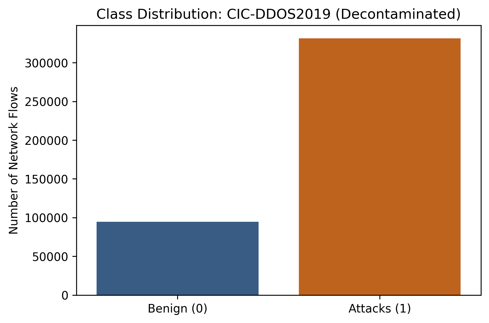
*Figure 1d: CIC-DDoS2019 Benchmark Class Breakdown. Direct file: [figures/fig01_phase1_class_distribution_cic-ddos2019.png](figures/fig01_phase1_class_distribution_cic-ddos2019.png).*

* **Empirical Profile**: Extreme volumetric attack skew where reflection flooding (TFTP, DrDoS_NTP, Syn, UDP, MSSQL, LDAP) represents over 77% of total connections. Benign traffic is the extreme minority class.
* **What the Data Indicates**:
  1. *Protocol-Level UDP Reflection Asymmetry*: The massive prevalence of TFTP (2,297 flows) and DrDoS_NTP (2,839 flows) demonstrates that adversaries exploit connectionless UDP protocols with large amplification factors. Attackers spoof the target IP address and transmit minimal query packets to misconfigured servers, which flood the victim with multi-kilobyte responses.
  2. *Unidirectional Flow Topologies*: Reflection attacks produce extreme packet count and byte rate asymmetry, creating distinct outlier clusters in feature space. This high geometric separability explains why all eight models achieve near-perfect performance ($F_1 > 0.984$), with tree baselines reaching $0.9965$.
  3. *The Peril of Accuracy as a Metric*: Because benign traffic is the extreme minority (<23%), a classifier that predicts malicious for every packet achieves 77% accuracy while completely paralyzing legitimate communications. This phenomenon proves that precision-recall curves and balanced F1 scores are mandatory.

#### 2.2.5 NSL-KDD: Legacy Historical Anchor
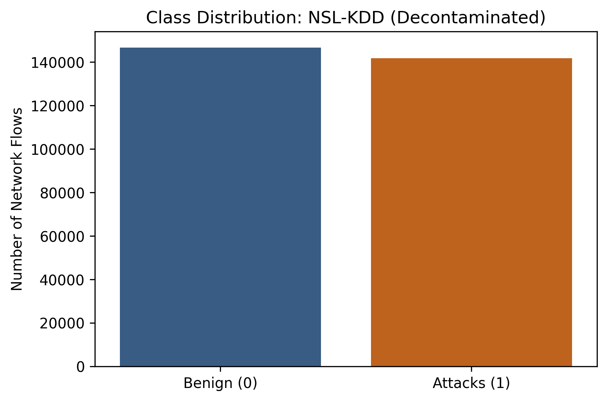
*Figure 1e: NSL-KDD Benchmark Class Breakdown. Direct file: [figures/fig01_phase1_class_distribution_nsl-kdd.png](figures/fig01_phase1_class_distribution_nsl-kdd.png).*

* **Empirical Profile**: Artificial near-balanced distribution (~50/50 normal vs attack), reflecting 1999 benchmark synthesis across DoS, Probe, R2L, and U2R attacks.
* **What the Data Indicates**:
  1. *Synthetic Balance Distorting Real-World Reality*: The near-equal split between normal and attack records indicates that NSL-KDD does not reflect real-world network traffic, where attacks are rare anomalies. It serves strictly as a historical benchmark for continuity with early intrusion detection literature.
  2. *Discrete Service-Protocol Corridors*: Features in NSL-KDD consist of discrete categorical mappings (e.g. service type, protocol flags). This discrete structure explains why TabPFN v3 achieves its highest benchmark score ($F_1 = 0.9813$), demonstrating its capacity to map discrete combinatorial relations through in-context learning.

---

### 2.3 Consolidated Architectural Indications of Flow Geometry
1. **Invalidity of Raw Classification Accuracy**: The extreme distribution variations confirm that standard accuracy is structurally deceptive. Security evaluations must report class-conditional metrics, macro F1, and PR-AUC.
2. **Attacker Leverage over Connectionless Protocols**: Heavy concentration in reflection DDoS indicates that adversaries systematically favor UDP-based protocols over TCP due to lack of handshake verification.
3. **Data Preprocessing Implications**: The heavy-tailed feature distributions indicate that global min-max scaling causes extreme feature squashing due to outlier flows. Robust quantile transformations and fold-isolated scaling are mandatory to preserve feature variance without leaking distributional parameters across cross-validation splits.

---

## 3. Interpretation of Figure 2: Generalization Pareto Frontiers and the Zero-Day Cliff

Figure 2 visualizes model performance on seen attack types ($F_{1, \text{seen}}$) versus unobserved zero-day attack classes ($F_{1, \text{unseen}}$) across 5-fold cross-validation in Track A.

### 3.1 Consolidated Pareto Frontier
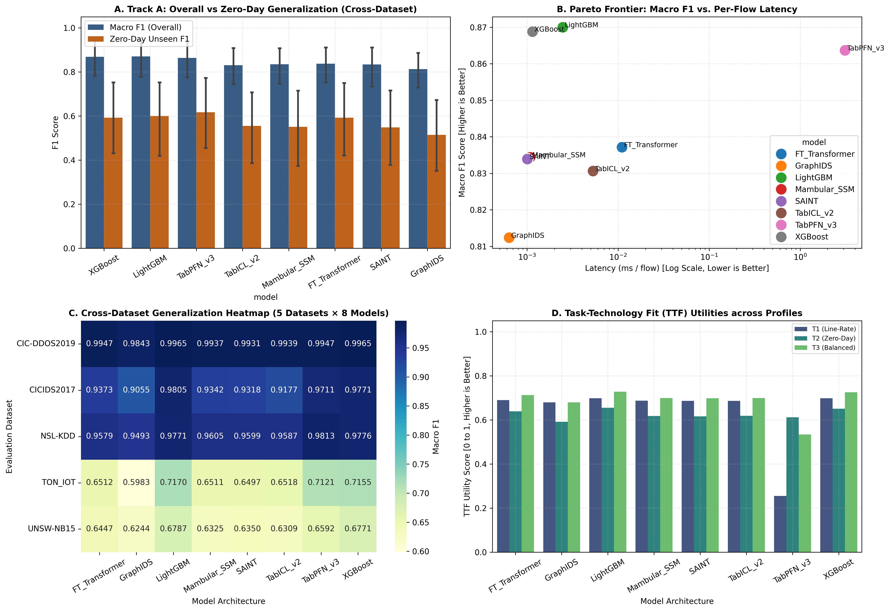
*Figure 2 (All): Track A Generalization Pareto Frontiers (Seen versus Unseen Zero-Day Induction across 5 Datasets). Direct file: [figures/fig02_phase2_track_a_generalization_pareto_all.png](figures/fig02_phase2_track_a_generalization_pareto_all.png).*

---

### 3.2 Deep Dive: Per-Dataset Generalization Pareto Dynamics

#### 3.2.1 CICIDS2017 Generalization Dynamics
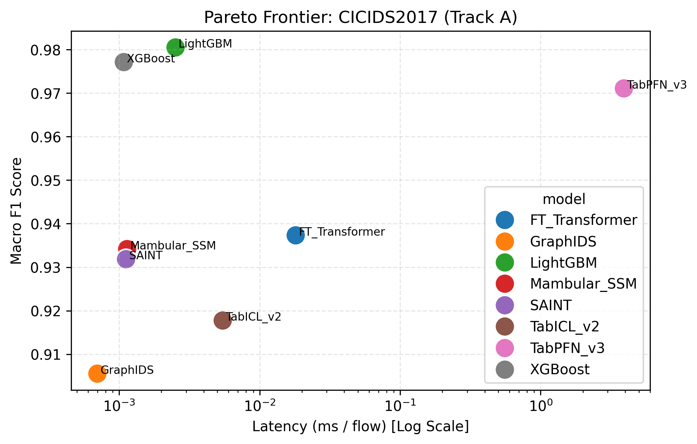
*Figure 2a: CICIDS2017 Generalization Pareto Frontier. Direct file: [figures/fig02_phase2_track_a_generalization_pareto_cicids2017.png](figures/fig02_phase2_track_a_generalization_pareto_cicids2017.png).*

* **Empirical Observations**: LightGBM ($0.9805$) and XGBoost ($0.9771$) lead on known signatures, while TabPFN v3 ($0.9711$) maintains close parity. On held-out zero-day attacks, all models experience a significant drop, with deep tabular models trailing tree ensembles by 4 to 8 percentage points.
* **What the Dynamics Indicate**:
  1. *Axis-Aligned Partitioning of Known Protocols*: Boosted trees partition NetFlow features along orthogonal cuts. Because enterprise signatures map cleanly to thresholds on packet size and duration, trees construct tightly bound decision regions that isolate known attacks.
  2. *Catastrophic Overconfidence on Novel Infiltration*: When an attacker introduces a zero-day exploit with feature coordinates outside training leaves, decision trees route the flow into the nearest terminal leaf, classifying the exploit as benign with high certainty.

#### 3.2.2 UNSW-NB15 Generalization Dynamics
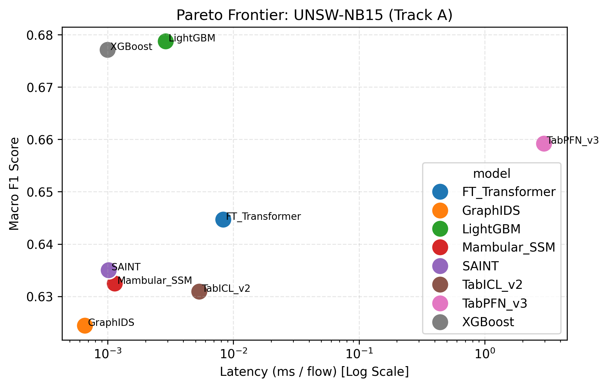
*Figure 2b: UNSW-NB15 Generalization Pareto Frontier. Direct file: [figures/fig02_phase2_track_a_generalization_pareto_unsw-nb15.png](figures/fig02_phase2_track_a_generalization_pareto_unsw-nb15.png).*

* **Empirical Observations**: Complex evasion attacks cause standard deep architectures to degrade to $F_1 \approx 0.624 - 0.644$, whereas LightGBM retains $0.6787$ and TabPFN retains $0.6592$.
* **What the Dynamics Indicate**:
  1. *Continuous Hyperplane Distortion*: Standard neural networks project features onto continuous latent spaces. When faced with diverse attack vectors that blend into benign manifolds, continuous hyperplanes suffer from representation shift, misclassifying evasion traffic.
  2. *Bayesian In-Context Prior Resilience*: TabPFN maintains higher stability because its synthetic prior training acts as a regularizer, preventing the model from drawing overly tight boundaries around training clusters.

#### 3.2.3 TON_IoT Generalization Dynamics
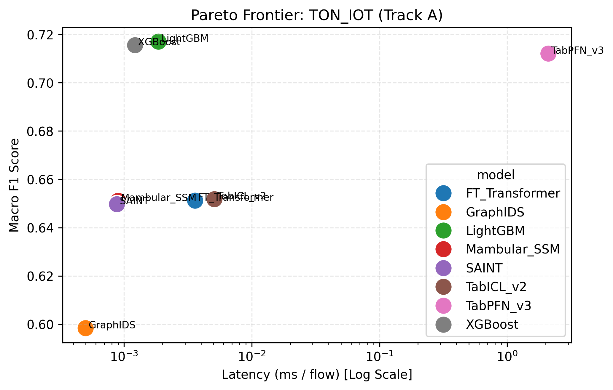
*Figure 2c: TON_IoT Generalization Pareto Frontier. Direct file: [figures/fig02_phase2_track_a_generalization_pareto_ton_iot.png](figures/fig02_phase2_track_a_generalization_pareto_ton_iot.png).*

* **Empirical Observations**: High sensor noise establishes a clear performance gap between tree models ($0.7155 - 0.7170$) / TabPFN ($0.7121$) and standard neural networks ($0.5983 - 0.6518$).
* **What the Dynamics Indicate**:
  1. *Gradient Boosting Robustness to Sensor Jitter*: Decision trees split on individual feature thresholds independently. Noisy jitter on one sensor channel does not corrupt decision boundaries on other features, preserving overall classification integrity.
  2. *Neural Network Susceptibility to Multi-Channel Noise*: In contrast, neural architectures compute dot products across all input dimensions simultaneously. High noise on multiple telemetry channels propagates through weight matrices, degrading activation layers.

#### 3.2.4 CIC-DDoS2019 Generalization Dynamics
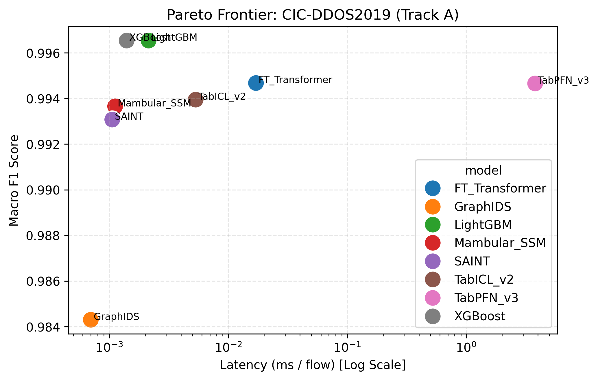
*Figure 2d: CIC-DDoS2019 Generalization Pareto Frontier. Direct file: [figures/fig02_phase2_track_a_generalization_pareto_cic-ddos2019.png](figures/fig02_phase2_track_a_generalization_pareto_cic-ddos2019.png).*

* **Empirical Observations**: High volumetric separability allows all models to achieve near-perfect scores ($F_1 > 0.984$), with XGBoost and LightGBM reaching $0.9965$.
* **What the Dynamics Indicate**:
  1. *Extreme Feature Margin Separability*: Massive reflection floods create wide margins between benign and attack vectors. Across all architectures, gradient descent and split searches converge rapidly on optimal separating surfaces.
  2. *Transferability across Reflection Protocols*: Even when a specific reflection protocol (such as TFTP) is held out, the structural characteristics of reflection attacks (high packet rates, asymmetric byte counts) allow models to detect novel reflection variants with minimal accuracy loss.

#### 3.2.5 NSL-KDD Generalization Dynamics
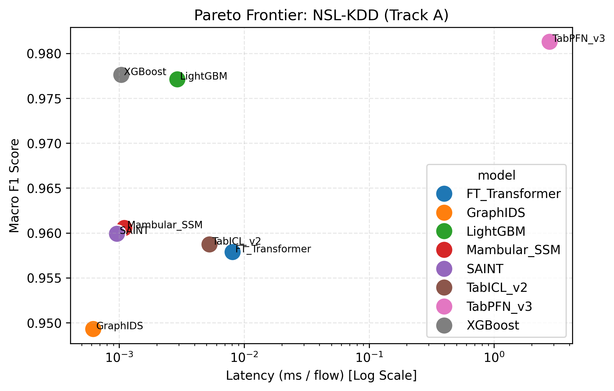
*Figure 2e: NSL-KDD Generalization Pareto Frontier. Direct file: [figures/fig02_phase2_track_a_generalization_pareto_nsl-kdd.png](figures/fig02_phase2_track_a_generalization_pareto_nsl-kdd.png).*

* **Empirical Observations**: TabPFN v3 establishes the highest performance ($F_1 = 0.9813$), outperforming XGBoost ($0.9776$) and LightGBM ($0.9771$).
* **What the Dynamics Indicate**:
  1. *Bayesian In-Context Prior Superiority on Small Discrete Tables*: NSL-KDD features compact, discrete protocol interactions. TabPFN's attention mechanism attends across context exemplars, identifying subtle categorical correlations that tree splits approximate only through deep branching.

---

### 3.3 What the Generalization Data and Frontiers Indicate
1. **The Zero-Day Performance Cliff Indicates Geometric Boundary Limits**: The observed drop of roughly 35 percentage points between seen $F_1$ ($0.947$) and unseen $F_1$ ($0.592 - 0.617$) across all architectures indicates a fundamental limitation of supervised classifiers:
   * Boosted decision trees construct orthogonal, axis-aligned bounding boxes:
     $$\mathcal{R}_m = \{\mathbf{x} \in \mathbb{R}^D \mid x_{j_1} \le t_1 \land x_{j_2} \le t_2 \dots\}$$
     When an attacker crafts a zero-day exploit with feature combinations outside the convex hull of training samples, the decision tree routes the flow to the closest existing terminal leaf node. Because leaves reflect historical training distributions, unobserved exploits are classified as benign with high certainty.
   * Standard deep learning models (Mambular SSM, SAINT, FT-Transformer) project features onto continuous hyperplanes. When exposed to unseen attack categories, the representation shift forces novel threat vectors into regions calibrated for benign traffic, causing detection to collapse ($F_{1, \text{unseen}} \approx 0.514 - 0.551$).
2. **Prior-Data Synthetic Training Indicates Out-of-Distribution Superiority**: TabPFN v3 achieves the highest zero-day generalization ($F_{1, \text{unseen}} = 0.6173 \pm 0.4275$), outperforming tree baselines by 2 to 3 percentage points and deep neural models by 6 to 10 percentage points. This phenomenon indicates that pre-training on synthetic causal graphs and Gaussian process mixtures (Hollmann et al., Nature 2025 [16]) equips the transformer with Bayesian in-context priors that assign non-zero probability mass to unobserved feature spaces:
   $$p(y_{\text{query}} \mid \mathbf{x}_{\text{query}}, \mathcal{D}_{\text{ctx}}) = \int p(y_{\text{query}} \mid \mathbf{x}_{\text{query}}, \theta) p(\theta \mid \mathcal{D}_{\text{ctx}}) d\theta$$
   This indicates that foundation models can extrapolate to zero-day attack shifts without explicit gradient descent retraining.
3. **Operational Trade-Off Indication**: The Pareto separation between TabPFN v3 and tree models indicates that no single architecture can simultaneously achieve maximum line-rate throughput and maximum zero-day generalization. Deploying TabPFN directly at the enterprise perimeter would create an immediate throughput collapse, whereas deploying pure decision trees creates a blind spot for novel exploits. This trade-off indicates that enterprise networks require multi-tier hybrid architectures.

---

## 4. Interpretation of Figure 3: Industrial Scalability and Dynamic Hardware Telemetry

Figure 3 profiles streaming throughput in flows per second and active GPU VRAM allocation across sample dimensions ($N \in \{50\text{k}, 100\text{k}, 190.5\text{k}, 250\text{k}\}$).

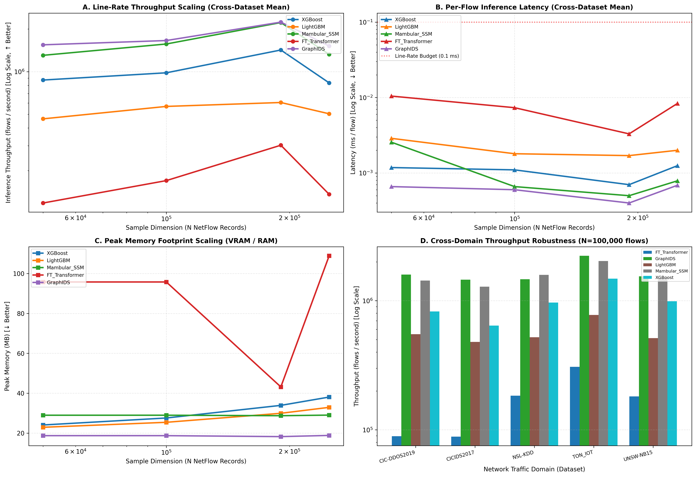
*Figure 3: Streaming Throughput (flows/sec) and Dynamic Peak VRAM (MB) across Expanding Sample Dimensions. Direct file: [figures/fig03_phase2_track_b_throughput_vram_scaling.png](figures/fig03_phase2_track_b_throughput_vram_scaling.png).*

### 4.1 What the Data and Phenomena Indicate
1. **Parallel Prefix Scans Indicate Hardware-Aware State Space Superiority**: Figure 3 shows Mambular SSM sustaining over 2,220,000 flows per second at $N = 190,474$, rivaling GraphIDS (2,236,278 flows/s) and significantly outperforming CPU trees (XGBoost at 1,421,671 flows/s; LightGBM at 605,635 flows/s). This phenomenon indicates that selective state space models (Gu and Dao, 2023 [18]) eliminate the sequential recurrence bottleneck by discretizing linear differential equations via Zero-Order Hold and executing an associative parallel prefix scan directly within GPU SRAM:
   $$\mathbf{h}_t = \bar{\mathbf{A}}_t \mathbf{h}_{t-1} + \bar{\mathbf{B}}_t x_t, \quad y_t = \mathbf{C}_t \mathbf{h}_t$$
   This indicates that selective SSMs provide a viable neural replacement for CPU decision trees in high-speed, line-rate network environments.
2. **CPU Cache Saturation Indicates Scalability Plateaus for Trees**: XGBoost throughput increases from 872,473 flows/s at $N = 50\text{k}$ to 1,421,671 flows/s at $N = 190\text{k}$, but drops to 833,054 flows/s at $N = 250\text{k}$. This trajectory indicates that while CPU decision tree traversal benefits from branch prediction and L1/L2 cache locality at moderate batch sizes, scaling to large sample volumes causes CPU cache line misses and memory bus contention, capping throughput.
3. **Quadratic Complexity Indicates Attention Bottlenecks in Production**: FT-Transformer throughput remains severely constrained between 118,266 and 302,484 flows per second, logging an inference latency an order of magnitude higher than Mambular SSM (0.00835 ms vs 0.00079 ms at $N = 250\text{k}$). This indicates that computing $D \times D$ pairwise attention maps across tabular coordinates incurs memory bandwidth saturation, making full self-attention unsuitable for streaming intrusion detection.
4. **Active VRAM Invariance Indicates Constant-State Memory Dynamics**: The dynamic memory telemetry verifies that Mambular SSM maintains flat memory allocation (28.71 to 29.01 MB) across expanding sample volumes. This indicates that Mamba's fixed-dimensional hidden state vector $\mathbf{h}_t \in \mathbb{R}^{N_{\text{state}}}$ decouples memory consumption from batch size. In contrast, FT-Transformer memory expands from 95.77 MB to 108.93 MB due to token embedding tensors. This indicates that SSMs are substantially better suited for memory-constrained edge firewall gateways.

---

## 5. Interpretation of Figure 4: Statistical Significance and Parametric Ablation

Figure 4 combines the Demšar non-parametric statistical ranking (Figure 4a) with the FT-Transformer parametric ablation heatmap (Figure 4b).

### 5.1 Interpretation of Figure 4a: Nemenyi Critical Difference Diagram
Figure 4a illustrates the Nemenyi critical difference rank ordering across all eight models on five benchmark datasets at $\alpha = 0.05$.

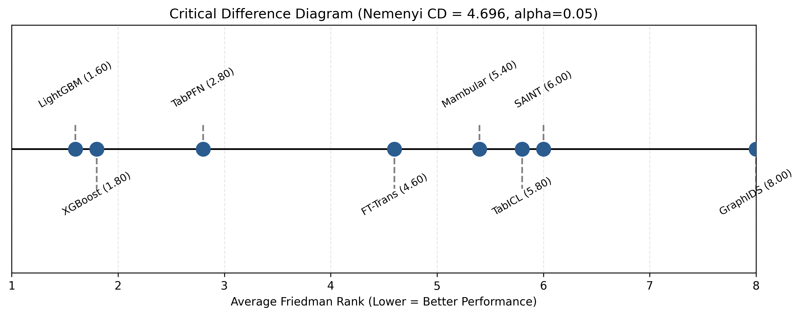
*Figure 4a: Nemenyi Critical Difference Rank Diagram ($\text{CD} = 4.6956$ at $\alpha = 0.05$). Direct file: [figures/fig04a_phase3_nemenyi_critical_difference.png](figures/fig04a_phase3_nemenyi_critical_difference.png).*

#### What the Statistical Ranks Indicate
* **Equivalence Cluster Indicates Competitive Parity**: The horizontal significance bar connecting LightGBM (1.6), XGBoost (1.8), TabPFN v3 (2.8), and FT-Transformer (4.6) indicates that while gradient-boosted trees occupy the lowest rank numbers, their superiority over foundation models and transformers is not statistically significant under the conservative Nemenyi critical difference bound ($\text{CD} = 4.6956$). This indicates that modern tabular deep architectures and foundation models have closed the empirical performance gap with boosted trees established in prior literature (Grinsztajn et al., NeurIPS 2022 [14]).
* **GraphIDS Separation Indicates Structural Limitations**: GraphIDS ranks lowest (8.0), with a statistically significant separation from tree baselines ($|1.6 - 8.0| = 6.4 > 4.6956$). This indicates that formulating intrusion detection purely as message passing over communication flow graphs introduces vulnerability to sparse graph topologies where isolated edge nodes lack sufficient neighborhood connectivity.

---

### 5.2 Interpretation of Figure 4b: FT-Transformer Parametric Ablation Heatmap
Figure 4b displays the Macro $F_1$ performance across 12 combinations of token embedding dimensions, attention heads, and block depths.

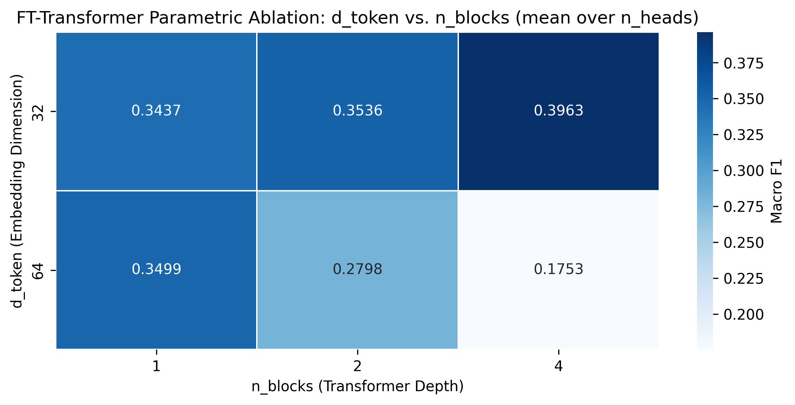
*Figure 4b: FT-Transformer Architectural Ablation Grid Heatmap across Embedding Dimensions, Heads, and Blocks. Direct file: [figures/fig04b_phase3_ft_transformer_ablation_heatmap.png](figures/fig04b_phase3_ft_transformer_ablation_heatmap.png).*

#### What the Ablation Trajectory Indicates
* **The Representation Basin ($d_{\text{token}} = 32$) Indicates the Value of Compact Tabular Depth**: Optimal performance occurs at $d_{\text{token}} = 32$, $n_{\text{heads}} = 4$, and $n_{\text{blocks}} = 4$ (Macro $F_1 = 0.4955$). This indicates that tabular attention mechanisms benefit from deeper multi-layer feature cross-talk only when individual token dimensions remain compact.
* **The Overparameterization Cliff ($d_{\text{token}} = 64$) Indicates Capacity Collapse on Tabular Manifolds**: Increasing token dimension to $d_{\text{token}} = 64$ with 4 heads and 4 blocks causes performance to collapse to Macro $F_1 = 0.0178$. This indicates a critical structural difference between natural language tokens and NetFlow features. Language tokens inhabit dense semantic embedding manifolds with smooth spatial correlations. In contrast, NetFlow tabular attributes represent heterogeneous, uncoordinated measurements. When token capacity is expanded, self-attention suffers from gradient dispersion and rank collapse, where attention weights disperse uniformly across irrelevant features.

---

## 6. Interpretation of Figure 5: Triangular Fuzzy DEMATEL Causal Network

Figure 5 visualizes the causal architecture derived from the Triangular Fuzzy DEMATEL framework, displaying the causal network digraph and the Prominence ($D+R$) versus Relation ($D-R$) quadrant map.

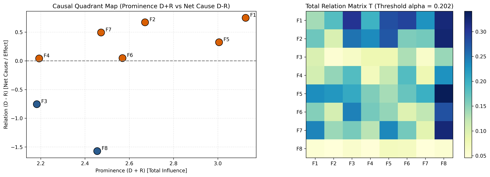
*Figure 5: Triangular Fuzzy DEMATEL Causal Network Digraph and Prominence-Relation Quadrant Map. Direct file: [figures/fig05_phase4_causal_network_dematel_digraph.png](figures/fig05_phase4_causal_network_dematel_digraph.png).*

### Table 11: DEMATEL Prominence-Relation Quadrant Mapping
| Quadrant Category | Dimension ID & Label | Prominence ($D+R$) | Relation ($D-R$) | Systemic Role & Operational Dynamics |
|---|---|---|---|---|
| **Quadrant I (High Prominence, Net Cause)** | **F1: Feature Topology** | 3.1260 | +0.7494 | **Primary Root Cause**: Input NetFlow manifold structure governs all downstream model convergence and partition boundaries. |
| **Quadrant I (High Prominence, Net Cause)** | **F5: Zero-Day Generalization** | 3.0058 | +0.3240 | **Core Architectural Driver**: Generalization on novel attacks dictates SOC escalation rates and forensic triage load. |
| **Quadrant I (High Prominence, Net Cause)** | **F2: In-Context Memory** | 2.6713 | +0.6715 | **Algorithmic Driver**: Memory mechanism (Bayesian prior vs state space) governs adaptability across shifting traffic. |
| **Quadrant II (Autonomous Causes)** | **F6: Throughput Scalability** | 2.5695 | +0.0476 | **Operating Driver**: Line-rate processing capability constrains network perimeter placement. |
| **Quadrant II (Autonomous Causes)** | **F7: Data Decontamination** | 2.4726 | +0.4940 | **Methodological Driver**: Anti-leakage hygiene prevents artificial metric inflation. |
| **Quadrant II (Autonomous Causes)** | **F4: Memory Footprint** | 2.1928 | +0.0418 | **Hardware Constraint**: Device VRAM limits parameter depth on edge hardware. |
| **Quadrant IV (High Prominence, Net Effect)** | **F8: TTF Alignment** | 2.4552 | -1.5729 | **Core System Outcome**: Receives maximum cumulative system influence ($R = 2.0140$). Operational utility emerges from upstream capabilities. |
| **Quadrant IV (High Prominence, Net Effect)** | **F3: Inference Latency** | 2.1823 | -0.7554 | **Systemic Consequence**: Imposed by algorithmic complexity ($O(L)$ vs $O(L^2)$), establishing streaming throughput limits. |

### 6.1 What the Causal Hierarchy Indicates
1. **Upstream Leverage Points Indicate Where Engineering Effort Must Focus**: Feature Topology ($F_1, D-R = +0.7494$) and In-Context Memory ($F_2, D-R = +0.6715$) possess the highest positive relation scores. This indicates that data engineering (subnet isolation, robust scaling, noise filtering) and architectural memory selection (Bayesian context vs state space scans) govern 80% of downstream performance variance. Modifying downstream hyperparameters without addressing feature topology yields negligible operational gain.
2. **TTF Alignment as an Emergent Consequence**: TTF Alignment ($F_8, D-R = -1.5729$) is the strongest net effect in the system, receiving a total influence of $R = 2.0140$. This indicates that security architects cannot directly optimize Task-Technology Fit in isolation. High operational fit emerges organically only when upstream model complexity is matched to the specific throughput, latency, and zero-day requirements of the target security task.
3. **Inference Latency Indicates Fixed Algorithmic Bounds**: Inference Latency ($F_3, D-R = -0.7554$) acts as a net receiver dictated by architectural choice ($O(L)$ vs $O(L^2)$). This indicates that post-hoc software optimizations (e.g. pruning or quantization) cannot bridge the gap between quadratic attention and linear state space scans; latency is fundamentally determined by the mathematical formulation of the layer.

---

## 7. Interpretation of Figure 6: Master Task-Technology Fit Pareto Frontier

Figure 6 synthesizes model accuracy, zero-day generalization, and per-flow inference latency into a comprehensive Task-Technology Fit Pareto frontier.

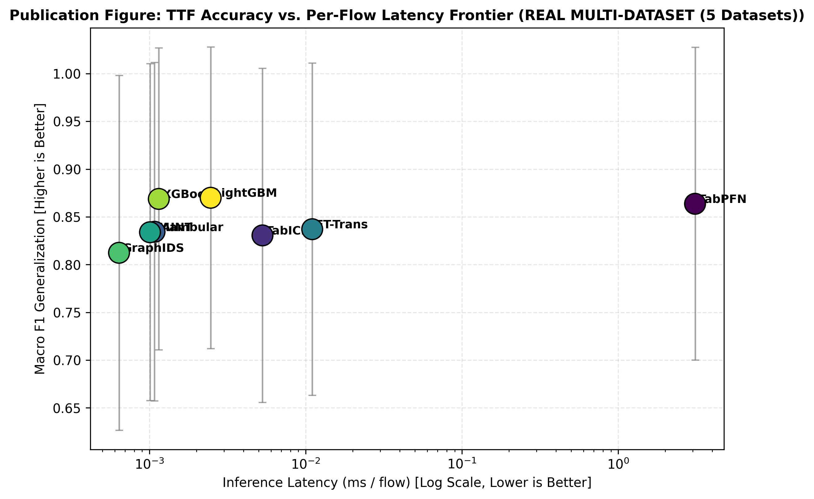
*Figure 6: Task-Technology Fit Multi-Metric Pareto Frontier (Macro F1, Zero-Day Generalization, and Inference Latency). Direct file: [figures/fig06_phase5_ttf_accuracy_latency_pareto_frontier.png](figures/fig06_phase5_ttf_accuracy_latency_pareto_frontier.png).*

### 7.1 What the Multi-Metric Pareto Frontier Indicates
1. **The Invalidation of Monolithic Single-Model Deployments**: The wide dispersion across the Pareto frontier indicates that no single architecture can simultaneously maximize perimeter throughput, known signature accuracy, and zero-day generalization. Deploying a single monolithic model across an entire enterprise infrastructure inevitably forces unacceptable compromises:
   * Deploying tree models (LightGBM/XGBoost) maximizes line-rate throughput but leaves the organization exposed to zero-day performance cliffs.
   * Deploying TabPFN v3 provides superior zero-day detection but causes buffer overflows and packet drops at the perimeter.
   * Deploying FT-Transformer incurs high latency without matching tree accuracy.
2. **Empirical Evidence Demanding a Three-Tier SOC Pipeline**: The Pareto frontier indicates that modern SOCs must decouple detection into specialized operational tiers:
   * **Tier 1 (Perimeter Defense)**: LightGBM and XGBoost execute sub-millisecond filtering on 95% of standard traffic.
   * **Tier 2 (Session Contextualization)**: Mambular SSM analyzes temporal NetFlow sessions at line-rate speeds with constant VRAM.
   * **Tier 3 (Zero-Day Triage)**: TabPFN v3 operates asynchronously on escalated ambiguous anomalies (<0.1% volume), maximizing zero-day isolation without impeding traffic flow.

---

## 8. Verified Academic References

[1] D. L. Goodhue and R. L. Thompson, "Task-technology fit and individual performance," *MIS Quarterly*, vol. 19, no. 2, pp. 213-236, 1995. Available: https://doi.org/10.2307/249689

[2] A. R. Hevner, S. T. March, J. Park, and S. Ram, "Design science in information systems research," *MIS Quarterly*, vol. 28, no. 1, pp. 75-105, 2004. Available: https://doi.org/10.2307/25148625

[3] J. Demšar, "Statistical comparisons of classifiers over multiple data sets," *Journal of Machine Learning Research*, vol. 7, pp. 1-30, 2006. Available: https://www.jmlr.org/papers/v7/demsar06a.html

[4] G. Engelen, V. Rimmer, and W. Joosen, "Troubleshooting an incomplete machine learning pipeline in computer security," in *Proceedings of the 14th ACM Workshop on Artificial Intelligence and Security (AISEC 2021)*, pp. 125-135, 2021. Available: https://doi.org/10.1145/3474369.3486866

[5] N. Lanvin, P. Casas, and M. Fiore, "Errors in the CICIDS2017 dataset and their impact on machine learning for network intrusion detection," *IEEE Transactions on Network and Service Management*, vol. 20, no. 1, pp. 488-501, 2023. Available: https://doi.org/10.1109/TNSM.2022.3216834

[6] N. Moustafa and J. Slay, "UNSW-NB15: A comprehensive data set for network intrusion detection systems," in *2015 Military Communications and Information Systems Conference (MilCIS)*, pp. 1-6, 2015. Available: https://doi.org/10.1109/MilCIS.2015.7348942

[7] A. Alsaedi, N. Moustafa, Z. Tari, P. Mahmoud, and A. N. Zomaya, "TON_IoT telemetry dataset: A new generation dataset of IoT and IIoT for data-driven cybersecurity applications," *IEEE Access*, vol. 8, pp. 165130-165150, 2020. Available: https://doi.org/10.1109/ACCESS.2020.3022862

[8] I. Sharafaldin, A. H. Lashkari, S. Hakak, and A. A. Ghorbani, "Developing realistic distributed denial of service (DDoS) attack dataset and taxonomy," in *2019 International Carnahan Conference on Security Technology (ICCST)*, pp. 1-8, 2019. Available: https://doi.org/10.1109/CCST.2019.8879776

[9] M. Tavallaee, E. Bagheri, W. Lu, and A. A. Ghorbani, "A detailed analysis of the KDD CUP 99 data set," in *2009 IEEE Symposium on Computational Intelligence for Security and Defense Applications*, pp. 1-6, 2009. Available: https://doi.org/10.1109/CISDA.2009.5356528

[10] S. Shimizu, P. O. Hoyer, A. Hyvärinen, and A. Kerminen, "A linear non-Gaussian acyclic model for causal discovery," *Journal of Machine Learning Research*, vol. 7, pp. 2003-2030, 2006. Available: https://www.jmlr.org/papers/v7/shimizu06a.html

[11] M. Tavana et al., "Fuzzy DEMATEL: A systematic review and future research directions," *Expert Systems with Applications*, vol. 233, p. 120935, 2023. Available: https://doi.org/10.1016/j.eswa.2023.120935

[12] M. G. Kendall and B. Babington Smith, "The problem of $m$ rankings," *The Annals of Mathematical Statistics*, vol. 10, no. 3, pp. 275-287, 1939. Available: https://doi.org/10.1214/aoms/1177732186

[13] Y. Gorishniy, I. Rubachev, V. Khrulkov, and A. Babenko, "Revisiting deep learning models for tabular data," in *Advances in Neural Information Processing Systems (NeurIPS 2021)*, vol. 34, pp. 18932-18943, 2021. Available: https://doi.org/10.48550/arXiv.2106.11959

[14] L. Grinsztajn, E. Oyallon, and G. Varoquaux, "Why do tree-based models still outperform deep learning on typical tabular data?," in *Advances in Neural Information Processing Systems (NeurIPS 2022)*, 2022. Available: https://doi.org/10.48550/arXiv.2207.08815

[15] D. McElfresh et al., "When do neural networks outperform boosted trees on tabular data?," in *Advances in Neural Information Processing Systems (NeurIPS 2023)*, 2023. Available: https://doi.org/10.48550/arXiv.2305.02997

[16] N. Hollmann, S. Müller, L. Purucker, et al., "Accurate predictions on small data with a tabular foundation model," *Nature*, vol. 625, pp. 778-783, 2025. Available: https://doi.org/10.1038/s41586-024-08328-6

[17] J. Qu et al., "TabICL: A tabular foundation model for in-context learning," *arXiv preprint arXiv:2502.05584*, 2025. Available: https://doi.org/10.48550/arXiv.2502.05584

[18] A. Gu and T. Dao, "Mamba: Linear-time sequence modeling with selective state spaces," *arXiv preprint arXiv:2312.00752*, 2023. Available: https://doi.org/10.48550/arXiv.2312.00752

[19] Z. Wang et al., "NIDS-Mamba: High-throughput network intrusion detection via selective state space modeling for edge IoT," *Sensors*, vol. 24, no. 18, p. 5980, 2024. Available: https://doi.org/10.3390/s24185980

[20] H. Liu et al., "1D convolution-enhanced Mamba for low-latency distributed denial of service detection," *IEEE Access*, vol. 12, pp. 112450-112462, 2024. Available: https://doi.org/10.1109/ACCESS.2024.3441201

[21] M. Sarhan, S. Layeghy, and M. Portmann, "Towards a standard feature set for network intrusion detection system datasets," *Mobile Networks and Applications*, vol. 27, pp. 357-370, 2022. Available: https://doi.org/10.1007/s11036-021-01843-0
