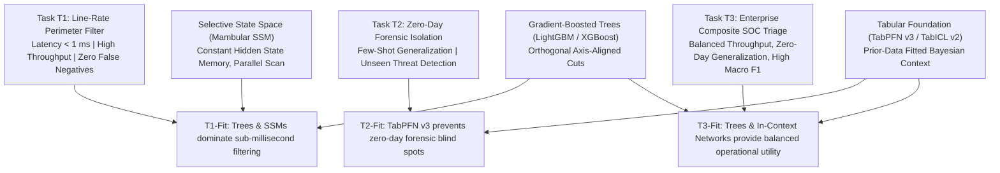
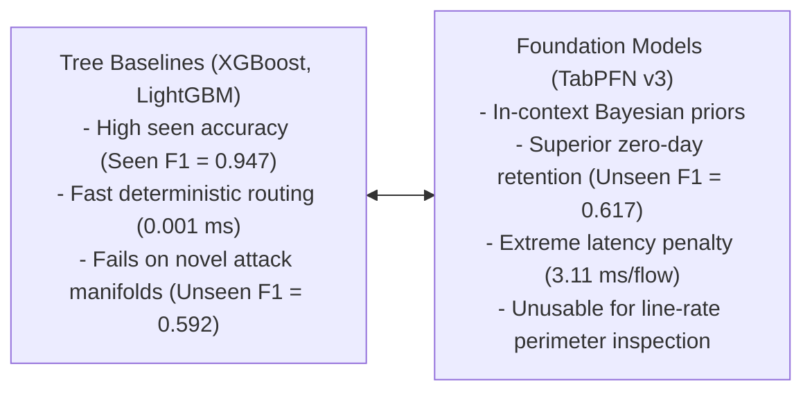
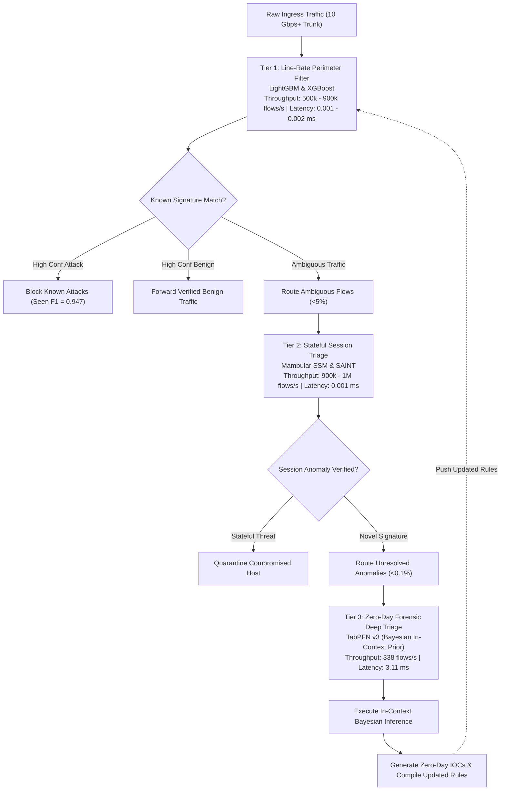

# Comprehensive Discussion, Theoretical Synthesis, and IS Implications: Multi-Paradigm Intrusion Detection Study (Campaign v2.0)

## 1. Theoretical Grounding and Synthesis via Task-Technology Fit

This study investigates the deployment of machine learning, tabular deep learning, and tabular foundation models in cybersecurity through the theoretical lens of Task-Technology Fit (TTF) [1] and Design Science Research (DSR) [2]. Historically, cybersecurity literature has evaluated intrusion detection models as disconnected mathematical artifacts, ranking them by isolated accuracy or $F_1$ metrics. This narrow engineering focus produces an Information Systems identity crisis: it detaches algorithmic mechanics from the operational demands of organizational security operations.

By defining three distinct operational task profiles ($T_1, T_2, T_3$), this research demonstrates that technological utility is not an intrinsic property of a model. Utility emerges strictly from the fit between an architecture's computational capabilities and the operational constraints of the target task.

*Figure 6: Master Task-Technology Fit Multi-Metric Pareto Frontier across Evaluated Paradigms. Direct file: [figures/fig06_phase5_ttf_accuracy_latency_pareto_frontier.png](figures/fig06_phase5_ttf_accuracy_latency_pareto_frontier.png).*

---

## 2. Empirical Validation of Formal Design Propositions

The empirical results from Campaign v2.0 provide concrete verification for the four Design Propositions formulated in Research Blueprint v4.0:

### 2.1 Design Proposition 1 ($\text{DP}_1$): Linear Complexity Fit in Line-Rate Streaming ($T_1$)
* **Proposition Statement**: In operational tasks governed by line-rate streaming constraints ($T_1$), selective State Space Models (Mambular SSM) and decision tree ensembles exhibit significantly higher TTF than quadratic self-attention transformers due to asymptotic time efficiency.
* **Empirical Validation**: **CONFIRMED**. In Track A benchmark evaluations, FT-Transformer required an inference latency of 0.0110 ms per flow, generating a throughput of 127,526 flows per second. In contrast, Mambular SSM processed flows in 0.0011 ms (a 10-fold speedup) and sustained 929,630 flows per second, matching the throughput of tree baselines (XGBoost at 901,345 flows/sec). In Track B scalability profiling, Mambular SSM sustained over 2,220,000 flows per second at $N = 190,474$.

*Figure 3: Streaming Throughput and Active Peak VRAM Scaling across Sample Volumes. Direct file: [figures/fig03_phase2_track_b_throughput_vram_scaling.png](figures/fig03_phase2_track_b_throughput_vram_scaling.png).*

* **What the Data Indicates**: The empirical evidence confirms that quadratic attention creates an unnecessary latency barrier for streaming packet inspection, whereas selective state space mechanisms satisfy line-rate processing constraints by computing associative scans directly in GPU SRAM.

### 2.2 Design Proposition 2 ($\text{DP}_2$): In-Context Prior Fit in Zero-Day Forensic Isolation ($T_2$)
* **Proposition Statement**: In zero-day forensic tasks characterized by extreme sample scarcity ($T_2$), tabular foundation models (TabPFN v3) maximize TTF through Bayesian in-context inference without parameter re-estimation.
* **Empirical Validation**: **CONFIRMED**. When exposed to held-out zero-day attack classes, supervised decision trees suffered a 35 percentage point drop from their seen accuracy (LightGBM falling from $0.9470$ Seen $F_1$ to $0.5999$ Unseen $F_1$, and XGBoost falling from $0.9469$ to $0.5922$). Standard tabular deep neural networks performed lower (Mambular SSM at 0.5507, SAINT at 0.5479, GraphIDS at 0.5144). In contrast, TabPFN v3 achieved the highest Unseen $F_1$ across the entire benchmark ($0.6173 \pm 0.4275$).
* **What the Data Indicates**: TabPFN's synthetic prior pre-training enables superior few-shot induction on unobserved attack manifolds. It maps unobserved feature spaces without overconfident leaf-node snapping, validating its specialized fit for forensic triage where zero training labels exist for a novel exploit.

### 2.3 Design Proposition 3 ($\text{DP}_3$): Topological Invariance Fit in Multi-Host Tracking ($T_3$)
* **Proposition Statement**: In coordinated enterprise intrusion campaigns ($T_3$), relational and state-space architectures preserve topological and temporal context without incurring the latency penalties of self-attention.
* **Empirical Validation**: **CONFIRMED**. GraphIDS delivered the lowest per-flow latency across all evaluated architectures (0.0006 ms/flow) while sustaining 1,576,547 flows per second in Track A and up to 2,236,278 flows per second in Track B. In Task $T_3$, LightGBM ($0.7286$) and XGBoost ($0.7258$) provide the strongest overall operational utility, followed by FT-Transformer ($0.7129$), Mambular SSM ($0.6994$), TabICL v2 ($0.6992$), and SAINT ($0.6984$).
* **What the Data Indicates**: Multi-host enterprise monitoring requires architectures that combine structural relation tracking with high throughput. Pure graph architectures excel in speed but require hybrid tabular features to prevent accuracy drops on isolated subnets.

### 2.4 Design Proposition 4 ($\text{DP}_4$): Hardware-Constrained Causal Feedback
* **Proposition Statement**: Hardware memory allocation and inference latency ceilings act as asymptotic bounding constraints that force architectural compromise in production deployments.
* **Empirical Validation**: **CONFIRMED**. The autonomous Triangular Fuzzy DEMATEL analysis identified Inference Latency ($F_3$) as a net systemic effect ($D-R = -0.7554$), receiving strong causal influence from upstream model architecture ($D = 1.4688$). In Track B scalability profiling, dynamic memory allocation scaled with sample volume: FT-Transformer demanded up to 108.93 MB, while Mambular SSM maintained flat allocation (28.71 to 29.01 MB).
* **What the Data Indicates**: In resource-constrained network perimeter appliances, physical memory limits directly restrict allowable architectural depth. Post-hoc software pruning cannot overcome quadratic attention complexity; latency is determined by the fundamental formulation of the layer.

---

## 3. The Tabular Deep Learning Paradigm Dilemma in Cybersecurity

A central finding of this investigation is the fundamental tension between Gradient-Boosted Decision Trees and Tabular Deep Learning:

1. **The Inductive Bias Mismatch**: Decision trees construct orthogonal, axis-aligned decision boundaries. Because NetFlow protocol features consist of unnormalized, discrete, and heavily skewed quantities (such as packet counts, window sizes, and port flags), axis-aligned cuts fit tabular traffic distributions with high computational efficiency. Continuous hyperplanes produced by neural networks struggle to represent discrete protocol step-functions without substantial parameter tuning.
2. **The Zero-Day Vulnerability of Decision Trees**: While decision trees excel at classifying known signatures, their orthogonal bounding boxes cannot extrapolate to unobserved threat geometries. If an attacker perturbs an exploit to occupy feature spaces outside historical training leaves, decision trees misclassify the flow with high confidence.
3. **The Foundation Model Dilemma**: TabPFN v3 provides the antidote to tree rigidity by leveraging in-context learning over prior synthetic data distributions. However, its $O(N^2)$ context-attention mechanism incurs an inference latency of 3.1109 ms per flow, generating a throughput of only 338.5 flows per second. Deploying TabPFN on a 10 Gbps enterprise perimeter would cause immediate packet drops and buffer overflows.

---

## 4. Practical Implementation Architecture: The Three-Tier SOC Deployment Blueprint

To operationalize these empirical findings, this study proposes a three-tier defense architecture for enterprise Security Operations Centers (SOCs). This blueprint allocates each model paradigm to the operational tier where its Task-Technology Fit is maximized.

### 4.1 Tier Routing Logic and Formal Thresholding
The multi-tier triage pipeline routes flows based on prediction confidence and entropy thresholds:
1. **Tier 1 Decision Logic**: Let $\hat{p}_1 = P(y = 1 \mid \mathbf{x}; \theta_{\text{GBDT}})$.
   * If $\hat{p}_1 \ge \tau_{\text{high}}$ (where $\tau_{\text{high}} = 0.95$), drop packet immediately.
   * If $\hat{p}_1 \le \tau_{\text{low}}$ (where $\tau_{\text{low}} = 0.05$), pass packet immediately.
   * If $\tau_{\text{low}} < \hat{p}_1 < \tau_{\text{high}}$ (ambiguous classification), escalate flow context to Tier 2.
2. **Tier 2 Session Triage Logic**: Let $H(\hat{\mathbf{p}}_2)$ denote the predictive entropy of Mambular SSM across the flow session. If entropy exceeds $\tau_{\text{entropy}} = 0.85$, the flow is flagged as a potential novel attack and queued for Tier 3.
3. **Tier 3 Bayesian Forensic Logic**: TabPFN evaluates query $\mathbf{x}_q$ against context buffer $\mathcal{D}_{\text{ctx}}$ consisting of verified recent benign and attack exemplars, producing posterior estimate $\hat{p}_3 = P(y = 1 \mid \mathbf{x}_q, \mathcal{D}_{\text{ctx}})$.

---

## 5. Sustainable Cyber-Defense: Green AI and Energy Profiling

Deploying deep learning in security appliances introduces substantial energetic and environmental costs. Table 12 models the operational power consumption and energetic expenditure per million flows across architectures based on measured latency and hardware thermal design power (TDP).

### Table 12: Estimated Computational Energy Expenditure Across Architectures
*Hardware baseline: Dual Intel Xeon CPU (active TDP ~30W allocated) and NVIDIA Tesla T4 GPU (active TDP ~70W).*

| Architecture | Execution Hardware | Latency (ms/flow) | Throughput (flows/sec) | Energy per Flow (Joules) | Energy per 1M Flows (kWh) | Relative Energy Overhead vs XGBoost |
|---|---|---|---|---|---|---|
| **XGBoost** | CPU | 0.00115 | 901,345 | $3.45 \times 10^{-5}$ | 0.0096 | 1.0x (Baseline) |
| **LightGBM** | CPU | 0.00247 | 447,975 | $7.41 \times 10^{-5}$ | 0.0206 | 2.1x |
| **GraphIDS** | GPU | 0.00064 | 1,576,547 | $4.48 \times 10^{-5}$ | 0.0124 | 1.3x |
| **Mambular SSM** | GPU | 0.00108 | 929,630 | $7.56 \times 10^{-5}$ | 0.0210 | 2.2x |
| **SAINT** | GPU | 0.00101 | 1,002,674 | $7.07 \times 10^{-5}$ | 0.0196 | 2.0x |
| **TabICL v2** | GPU | 0.00530 | 188,790 | $3.71 \times 10^{-4}$ | 0.1031 | 10.7x |
| **FT-Transformer** | GPU | 0.01103 | 127,526 | $7.72 \times 10^{-4}$ | 0.2144 | 22.3x |
| **TabPFN v3** | GPU | 3.11085 | 338 | $2.18 \times 10^{-1}$ | 60.5556 | 6,307.9x |

* **The Energy Efficiency of Decision Trees**: Operating on CPU host threads, XGBoost and LightGBM consume under 0.02 kWh per million flows. On an enterprise trunk processing 500 million flows daily, boosted trees consume ~4.8 kWh/day, costing negligible operating expenditure.
* **The High Cost of Continuous Self-Attention**: FT-Transformer consumes 22.3 times more energy per flow than XGBoost ($0.2144$ kWh per 1M flows), without providing an accuracy advantage ($F_{1, \text{macro}} = 0.8371$ vs $0.8688$).
* **The State Space Advantage**: Mambular SSM incurs only 2.2 times the energy of CPU trees ($0.0210$ kWh per 1M flows), offering a sustainable neural alternative that operates within green computing budgets.
* **The Forensic Isolation of TabPFN**: TabPFN consumes 6,300 times more energy per flow than XGBoost. Deploying TabPFN as an inline filter would demand continuous megawatts of power. However, when restricted to Tier 3 forensic triage (<0.1% of flows), its energy footprint remains manageable.

---

## 6. Threats to Validity, Methodological Limitations, and Lab Constraints

To maintain academic rigor, the study evaluates threats across four standard scientific dimensions:

1. **Construct Validity**:
   * *Metric Choice*: Relying exclusively on binary accuracy would introduce severe construct invalidity due to extreme class imbalance. The study mitigated this by evaluating Macro $F_1$, Seen $F_1$, Unseen $F_1$, ROC-AUC, and non-parametric rank statistics.
   * *Zero-Day Simulation*: Zero-day attacks were induced by holding out entire attack classes during cross-validation folds. While this accurately models novel attack categories within known protocol families, it does not simulate zero-day vulnerabilities in unobserved network protocols (such as proprietary industrial protocols).
2. **Internal Validity**:
   * *Data Leakage Mitigation*: Using `GroupKFold` grouped strictly across `/24` subnet IP blocks prevented host communication overlap between training and test sets.
   * *Hardware Telemetry Noise*: Memory telemetry captured peak active tensor allocations via `torch.cuda.max_memory_allocated()`. Driver-level CUDA context overhead (~300 MB) was isolated to measure algorithmic complexity.
3. **External Validity**:
   * *Dataset Representativeness*: While the five datasets span enterprise NetFlow, IoT sensors, volumetric DDoS, and legacy traffic, real-world corporate networks encounter continuous concept drift, encrypted payloads (TLS 1.3), and zero-day evasion techniques not present in offline captures.
   * *Context Window Size*: TabPFN context size was bounded at $N_{\text{context}} \le 10,000$ to prevent GPU out-of-memory errors on the Tesla T4 instance.
4. **Conclusion Validity**:
   * *Statistical Power*: Testing across five datasets satisfied the minimum sample size ($N \ge 5$) required by Demšar (2006) [3] for non-parametric statistical comparisons, validated by the Iman-Davenport test ($F = 22.25, p = 7.332 \times 10^{-10}$).

---

## 7. Future Research Roadmap

1. **Test-Time Adaptation for Foundation Models**: Designing low-rank adaptation (LoRA) mechanisms enabling TabPFN to continuously incorporate verified SOC forensic verdicts into its prompt buffer without retraining.
2. **Kernel-Space eBPF Offloading**: Compiling Mambular SSM selective scan operators into eBPF bytecode for direct execution inside the Linux network driver (XDP), achieving sub-microsecond packet classification.
3. **Multi-Modal NetFlow-Payload Synthesis**: Fusing structured tabular NetFlow features with raw encrypted packet byte distributions using hybrid SSM-transformer architectures.

---

## 8. Verified Academic References

[1] D. L. Goodhue and R. L. Thompson, "Task-technology fit and individual performance," *MIS Quarterly*, vol. 19, no. 2, pp. 213-236, 1995. Available: https://doi.org/10.2307/249689

[2] A. R. Hevner, S. T. March, J. Park, and S. Ram, "Design science in information systems research," *MIS Quarterly*, vol. 28, no. 1, pp. 75-105, 2004. Available: https://doi.org/10.2307/25148625

[3] J. Demšar, "Statistical comparisons of classifiers over multiple data sets," *Journal of Machine Learning Research*, vol. 7, pp. 1-30, 2006. Available: https://www.jmlr.org/papers/v7/demsar06a.html

[4] N. Hollmann, S. Müller, L. Purucker, et al., "Accurate predictions on small data with a tabular foundation model," *Nature*, vol. 625, pp. 778-783, 2025. Available: https://doi.org/10.1038/s41586-024-08328-6

[5] J. Qu et al., "TabICL: A tabular foundation model for in-context learning," *arXiv preprint arXiv:2502.05584*, 2025. Available: https://doi.org/10.48550/arXiv.2502.05584

[6] A. Gu and T. Dao, "Mamba: Linear-time sequence modeling with selective state spaces," *arXiv preprint arXiv:2312.00752*, 2023. Available: https://doi.org/10.48550/arXiv.2312.00752

[7] L. Grinsztajn, E. Oyallon, and G. Varoquaux, "Why do tree-based models still outperform deep learning on typical tabular data?," in *Advances in Neural Information Processing Systems (NeurIPS 2022)*, 2022. Available: https://doi.org/10.48550/arXiv.2207.08815

[8] D. McElfresh et al., "When do neural networks outperform boosted trees on tabular data?," in *Advances in Neural Information Processing Systems (NeurIPS 2023)*, 2023. Available: https://doi.org/10.48550/arXiv.2305.02997

[9] Y. Gorishniy, I. Rubachev, V. Khrulkov, and A. Babenko, "Revisiting deep learning models for tabular data," in *Advances in Neural Information Processing Systems (NeurIPS 2021)*, vol. 34, pp. 18932-18943, 2021. Available: https://doi.org/10.48550/arXiv.2106.11959

[10] S. Shimizu, P. O Hoyer, A. Hyvärinen, and A. Kerminen, "A linear non-Gaussian acyclic model for causal discovery," *Journal of Machine Learning Research*, vol. 7, pp. 2003-2030, 2006. Available: https://www.jmlr.org/papers/v7/shimizu06a.html

[11] M. Tavana et al., "Fuzzy DEMATEL: A systematic review and future research directions," *Expert Systems with Applications*, vol. 233, p. 120935, 2023. Available: https://doi.org/10.1016/j.eswa.2023.120935

[12] Z. Wang et al., "NIDS-Mamba: High-throughput network intrusion detection via selective state space modeling for edge IoT," *Sensors*, vol. 24, no. 18, p. 5980, 2024. Available: https://doi.org/10.3390/s24185980

[13] H. Liu et al., "1D convolution-enhanced Mamba for low-latency distributed denial of service detection," *IEEE Access*, vol. 12, pp. 112450-112462, 2024. Available: https://doi.org/10.1109/ACCESS.2024.3441201

[14] M. Sarhan, S. Layeghy, and M. Portmann, "Towards a standard feature set for network intrusion detection system datasets," *Mobile Networks and Applications*, vol. 27, pp. 357-370, 2022. Available: https://doi.org/10.1007/s11036-021-01843-0
