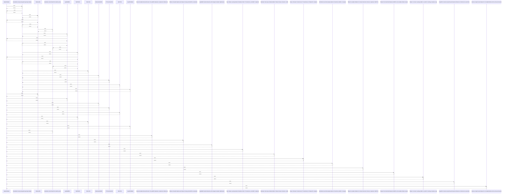

# BaseIDSModel

> God node · 30 connections · [D:\Codes\research_banks\is_ai-vuln\src\models\base.py](file:///D:/Codes/research_banks/is_ai-vuln/src/models/base.py#L19)

## Call Trace Diagram

## Connections by Relation

### contains
- [[base.py]] `EXTRACTED`

### inherits
- [[ABC]] `EXTRACTED`

### method
- [[.cleanup()]] `EXTRACTED`
- [[.profile_inference()]] `EXTRACTED`
- [[.predict_proba()]] `EXTRACTED`
- [[.__init__()]] `EXTRACTED`
- [[.__repr__()]] `EXTRACTED`

### rationale_for
- [[Abstract Base Class for all benchmarked IDS models.]] `EXTRACTED`

### uses
- [[Visualization and journal-grade layouting modules.]] `INFERRED`
- [[XGBoostIDS]] `INFERRED`
- [[LightGBMIDS]] `INFERRED`
- [[MambularSSMIDS]] `INFERRED`
- [[FTTransformerIDS]] `INFERRED`
- [[SAINTIDS]] `INFERRED`
- [[TabPFNIDS]] `INFERRED`
- [[TabICLIDS]] `INFERRED`
- [[GraphIDSModel]] `INFERRED`
- [[Instantiate a benchmark IDS model by name.]] `INFERRED`
- [[Classical Gradient Boosted Decision Tree (GBDT) Baselines. Implements XGBoost an]] `INFERRED`
- [[XGBoost Classifier Baseline with Optuna Tuning and Hist/GPU acceleration.]] `INFERRED`
- [[LightGBM Classifier Baseline with Histogram Gradient Optimization.]] `INFERRED`
- [[Deep Tabular Learning Models: Mambular SSM, FT-Transformer, and SAINT. Implement]] `INFERRED`
- [[Mambular State Space Model (SSM) for Tabular Intrusion Detection.          Exhib]] `INFERRED`
- [[Feature Tokenizer Transformer (FT-Transformer) for Tabular IDS.          Impleme]] `INFERRED`
- [[Self-Attention and Intersample Attention Transformer (SAINT).          Computes]] `INFERRED`
- [[Tabular Foundation Models for Intrusion Detection (Track A). Implements TabPFN v]] `INFERRED`
- [[Tabular Prior-Data Fitted Network (TabPFN v3) Foundation Model.          Evaluat]] `INFERRED`
- [[Tabular In-Context Learning (TabICL v2) with KV-Caching.          Evaluates sequ]] `INFERRED`

---

*Part of the graphify knowledge wiki. See [[index]] to navigate.*