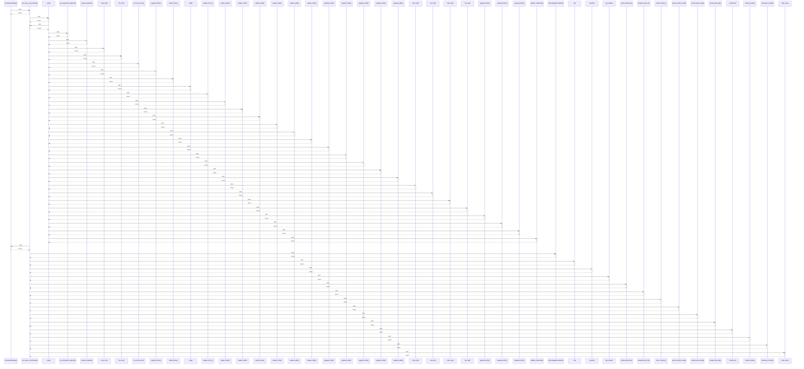

# CheckpointManager

> God node · 11 connections · [D:\Codes\research_banks\is_ai-vuln\src\utils\checkpoint_manager.py](file:///D:/Codes/research_banks/is_ai-vuln/src/utils/checkpoint_manager.py#L7)

## Call Trace Diagram

## Connections by Relation

### calls
- [[run_track_a_benchmark()]] `INFERRED`

### contains
- [[checkpoint_manager.py]] `EXTRACTED`

### method
- [[._load_or_init()]] `EXTRACTED`
- [[.should_skip_model()]] `EXTRACTED`
- [[.should_skip_fold()]] `EXTRACTED`
- [[._persist_state()]] `EXTRACTED`
- [[.record_fold_completion()]] `EXTRACTED`
- [[.mark_completed()]] `EXTRACTED`
- [[.reset_state()]] `EXTRACTED`
- [[.__init__()]] `EXTRACTED`

### rationale_for
- [[Manages experiment state checkpointing, allowing seamless resumption across fold]] `EXTRACTED`

---

*Part of the graphify knowledge wiki. See [[index]] to navigate.*