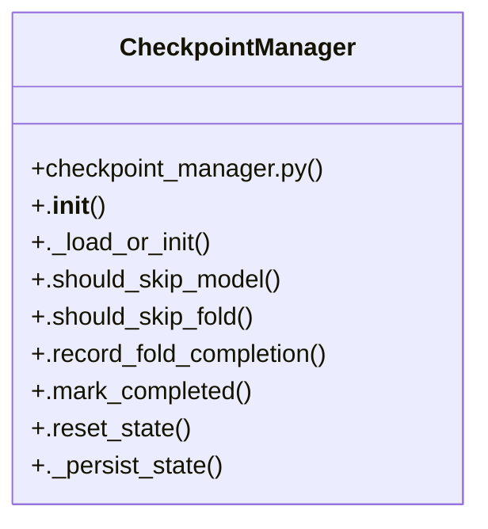

# Community 0

> 19 nodes · cohesion 0.13

## Key Concepts

- [CheckpointManager](file:///D:/Codes/research_banks/is_ai-vuln/src/utils/checkpoint_manager.py#L7) (10 connections)
- [._load_or_init()](file:///D:/Codes/research_banks/is_ai-vuln/src/utils/checkpoint_manager.py#L19) (4 connections)
- [._persist_state()](file:///D:/Codes/research_banks/is_ai-vuln/src/utils/checkpoint_manager.py#L97) (4 connections)
- [.mark_completed()](file:///D:/Codes/research_banks/is_ai-vuln/src/utils/checkpoint_manager.py#L82) (3 connections)
- [.record_fold_completion()](file:///D:/Codes/research_banks/is_ai-vuln/src/utils/checkpoint_manager.py#L60) (3 connections)
- [.reset_state()](file:///D:/Codes/research_banks/is_ai-vuln/src/utils/checkpoint_manager.py#L89) (3 connections)
- [.should_skip_fold()](file:///D:/Codes/research_banks/is_ai-vuln/src/utils/checkpoint_manager.py#L52) (3 connections)
- [.should_skip_model()](file:///D:/Codes/research_banks/is_ai-vuln/src/utils/checkpoint_manager.py#L48) (3 connections)
- [.__init__()](file:///D:/Codes/research_banks/is_ai-vuln/src/utils/checkpoint_manager.py#L10) (2 connections)
- [checkpoint_manager.py](file:///D:/Codes/research_banks/is_ai-vuln/src/utils/checkpoint_manager.py#L1) (2 connections)
- [State Checkpointing & Fault-Tolerant Autorecovery Pipeline for Google Colab and](file:///D:/Codes/research_banks/is_ai-vuln/src/utils/checkpoint_manager.py#L1) (1 connections)
- [Load state from disk if exists, otherwise initialize clean state schema.](file:///D:/Codes/research_banks/is_ai-vuln/src/utils/checkpoint_manager.py#L20) (1 connections)
- [Check whether all folds for a given model have been completed.](file:///D:/Codes/research_banks/is_ai-vuln/src/utils/checkpoint_manager.py#L49) (1 connections)
- [Check whether a specific fold for a given model has already completed.](file:///D:/Codes/research_banks/is_ai-vuln/src/utils/checkpoint_manager.py#L53) (1 connections)
- [Record the completion of a fold, update metrics, and persist to disk.](file:///D:/Codes/research_banks/is_ai-vuln/src/utils/checkpoint_manager.py#L61) (1 connections)
- [Manages experiment state checkpointing, allowing seamless resumption across fold](file:///D:/Codes/research_banks/is_ai-vuln/src/utils/checkpoint_manager.py#L8) (1 connections)
- [Mark the entire track for this dataset as completed.](file:///D:/Codes/research_banks/is_ai-vuln/src/utils/checkpoint_manager.py#L83) (1 connections)
- [Reset the checkpoint state, optionally archiving the current state.](file:///D:/Codes/research_banks/is_ai-vuln/src/utils/checkpoint_manager.py#L90) (1 connections)
- [Atomically persist state JSON.](file:///D:/Codes/research_banks/is_ai-vuln/src/utils/checkpoint_manager.py#L98) (1 connections)

## Class Diagram

## Relationships

- No strong cross-community connections detected

## Source Files

- [D:\Codes\research_banks\is_ai-vuln\src\utils\checkpoint_manager.py](file:///D:/Codes/research_banks/is_ai-vuln/src/utils/checkpoint_manager.py)

## Audit Trail

- EXTRACTED: 46 (100%)
- INFERRED: 0 (0%)
- AMBIGUOUS: 0 (0%)

---

*Part of the graphify knowledge wiki. See [[index]] to navigate.*