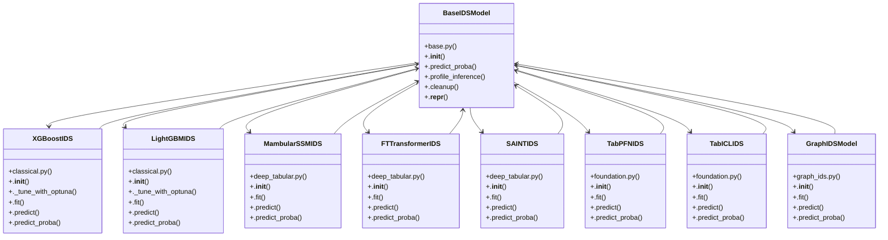

# Community 0

> 68 nodes · cohesion 0.06

## Key Concepts

- [BaseIDSModel](file:///D:/Codes/research_banks/is_ai-vuln/src/models/base.py#L19) (30 connections)
- [Visualization and journal-grade layouting modules.](file:///D:/Codes/research_banks/is_ai-vuln/src/visualization/__init__.py#L1) (16 connections)
- [LightGBMIDS](file:///D:/Codes/research_banks/is_ai-vuln/src/models/classical.py#L114) (11 connections)
- [XGBoostIDS](file:///D:/Codes/research_banks/is_ai-vuln/src/models/classical.py#L16) (11 connections)
- [FTTransformerIDS](file:///D:/Codes/research_banks/is_ai-vuln/src/models/deep_tabular.py#L131) (10 connections)
- [MambularSSMIDS](file:///D:/Codes/research_banks/is_ai-vuln/src/models/deep_tabular.py#L16) (10 connections)
- [SAINTIDS](file:///D:/Codes/research_banks/is_ai-vuln/src/models/deep_tabular.py#L221) (10 connections)
- [TabICLIDS](file:///D:/Codes/research_banks/is_ai-vuln/src/models/foundation.py#L99) (10 connections)
- [TabPFNIDS](file:///D:/Codes/research_banks/is_ai-vuln/src/models/foundation.py#L16) (10 connections)
- [GraphIDSModel](file:///D:/Codes/research_banks/is_ai-vuln/src/models/graph_ids.py#L16) (10 connections)
- [Instantiate a benchmark IDS model by name.](file:///D:/Codes/research_banks/is_ai-vuln/src/models/__init__.py#L26) (10 connections)
- **BaseIDSModel** (8 connections)
- [.predict_proba()](file:///D:/Codes/research_banks/is_ai-vuln/src/models/deep_tabular.py#L306) (6 connections)
- [deep_tabular.py](file:///D:/Codes/research_banks/is_ai-vuln/src/models/deep_tabular.py#L1) (4 connections)
- [.predict_proba()](file:///D:/Codes/research_banks/is_ai-vuln/src/models/foundation.py#L139) (4 connections)
- [.fit()](file:///D:/Codes/research_banks/is_ai-vuln/src/models/classical.py#L165) (3 connections)
- [._tune_with_optuna()](file:///D:/Codes/research_banks/is_ai-vuln/src/models/classical.py#L131) (3 connections)
- [.fit()](file:///D:/Codes/research_banks/is_ai-vuln/src/models/classical.py#L72) (3 connections)
- [classical.py](file:///D:/Codes/research_banks/is_ai-vuln/src/models/classical.py#L1) (3 connections)
- [foundation.py](file:///D:/Codes/research_banks/is_ai-vuln/src/models/foundation.py#L1) (3 connections)
- [.fit()](file:///D:/Codes/research_banks/is_ai-vuln/src/models/deep_tabular.py#L232) (3 connections)
- [.__init__()](file:///D:/Codes/research_banks/is_ai-vuln/src/models/deep_tabular.py#L227) (3 connections)
- [.predict()](file:///D:/Codes/research_banks/is_ai-vuln/src/models/foundation.py#L131) (3 connections)
- [.predict()](file:///D:/Codes/research_banks/is_ai-vuln/src/models/foundation.py#L60) (3 connections)
- [.__init__()](file:///D:/Codes/research_banks/is_ai-vuln/src/models/classical.py#L117) (2 connections)
- *... and 43 more nodes in this community*

## Class Diagram

## Relationships

- [[Community 8]] (6 shared connections)

## Source Files

- [D:\Codes\research_banks\is_ai-vuln\src\__init__.py](file:///D:/Codes/research_banks/is_ai-vuln/src/__init__.py)
- [D:\Codes\research_banks\is_ai-vuln\src\data\__init__.py](file:///D:/Codes/research_banks/is_ai-vuln/src/data/__init__.py)
- [D:\Codes\research_banks\is_ai-vuln\src\dematel\__init__.py](file:///D:/Codes/research_banks/is_ai-vuln/src/dematel/__init__.py)
- [D:\Codes\research_banks\is_ai-vuln\src\evaluation\__init__.py](file:///D:/Codes/research_banks/is_ai-vuln/src/evaluation/__init__.py)
- [D:\Codes\research_banks\is_ai-vuln\src\models\__init__.py](file:///D:/Codes/research_banks/is_ai-vuln/src/models/__init__.py)
- [D:\Codes\research_banks\is_ai-vuln\src\models\base.py](file:///D:/Codes/research_banks/is_ai-vuln/src/models/base.py)
- [D:\Codes\research_banks\is_ai-vuln\src\models\classical.py](file:///D:/Codes/research_banks/is_ai-vuln/src/models/classical.py)
- [D:\Codes\research_banks\is_ai-vuln\src\models\deep_tabular.py](file:///D:/Codes/research_banks/is_ai-vuln/src/models/deep_tabular.py)
- [D:\Codes\research_banks\is_ai-vuln\src\models\foundation.py](file:///D:/Codes/research_banks/is_ai-vuln/src/models/foundation.py)
- [D:\Codes\research_banks\is_ai-vuln\src\models\graph_ids.py](file:///D:/Codes/research_banks/is_ai-vuln/src/models/graph_ids.py)
- [D:\Codes\research_banks\is_ai-vuln\src\utils\__init__.py](file:///D:/Codes/research_banks/is_ai-vuln/src/utils/__init__.py)
- [D:\Codes\research_banks\is_ai-vuln\src\visualization\__init__.py](file:///D:/Codes/research_banks/is_ai-vuln/src/visualization/__init__.py)

## Audit Trail

- EXTRACTED: 188 (71%)
- INFERRED: 76 (29%)
- AMBIGUOUS: 0 (0%)

---

*Part of the graphify knowledge wiki. See [[index]] to navigate.*