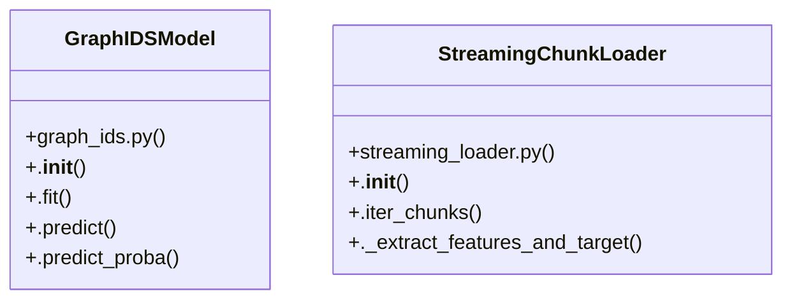

# Community 1

> 52 nodes · cohesion 0.06

## Key Concepts

- [run_track_a_benchmark()](file:///D:/Codes/research_banks/is_ai-vuln/scratch/cell14_phase2a.py#L11) (18 connections)
- [run_tests()](file:///D:/Codes/research_banks/is_ai-vuln/scratch/test_full_pipeline.py#L36) (16 connections)
- [GraphIDSModel](file:///D:/Codes/research_banks/is_ai-vuln/src/models/graph_ids.py#L16) (10 connections)
- [test_all_models()](file:///D:/Codes/research_banks/is_ai-vuln/scratch/test_models.py#L19) (9 connections)
- [StreamingChunkLoader](file:///D:/Codes/research_banks/is_ai-vuln/src/data/streaming_loader.py#L21) (7 connections)
- [.cleanup()](file:///D:/Codes/research_banks/is_ai-vuln/src/models/base.py#L111) (6 connections)
- [.fit()](file:///D:/Codes/research_banks/is_ai-vuln/src/models/graph_ids.py#L27) (6 connections)
- [.predict()](file:///D:/Codes/research_banks/is_ai-vuln/src/models/graph_ids.py#L74) (6 connections)
- [.profile_inference()](file:///D:/Codes/research_banks/is_ai-vuln/src/models/base.py#L51) (5 connections)
- [run_causal_triangulation()](file:///D:/Codes/research_banks/is_ai-vuln/src/dematel/causal_validation.py#L104) (5 connections)
- [robustness.py](file:///D:/Codes/research_banks/is_ai-vuln/src/evaluation/robustness.py#L1) (5 connections)
- [evaluate_fold_run()](file:///D:/Codes/research_banks/is_ai-vuln/src/evaluation/metrics.py#L53) (5 connections)
- [evaluate_robustness_degradation_slope()](file:///D:/Codes/research_banks/is_ai-vuln/src/evaluation/robustness.py#L39) (5 connections)
- [run_component_ablation_sweep()](file:///D:/Codes/research_banks/is_ai-vuln/src/evaluation/robustness.py#L73) (5 connections)
- [metrics.py](file:///D:/Codes/research_banks/is_ai-vuln/src/evaluation/metrics.py#L1) (4 connections)
- [.predict_proba()](file:///D:/Codes/research_banks/is_ai-vuln/src/models/graph_ids.py#L80) (4 connections)
- [calculate_ttf_utility()](file:///D:/Codes/research_banks/is_ai-vuln/src/evaluation/metrics.py#L71) (4 connections)
- [inject_gaussian_noise()](file:///D:/Codes/research_banks/is_ai-vuln/src/evaluation/robustness.py#L14) (4 connections)
- [.iter_chunks()](file:///D:/Codes/research_banks/is_ai-vuln/src/data/streaming_loader.py#L36) (4 connections)
- [safe_slice()](file:///D:/Codes/research_banks/is_ai-vuln/scratch/cell14_phase2a.py#L5) (3 connections)
- [export_benchmark_to_latex()](file:///D:/Codes/research_banks/is_ai-vuln/src/visualization/latex_exporter.py#L11) (3 connections)
- [evaluate_classification_metrics()](file:///D:/Codes/research_banks/is_ai-vuln/src/evaluation/metrics.py#L22) (3 connections)
- [cell14_phase2a.py](file:///D:/Codes/research_banks/is_ai-vuln/scratch/cell14_phase2a.py#L1) (2 connections)
- [test_full_pipeline.py](file:///D:/Codes/research_banks/is_ai-vuln/scratch/test_full_pipeline.py#L1) (2 connections)
- [graph_ids.py](file:///D:/Codes/research_banks/is_ai-vuln/src/models/graph_ids.py#L1) (2 connections)
- *... and 27 more nodes in this community*

## Class Diagram

```mermaid
classDiagram
    class GraphIDSModel {
        +graph_ids.py()
        +.__init__()
        +.fit()
        +.predict()
        +.predict_proba()
    }
    class StreamingChunkLoader {
        +streaming_loader.py()
        +.__init__()
        +.iter_chunks()
        +._extract_features_and_target()
    }
```

## Relationships

- [[Community 3]] (13 shared connections)
- [[Community 2]] (7 shared connections)
- [[Community 0]] (4 shared connections)

## Source Files

- [D:\Codes\research_banks\is_ai-vuln\scratch\cell14_phase2a.py](file:///D:/Codes/research_banks/is_ai-vuln/scratch/cell14_phase2a.py)
- [D:\Codes\research_banks\is_ai-vuln\scratch\test_full_pipeline.py](file:///D:/Codes/research_banks/is_ai-vuln/scratch/test_full_pipeline.py)
- [D:\Codes\research_banks\is_ai-vuln\scratch\test_models.py](file:///D:/Codes/research_banks/is_ai-vuln/scratch/test_models.py)
- [D:\Codes\research_banks\is_ai-vuln\src\data\streaming_loader.py](file:///D:/Codes/research_banks/is_ai-vuln/src/data/streaming_loader.py)
- [D:\Codes\research_banks\is_ai-vuln\src\dematel\causal_validation.py](file:///D:/Codes/research_banks/is_ai-vuln/src/dematel/causal_validation.py)
- [D:\Codes\research_banks\is_ai-vuln\src\evaluation\metrics.py](file:///D:/Codes/research_banks/is_ai-vuln/src/evaluation/metrics.py)
- [D:\Codes\research_banks\is_ai-vuln\src\evaluation\robustness.py](file:///D:/Codes/research_banks/is_ai-vuln/src/evaluation/robustness.py)
- [D:\Codes\research_banks\is_ai-vuln\src\models\base.py](file:///D:/Codes/research_banks/is_ai-vuln/src/models/base.py)
- [D:\Codes\research_banks\is_ai-vuln\src\models\graph_ids.py](file:///D:/Codes/research_banks/is_ai-vuln/src/models/graph_ids.py)
- [D:\Codes\research_banks\is_ai-vuln\src\visualization\latex_exporter.py](file:///D:/Codes/research_banks/is_ai-vuln/src/visualization/latex_exporter.py)

## Audit Trail

- EXTRACTED: 99 (56%)
- INFERRED: 77 (44%)
- AMBIGUOUS: 0 (0%)

---

*Part of the graphify knowledge wiki. See [[index]] to navigate.*