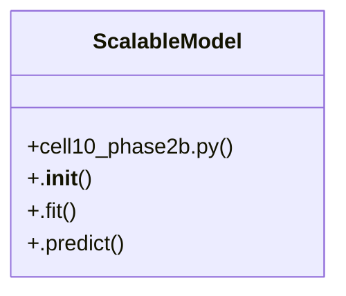

# Community 15

> 6 nodes · cohesion 0.33

## Key Concepts

- [ScalableModel](file:///D:/Codes/research_banks/is_ai-vuln/scratch/cell10_phase2b.py#L5) (5 connections)
- [Production-grade scalable architectures for line-rate network streaming.](file:///D:/Codes/research_banks/is_ai-vuln/scratch/cell10_phase2b.py#L6) (1 connections)
- [.fit()](file:///D:/Codes/research_banks/is_ai-vuln/scratch/cell10_phase2b.py#L13) (1 connections)
- [.__init__()](file:///D:/Codes/research_banks/is_ai-vuln/scratch/cell10_phase2b.py#L7) (1 connections)
- [.predict()](file:///D:/Codes/research_banks/is_ai-vuln/scratch/cell10_phase2b.py#L74) (1 connections)
- [cell10_phase2b.py](file:///D:/Codes/research_banks/is_ai-vuln/scratch/cell10_phase2b.py#L1) (1 connections)

## Class Diagram

## Relationships

- No strong cross-community connections detected

## Source Files

- [D:\Codes\research_banks\is_ai-vuln\scratch\cell10_phase2b.py](file:///D:/Codes/research_banks/is_ai-vuln/scratch/cell10_phase2b.py)

## Audit Trail

- EXTRACTED: 10 (100%)
- INFERRED: 0 (0%)
- AMBIGUOUS: 0 (0%)

---

*Part of the graphify knowledge wiki. See [[index]] to navigate.*