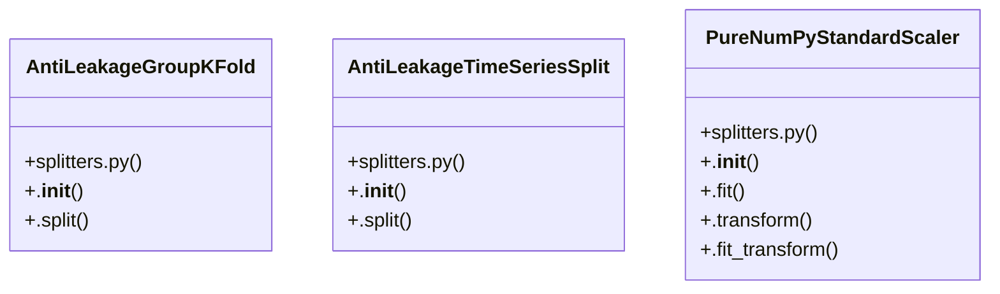

# Community 2

> 38 nodes · cohesion 0.07

## Key Concepts

- [run_preparation_pipeline()](file:///D:/Codes/research_banks/is_ai-vuln/src/data/prep_pipeline.py#L38) (10 connections)
- [.split()](file:///D:/Codes/research_banks/is_ai-vuln/src/data/splitters.py#L121) (8 connections)
- [splitters.py](file:///D:/Codes/research_banks/is_ai-vuln/src/data/splitters.py#L1) (7 connections)
- [PureNumPyStandardScaler](file:///D:/Codes/research_banks/is_ai-vuln/src/data/splitters.py#L47) (7 connections)
- [AntiLeakageGroupKFold](file:///D:/Codes/research_banks/is_ai-vuln/src/data/splitters.py#L69) (6 connections)
- [fit_fold_isolated_pipeline()](file:///D:/Codes/research_banks/is_ai-vuln/src/data/splitters.py#L140) (5 connections)
- [generate_notebook_02.py](file:///D:/Codes/research_banks/is_ai-vuln/scratch/generate_notebook_02.py#L1) (4 connections)
- [AntiLeakageTimeSeriesSplit](file:///D:/Codes/research_banks/is_ai-vuln/src/data/splitters.py#L113) (4 connections)
- [.fit_transform()](file:///D:/Codes/research_banks/is_ai-vuln/src/data/splitters.py#L66) (4 connections)
- [graph_builder.py](file:///D:/Codes/research_banks/is_ai-vuln/src/data/graph_builder.py#L1) (3 connections)
- [create_code_cell()](file:///D:/Codes/research_banks/is_ai-vuln/scratch/generate_notebook_02.py#L13) (3 connections)
- [create_markdown_cell()](file:///D:/Codes/research_banks/is_ai-vuln/scratch/generate_notebook_02.py#L22) (3 connections)
- [generate_notebook()](file:///D:/Codes/research_banks/is_ai-vuln/scratch/generate_notebook_02.py#L29) (3 connections)
- [build_networkx_flow_graph()](file:///D:/Codes/research_banks/is_ai-vuln/src/data/graph_builder.py#L17) (3 connections)
- [export_to_pyg_tensors()](file:///D:/Codes/research_banks/is_ai-vuln/src/data/graph_builder.py#L66) (3 connections)
- [.split()](file:///D:/Codes/research_banks/is_ai-vuln/src/data/splitters.py#L77) (3 connections)
- [extract_subnet_mask()](file:///D:/Codes/research_banks/is_ai-vuln/src/data/splitters.py#L29) (3 connections)
- [.transform()](file:///D:/Codes/research_banks/is_ai-vuln/src/data/splitters.py#L60) (3 connections)
- [Execute complete ingestion, cleaning, anti-leakage splitting, and artifact gener](file:///D:/Codes/research_banks/is_ai-vuln/src/data/prep_pipeline.py#L45) (2 connections)
- [.fit()](file:///D:/Codes/research_banks/is_ai-vuln/src/data/splitters.py#L53) (2 connections)
- [safe_slice()](file:///D:/Codes/research_banks/is_ai-vuln/src/data/splitters.py#L18) (2 connections)
- [prep_pipeline.py](file:///D:/Codes/research_banks/is_ai-vuln/src/data/prep_pipeline.py#L1) (1 connections)
- [Generator script for src/notebook/02_phase2_track_a_benchmark_colab.ipynb.](file:///D:/Codes/research_banks/is_ai-vuln/scratch/generate_notebook_02.py#L1) (1 connections)
- [Graph Construction Engine for GraphIDS. Converts tabular NetFlow records into to](file:///D:/Codes/research_banks/is_ai-vuln/src/data/graph_builder.py#L1) (1 connections)
- [Construct a directed network interaction graph from NetFlow DataFrame.      Args](file:///D:/Codes/research_banks/is_ai-vuln/src/data/graph_builder.py#L24) (1 connections)
- *... and 13 more nodes in this community*

## Class Diagram

## Relationships

- [[Community 8]] (3 shared connections)
- [[Community 3]] (2 shared connections)

## Source Files

- [D:\Codes\research_banks\is_ai-vuln\scratch\generate_notebook_02.py](file:///D:/Codes/research_banks/is_ai-vuln/scratch/generate_notebook_02.py)
- [D:\Codes\research_banks\is_ai-vuln\src\data\graph_builder.py](file:///D:/Codes/research_banks/is_ai-vuln/src/data/graph_builder.py)
- [D:\Codes\research_banks\is_ai-vuln\src\data\prep_pipeline.py](file:///D:/Codes/research_banks/is_ai-vuln/src/data/prep_pipeline.py)
- [D:\Codes\research_banks\is_ai-vuln\src\data\splitters.py](file:///D:/Codes/research_banks/is_ai-vuln/src/data/splitters.py)

## Audit Trail

- EXTRACTED: 84 (80%)
- INFERRED: 21 (20%)
- AMBIGUOUS: 0 (0%)

---

*Part of the graphify knowledge wiki. See [[index]] to navigate.*