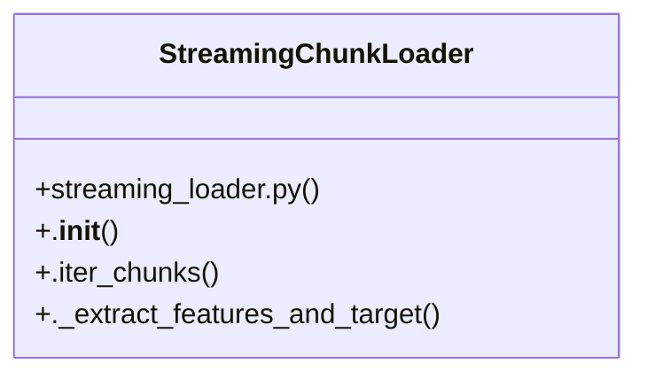

# Community 2

> 36 nodes · cohesion 0.08

## Key Concepts

- [run_tests()](file:///D:/Codes/research_banks/is_ai-vuln/scratch/test_full_pipeline.py#L36) (16 connections)
- [test_all_models()](file:///D:/Codes/research_banks/is_ai-vuln/scratch/test_models.py#L19) (9 connections)
- [StreamingChunkLoader](file:///D:/Codes/research_banks/is_ai-vuln/src/data/streaming_loader.py#L21) (7 connections)
- [.cleanup()](file:///D:/Codes/research_banks/is_ai-vuln/src/models/base.py#L111) (6 connections)
- [run_causal_triangulation()](file:///D:/Codes/research_banks/is_ai-vuln/src/dematel/causal_validation.py#L104) (5 connections)
- [robustness.py](file:///D:/Codes/research_banks/is_ai-vuln/src/evaluation/robustness.py#L1) (5 connections)
- [.fit()](file:///D:/Codes/research_banks/is_ai-vuln/src/models/graph_ids.py#L27) (5 connections)
- [.predict()](file:///D:/Codes/research_banks/is_ai-vuln/src/models/graph_ids.py#L74) (5 connections)
- [evaluate_robustness_degradation_slope()](file:///D:/Codes/research_banks/is_ai-vuln/src/evaluation/robustness.py#L39) (5 connections)
- [run_component_ablation_sweep()](file:///D:/Codes/research_banks/is_ai-vuln/src/evaluation/robustness.py#L73) (5 connections)
- [streaming_loader.py](file:///D:/Codes/research_banks/is_ai-vuln/src/data/streaming_loader.py#L1) (4 connections)
- [inject_gaussian_noise()](file:///D:/Codes/research_banks/is_ai-vuln/src/evaluation/robustness.py#L14) (4 connections)
- [generate_scalable_synthetic_partition()](file:///D:/Codes/research_banks/is_ai-vuln/src/data/streaming_loader.py#L121) (4 connections)
- [.iter_chunks()](file:///D:/Codes/research_banks/is_ai-vuln/src/data/streaming_loader.py#L36) (4 connections)
- [.predict_proba()](file:///D:/Codes/research_banks/is_ai-vuln/src/models/graph_ids.py#L80) (3 connections)
- [export_benchmark_to_latex()](file:///D:/Codes/research_banks/is_ai-vuln/src/visualization/latex_exporter.py#L11) (3 connections)
- [test_full_pipeline.py](file:///D:/Codes/research_banks/is_ai-vuln/scratch/test_full_pipeline.py#L1) (2 connections)
- [latex_exporter.py](file:///D:/Codes/research_banks/is_ai-vuln/src/visualization/latex_exporter.py#L1) (2 connections)
- [inject_feature_corruption()](file:///D:/Codes/research_banks/is_ai-vuln/src/evaluation/robustness.py#L27) (2 connections)
- [._extract_features_and_target()](file:///D:/Codes/research_banks/is_ai-vuln/src/data/streaming_loader.py#L103) (2 connections)
- [Comprehensive Full-Pipeline Verification Test Suite. Verifies streaming data loa](file:///D:/Codes/research_banks/is_ai-vuln/scratch/test_full_pipeline.py#L1) (2 connections)
- [Release weights and garbage collect GPU/CPU memory.](file:///D:/Codes/research_banks/is_ai-vuln/src/models/base.py#L112) (1 connections)
- [Run DirectLiNGAM causal discovery and calculate SHD against Fuzzy DEMATEL digrap](file:///D:/Codes/research_banks/is_ai-vuln/src/dematel/causal_validation.py#L108) (1 connections)
- [test_models.py](file:///D:/Codes/research_banks/is_ai-vuln/scratch/test_models.py#L1) (1 connections)
- [Automated LaTeX Table Generation for Q1 Journal Publication. Generates professio](file:///D:/Codes/research_banks/is_ai-vuln/src/visualization/latex_exporter.py#L1) (1 connections)
- *... and 11 more nodes in this community*

## Class Diagram

## Relationships

- [[Community 1]] (10 shared connections)
- [[Community 16]] (2 shared connections)

## Source Files

- [D:\Codes\research_banks\is_ai-vuln\scratch\test_full_pipeline.py](file:///D:/Codes/research_banks/is_ai-vuln/scratch/test_full_pipeline.py)
- [D:\Codes\research_banks\is_ai-vuln\scratch\test_models.py](file:///D:/Codes/research_banks/is_ai-vuln/scratch/test_models.py)
- [D:\Codes\research_banks\is_ai-vuln\src\data\streaming_loader.py](file:///D:/Codes/research_banks/is_ai-vuln/src/data/streaming_loader.py)
- [D:\Codes\research_banks\is_ai-vuln\src\dematel\causal_validation.py](file:///D:/Codes/research_banks/is_ai-vuln/src/dematel/causal_validation.py)
- [D:\Codes\research_banks\is_ai-vuln\src\evaluation\robustness.py](file:///D:/Codes/research_banks/is_ai-vuln/src/evaluation/robustness.py)
- [D:\Codes\research_banks\is_ai-vuln\src\models\base.py](file:///D:/Codes/research_banks/is_ai-vuln/src/models/base.py)
- [D:\Codes\research_banks\is_ai-vuln\src\models\graph_ids.py](file:///D:/Codes/research_banks/is_ai-vuln/src/models/graph_ids.py)
- [D:\Codes\research_banks\is_ai-vuln\src\visualization\latex_exporter.py](file:///D:/Codes/research_banks/is_ai-vuln/src/visualization/latex_exporter.py)

## Audit Trail

- EXTRACTED: 66 (57%)
- INFERRED: 49 (43%)
- AMBIGUOUS: 0 (0%)

---

*Part of the graphify knowledge wiki. See [[index]] to navigate.*