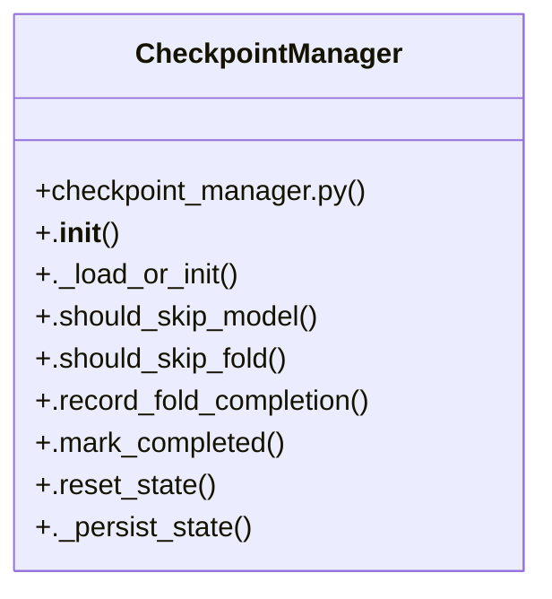

# Community 2

> 40 nodes · cohesion 0.07

## Key Concepts

- [run_track_a_benchmark()](file:///D:/Codes/research_banks/is_ai-vuln/scratch/cell14_phase2a.py#L11) (18 connections)
- [CheckpointManager](file:///D:/Codes/research_banks/is_ai-vuln/src/utils/checkpoint_manager.py#L7) (11 connections)
- [test_all_models()](file:///D:/Codes/research_banks/is_ai-vuln/scratch/test_models.py#L19) (9 connections)
- [.predict()](file:///D:/Codes/research_banks/is_ai-vuln/src/models/graph_ids.py#L74) (6 connections)
- [.profile_inference()](file:///D:/Codes/research_banks/is_ai-vuln/src/models/base.py#L51) (5 connections)
- [get_model()](file:///D:/Codes/research_banks/is_ai-vuln/src/models/__init__.py#L25) (5 connections)
- [evaluate_fold_run()](file:///D:/Codes/research_banks/is_ai-vuln/src/evaluation/metrics.py#L53) (5 connections)
- [._load_or_init()](file:///D:/Codes/research_banks/is_ai-vuln/src/utils/checkpoint_manager.py#L19) (4 connections)
- [._persist_state()](file:///D:/Codes/research_banks/is_ai-vuln/src/utils/checkpoint_manager.py#L97) (4 connections)
- [.should_skip_fold()](file:///D:/Codes/research_banks/is_ai-vuln/src/utils/checkpoint_manager.py#L52) (4 connections)
- [.should_skip_model()](file:///D:/Codes/research_banks/is_ai-vuln/src/utils/checkpoint_manager.py#L48) (4 connections)
- [metrics.py](file:///D:/Codes/research_banks/is_ai-vuln/src/evaluation/metrics.py#L1) (4 connections)
- [.predict_proba()](file:///D:/Codes/research_banks/is_ai-vuln/src/models/graph_ids.py#L80) (4 connections)
- [calculate_ttf_utility()](file:///D:/Codes/research_banks/is_ai-vuln/src/evaluation/metrics.py#L71) (4 connections)
- [safe_slice()](file:///D:/Codes/research_banks/is_ai-vuln/scratch/cell14_phase2a.py#L5) (3 connections)
- [.mark_completed()](file:///D:/Codes/research_banks/is_ai-vuln/src/utils/checkpoint_manager.py#L82) (3 connections)
- [.record_fold_completion()](file:///D:/Codes/research_banks/is_ai-vuln/src/utils/checkpoint_manager.py#L60) (3 connections)
- [.reset_state()](file:///D:/Codes/research_banks/is_ai-vuln/src/utils/checkpoint_manager.py#L89) (3 connections)
- [evaluate_classification_metrics()](file:///D:/Codes/research_banks/is_ai-vuln/src/evaluation/metrics.py#L22) (3 connections)
- [.__init__()](file:///D:/Codes/research_banks/is_ai-vuln/src/utils/checkpoint_manager.py#L10) (2 connections)
- [cell14_phase2a.py](file:///D:/Codes/research_banks/is_ai-vuln/scratch/cell14_phase2a.py#L1) (2 connections)
- [__init__.py](file:///D:/Codes/research_banks/is_ai-vuln/src/models/__init__.py#L1) (2 connections)
- [checkpoint_manager.py](file:///D:/Codes/research_banks/is_ai-vuln/src/utils/checkpoint_manager.py#L1) (2 connections)
- [Profile inference latency (ms/flow), throughput (flows/sec), and peak VRAM/RAM.](file:///D:/Codes/research_banks/is_ai-vuln/src/models/base.py#L57) (1 connections)
- [Execute the full 8-model × N-fold Track A benchmark for ONE dataset.](file:///D:/Codes/research_banks/is_ai-vuln/scratch/cell14_phase2a.py#L12) (1 connections)
- *... and 15 more nodes in this community*

## Class Diagram

## Relationships

- [[Community 5]] (9 shared connections)
- [[Community 1]] (4 shared connections)
- [[Community 0]] (2 shared connections)
- [[Community 12]] (1 shared connections)

## Source Files

- [D:\Codes\research_banks\is_ai-vuln\scratch\cell14_phase2a.py](file:///D:/Codes/research_banks/is_ai-vuln/scratch/cell14_phase2a.py)
- [D:\Codes\research_banks\is_ai-vuln\scratch\test_models.py](file:///D:/Codes/research_banks/is_ai-vuln/scratch/test_models.py)
- [D:\Codes\research_banks\is_ai-vuln\src\evaluation\metrics.py](file:///D:/Codes/research_banks/is_ai-vuln/src/evaluation/metrics.py)
- [D:\Codes\research_banks\is_ai-vuln\src\models\__init__.py](file:///D:/Codes/research_banks/is_ai-vuln/src/models/__init__.py)
- [D:\Codes\research_banks\is_ai-vuln\src\models\base.py](file:///D:/Codes/research_banks/is_ai-vuln/src/models/base.py)
- [D:\Codes\research_banks\is_ai-vuln\src\models\graph_ids.py](file:///D:/Codes/research_banks/is_ai-vuln/src/models/graph_ids.py)
- [D:\Codes\research_banks\is_ai-vuln\src\utils\checkpoint_manager.py](file:///D:/Codes/research_banks/is_ai-vuln/src/utils/checkpoint_manager.py)

## Audit Trail

- EXTRACTED: 86 (68%)
- INFERRED: 41 (32%)
- AMBIGUOUS: 0 (0%)

---

*Part of the graphify knowledge wiki. See [[index]] to navigate.*