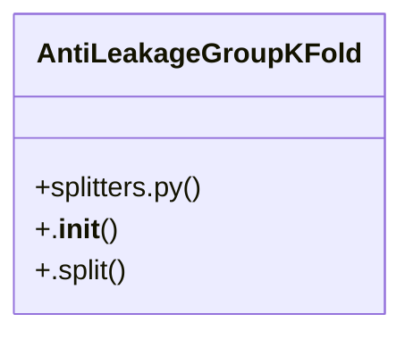

# Community 2

> 45 nodes · cohesion 0.06

## Key Concepts

- [run_preparation_pipeline()](file:///D:/Codes/research_banks/is_ai-vuln/src/data/prep_pipeline.py#L39) (11 connections)
- [prepare_benchmark_dataset()](file:///D:/Codes/research_banks/is_ai-vuln/src/data/drive_downloader.py#L299) (10 connections)
- [drive_downloader.py](file:///D:/Codes/research_banks/is_ai-vuln/src/data/drive_downloader.py#L1) (9 connections)
- [resolve_track_b_dataset()](file:///D:/Codes/research_banks/is_ai-vuln/src/data/streaming_loader.py#L154) (8 connections)
- [is_synthetic_path()](file:///D:/Codes/research_banks/is_ai-vuln/src/data/drive_downloader.py#L294) (7 connections)
- [AntiLeakageGroupKFold](file:///D:/Codes/research_banks/is_ai-vuln/src/data/splitters.py#L69) (7 connections)
- [verify_all_updates.py](file:///D:/Codes/research_banks/is_ai-vuln/scratch/verify_all_updates.py#L1) (6 connections)
- [initialize_dataset_directories()](file:///D:/Codes/research_banks/is_ai-vuln/src/data/drive_downloader.py#L279) (6 connections)
- [scan_available_datasets()](file:///D:/Codes/research_banks/is_ai-vuln/src/data/drive_downloader.py#L474) (5 connections)
- [verify_all_notebooks.py](file:///D:/Codes/research_banks/is_ai-vuln/scratch/verify_all_notebooks.py#L1) (4 connections)
- [test_drive_folder_simulation()](file:///D:/Codes/research_banks/is_ai-vuln/scratch/verify_all_notebooks.py#L32) (4 connections)
- [graph_builder.py](file:///D:/Codes/research_banks/is_ai-vuln/src/data/graph_builder.py#L1) (3 connections)
- [download_file()](file:///D:/Codes/research_banks/is_ai-vuln/src/data/drive_downloader.py#L171) (3 connections)
- [ensure_gitignore_safeguards()](file:///D:/Codes/research_banks/is_ai-vuln/src/data/drive_downloader.py#L132) (3 connections)
- [generate_synthetic_benchmark_sample()](file:///D:/Codes/research_banks/is_ai-vuln/src/data/drive_downloader.py#L207) (3 connections)
- [verify_file_sha256()](file:///D:/Codes/research_banks/is_ai-vuln/src/data/drive_downloader.py#L151) (3 connections)
- [build_networkx_flow_graph()](file:///D:/Codes/research_banks/is_ai-vuln/src/data/graph_builder.py#L17) (3 connections)
- [export_to_pyg_tensors()](file:///D:/Codes/research_banks/is_ai-vuln/src/data/graph_builder.py#L66) (3 connections)
- [.split()](file:///D:/Codes/research_banks/is_ai-vuln/src/data/splitters.py#L77) (3 connections)
- [test_drive_downloader_real_vs_synthetic()](file:///D:/Codes/research_banks/is_ai-vuln/scratch/verify_all_updates.py#L35) (3 connections)
- [Execute complete ingestion, cleaning, anti-leakage splitting, and artifact gener](file:///D:/Codes/research_banks/is_ai-vuln/src/data/prep_pipeline.py#L49) (2 connections)
- [test_streaming_loader_resolution()](file:///D:/Codes/research_banks/is_ai-vuln/scratch/verify_all_updates.py#L59) (2 connections)
- [prep_pipeline.py](file:///D:/Codes/research_banks/is_ai-vuln/src/data/prep_pipeline.py#L1) (1 connections)
- [Drive Dataset Retrieval, Checksum Verification & Automatic .gitignore Safeguards](file:///D:/Codes/research_banks/is_ai-vuln/src/data/drive_downloader.py#L1) (1 connections)
- [Check and automatically append required exclusion rules to .gitignore.](file:///D:/Codes/research_banks/is_ai-vuln/src/data/drive_downloader.py#L133) (1 connections)
- *... and 20 more nodes in this community*

## Class Diagram

## Relationships

- [[Community 1]] (19 shared connections)
- [[Community 4]] (1 shared connections)

## Source Files

- [D:\Codes\research_banks\is_ai-vuln\scratch\verify_all_notebooks.py](file:///D:/Codes/research_banks/is_ai-vuln/scratch/verify_all_notebooks.py)
- [D:\Codes\research_banks\is_ai-vuln\scratch\verify_all_updates.py](file:///D:/Codes/research_banks/is_ai-vuln/scratch/verify_all_updates.py)
- [D:\Codes\research_banks\is_ai-vuln\src\data\drive_downloader.py](file:///D:/Codes/research_banks/is_ai-vuln/src/data/drive_downloader.py)
- [D:\Codes\research_banks\is_ai-vuln\src\data\graph_builder.py](file:///D:/Codes/research_banks/is_ai-vuln/src/data/graph_builder.py)
- [D:\Codes\research_banks\is_ai-vuln\src\data\prep_pipeline.py](file:///D:/Codes/research_banks/is_ai-vuln/src/data/prep_pipeline.py)
- [D:\Codes\research_banks\is_ai-vuln\src\data\splitters.py](file:///D:/Codes/research_banks/is_ai-vuln/src/data/splitters.py)
- [D:\Codes\research_banks\is_ai-vuln\src\data\streaming_loader.py](file:///D:/Codes/research_banks/is_ai-vuln/src/data/streaming_loader.py)

## Audit Trail

- EXTRACTED: 94 (72%)
- INFERRED: 37 (28%)
- AMBIGUOUS: 0 (0%)

---

*Part of the graphify knowledge wiki. See [[index]] to navigate.*