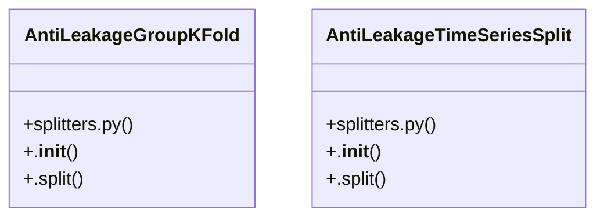

# Community 3

> 10 nodes · cohesion 0.20

## Key Concepts

- [AntiLeakageGroupKFold](file:///D:/Codes/research_banks/is_ai-vuln/src/data/splitters.py#L69) (4 connections)
- [AntiLeakageTimeSeriesSplit](file:///D:/Codes/research_banks/is_ai-vuln/src/data/splitters.py#L110) (4 connections)
- [.split()](file:///D:/Codes/research_banks/is_ai-vuln/src/data/splitters.py#L77) (3 connections)
- [.split()](file:///D:/Codes/research_banks/is_ai-vuln/src/data/splitters.py#L118) (3 connections)
- [.__init__()](file:///D:/Codes/research_banks/is_ai-vuln/src/data/splitters.py#L72) (1 connections)
- [.__init__()](file:///D:/Codes/research_banks/is_ai-vuln/src/data/splitters.py#L113) (1 connections)
- [Time-aware chronological cross-validator without future-looking data leakage.](file:///D:/Codes/research_banks/is_ai-vuln/src/data/splitters.py#L111) (1 connections)
- [Generate sequential train/validation split indices.](file:///D:/Codes/research_banks/is_ai-vuln/src/data/splitters.py#L123) (1 connections)
- [GroupKFold cross-validator grouped by IP subnets or Host IDs to prevent session](file:///D:/Codes/research_banks/is_ai-vuln/src/data/splitters.py#L70) (1 connections)
- [Generate train/validation indices grouped by subnet/host.](file:///D:/Codes/research_banks/is_ai-vuln/src/data/splitters.py#L83) (1 connections)

## Class Diagram

## Relationships

- No strong cross-community connections detected

## Source Files

- [D:\Codes\research_banks\is_ai-vuln\src\data\splitters.py](file:///D:/Codes/research_banks/is_ai-vuln/src/data/splitters.py)

## Audit Trail

- EXTRACTED: 20 (100%)
- INFERRED: 0 (0%)
- AMBIGUOUS: 0 (0%)

---

*Part of the graphify knowledge wiki. See [[index]] to navigate.*