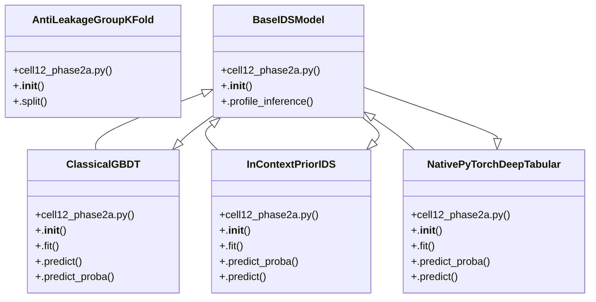

# Community 6

> 32 nodes · cohesion 0.10

## Key Concepts

- [cell12_phase2a.py](file:///D:/Codes/research_banks/is_ai-vuln/scratch/cell12_phase2a.py#L1) (10 connections)
- [InContextPriorIDS](file:///D:/Codes/research_banks/is_ai-vuln/scratch/cell12_phase2a.py#L163) (8 connections)
- [NativePyTorchDeepTabular](file:///D:/Codes/research_banks/is_ai-vuln/scratch/cell12_phase2a.py#L224) (8 connections)
- [ClassicalGBDT](file:///D:/Codes/research_banks/is_ai-vuln/scratch/cell12_phase2a.py#L129) (7 connections)
- [BaseIDSModel](file:///D:/Codes/research_banks/is_ai-vuln/scratch/cell12_phase2a.py#L96) (6 connections)
- [.predict_proba()](file:///D:/Codes/research_banks/is_ai-vuln/scratch/cell12_phase2a.py#L406) (5 connections)
- [AntiLeakageGroupKFold](file:///D:/Codes/research_banks/is_ai-vuln/scratch/cell12_phase2a.py#L21) (4 connections)
- [get_model()](file:///D:/Codes/research_banks/is_ai-vuln/scratch/cell12_phase2a.py#L428) (4 connections)
- [.predict()](file:///D:/Codes/research_banks/is_ai-vuln/scratch/cell12_phase2a.py#L424) (4 connections)
- [extract_subnet_mask()](file:///D:/Codes/research_banks/is_ai-vuln/scratch/cell12_phase2a.py#L17) (3 connections)
- [.fit()](file:///D:/Codes/research_banks/is_ai-vuln/scratch/cell12_phase2a.py#L241) (3 connections)
- [.__init__()](file:///D:/Codes/research_banks/is_ai-vuln/scratch/cell12_phase2a.py#L229) (3 connections)
- [.split()](file:///D:/Codes/research_banks/is_ai-vuln/scratch/cell12_phase2a.py#L28) (2 connections)
- [.profile_inference()](file:///D:/Codes/research_banks/is_ai-vuln/scratch/cell12_phase2a.py#L100) (2 connections)
- [.fit()](file:///D:/Codes/research_banks/is_ai-vuln/scratch/cell12_phase2a.py#L134) (2 connections)
- [.__init__()](file:///D:/Codes/research_banks/is_ai-vuln/scratch/cell12_phase2a.py#L130) (2 connections)
- [.predict()](file:///D:/Codes/research_banks/is_ai-vuln/scratch/cell12_phase2a.py#L157) (2 connections)
- [.predict_proba()](file:///D:/Codes/research_banks/is_ai-vuln/scratch/cell12_phase2a.py#L159) (2 connections)
- [.fit()](file:///D:/Codes/research_banks/is_ai-vuln/scratch/cell12_phase2a.py#L171) (2 connections)
- [.__init__()](file:///D:/Codes/research_banks/is_ai-vuln/scratch/cell12_phase2a.py#L165) (2 connections)
- [.predict()](file:///D:/Codes/research_banks/is_ai-vuln/scratch/cell12_phase2a.py#L220) (2 connections)
- [.predict_proba()](file:///D:/Codes/research_banks/is_ai-vuln/scratch/cell12_phase2a.py#L197) (2 connections)
- [safe_slice()](file:///D:/Codes/research_banks/is_ai-vuln/scratch/cell12_phase2a.py#L11) (2 connections)
- [.__init__()](file:///D:/Codes/research_banks/is_ai-vuln/scratch/cell12_phase2a.py#L23) (1 connections)
- [.__init__()](file:///D:/Codes/research_banks/is_ai-vuln/scratch/cell12_phase2a.py#L97) (1 connections)
- *... and 7 more nodes in this community*

## Class Diagram

## Relationships

- No strong cross-community connections detected

## Source Files

- [D:\Codes\research_banks\is_ai-vuln\scratch\cell12_phase2a.py](file:///D:/Codes/research_banks/is_ai-vuln/scratch/cell12_phase2a.py)

## Audit Trail

- EXTRACTED: 96 (100%)
- INFERRED: 0 (0%)
- AMBIGUOUS: 0 (0%)

---

*Part of the graphify knowledge wiki. See [[index]] to navigate.*