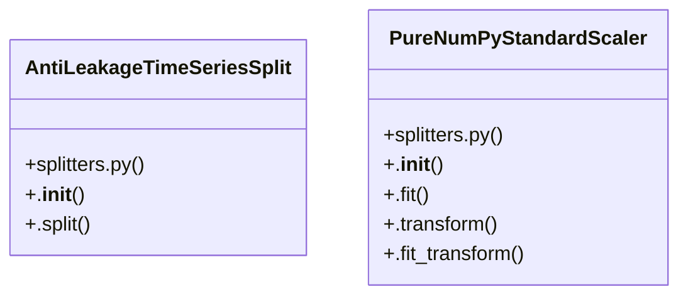

# Community 7

> 17 nodes · cohesion 0.15

## Key Concepts

- [splitters.py](file:///D:/Codes/research_banks/is_ai-vuln/src/data/splitters.py#L1) (7 connections)
- [PureNumPyStandardScaler](file:///D:/Codes/research_banks/is_ai-vuln/src/data/splitters.py#L47) (7 connections)
- [fit_fold_isolated_pipeline()](file:///D:/Codes/research_banks/is_ai-vuln/src/data/splitters.py#L140) (5 connections)
- [AntiLeakageTimeSeriesSplit](file:///D:/Codes/research_banks/is_ai-vuln/src/data/splitters.py#L113) (4 connections)
- [.fit_transform()](file:///D:/Codes/research_banks/is_ai-vuln/src/data/splitters.py#L66) (4 connections)
- [extract_subnet_mask()](file:///D:/Codes/research_banks/is_ai-vuln/src/data/splitters.py#L29) (3 connections)
- [.transform()](file:///D:/Codes/research_banks/is_ai-vuln/src/data/splitters.py#L60) (3 connections)
- [.fit()](file:///D:/Codes/research_banks/is_ai-vuln/src/data/splitters.py#L53) (2 connections)
- [safe_slice()](file:///D:/Codes/research_banks/is_ai-vuln/src/data/splitters.py#L18) (2 connections)
- [.__init__()](file:///D:/Codes/research_banks/is_ai-vuln/src/data/splitters.py#L116) (1 connections)
- [.__init__()](file:///D:/Codes/research_banks/is_ai-vuln/src/data/splitters.py#L49) (1 connections)
- [Anti-Leakage Data Partitioning Suite. Implements Subnet-Grouped and Time-Aware K](file:///D:/Codes/research_banks/is_ai-vuln/src/data/splitters.py#L1) (1 connections)
- [Time-aware chronological cross-validator without future-looking data leakage.](file:///D:/Codes/research_banks/is_ai-vuln/src/data/splitters.py#L114) (1 connections)
- [Fit scaler and sampler STRICTLY within the train split, preventing leakage to va](file:///D:/Codes/research_banks/is_ai-vuln/src/data/splitters.py#L149) (1 connections)
- [Safely slice pandas DataFrame, Series, or NumPy ndarray by integer indices.](file:///D:/Codes/research_banks/is_ai-vuln/src/data/splitters.py#L19) (1 connections)
- [Extract subnet group from IPv4 address string (default /24 mask).](file:///D:/Codes/research_banks/is_ai-vuln/src/data/splitters.py#L30) (1 connections)
- [Pure NumPy implementation of standard scaler for isolated or minimal environment](file:///D:/Codes/research_banks/is_ai-vuln/src/data/splitters.py#L48) (1 connections)

## Class Diagram

## Relationships

- [[Community 2]] (6 shared connections)

## Source Files

- [D:\Codes\research_banks\is_ai-vuln\src\data\splitters.py](file:///D:/Codes/research_banks/is_ai-vuln/src/data/splitters.py)

## Audit Trail

- EXTRACTED: 44 (98%)
- INFERRED: 1 (2%)
- AMBIGUOUS: 0 (0%)

---

*Part of the graphify knowledge wiki. See [[index]] to navigate.*