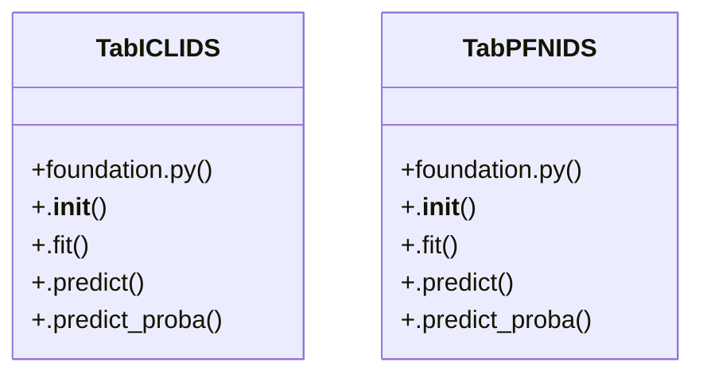

# Community 8

> 14 nodes · cohesion 0.21

## Key Concepts

- [TabICLIDS](file:///D:/Codes/research_banks/is_ai-vuln/src/models/foundation.py#L99) (10 connections)
- [TabPFNIDS](file:///D:/Codes/research_banks/is_ai-vuln/src/models/foundation.py#L16) (10 connections)
- [.predict_proba()](file:///D:/Codes/research_banks/is_ai-vuln/src/models/foundation.py#L139) (4 connections)
- [foundation.py](file:///D:/Codes/research_banks/is_ai-vuln/src/models/foundation.py#L1) (3 connections)
- [.predict()](file:///D:/Codes/research_banks/is_ai-vuln/src/models/foundation.py#L131) (3 connections)
- [.predict()](file:///D:/Codes/research_banks/is_ai-vuln/src/models/foundation.py#L60) (3 connections)
- [Tabular Foundation Models for Intrusion Detection (Track A). Implements TabPFN v](file:///D:/Codes/research_banks/is_ai-vuln/src/models/foundation.py#L1) (2 connections)
- [Tabular In-Context Learning (TabICL v2) with KV-Caching.          Evaluates sequ](file:///D:/Codes/research_banks/is_ai-vuln/src/models/foundation.py#L100) (2 connections)
- [Tabular Prior-Data Fitted Network (TabPFN v3) Foundation Model.          Evaluat](file:///D:/Codes/research_banks/is_ai-vuln/src/models/foundation.py#L17) (2 connections)
- [.fit()](file:///D:/Codes/research_banks/is_ai-vuln/src/models/foundation.py#L111) (2 connections)
- [.__init__()](file:///D:/Codes/research_banks/is_ai-vuln/src/models/foundation.py#L105) (2 connections)
- [.fit()](file:///D:/Codes/research_banks/is_ai-vuln/src/models/foundation.py#L29) (2 connections)
- [.__init__()](file:///D:/Codes/research_banks/is_ai-vuln/src/models/foundation.py#L23) (2 connections)
- [.predict_proba()](file:///D:/Codes/research_banks/is_ai-vuln/src/models/foundation.py#L76) (2 connections)

## Class Diagram

## Relationships

- [[Community 4]] (2 shared connections)

## Source Files

- [D:\Codes\research_banks\is_ai-vuln\src\models\foundation.py](file:///D:/Codes/research_banks/is_ai-vuln/src/models/foundation.py)

## Audit Trail

- EXTRACTED: 40 (82%)
- INFERRED: 9 (18%)
- AMBIGUOUS: 0 (0%)

---

*Part of the graphify knowledge wiki. See [[index]] to navigate.*