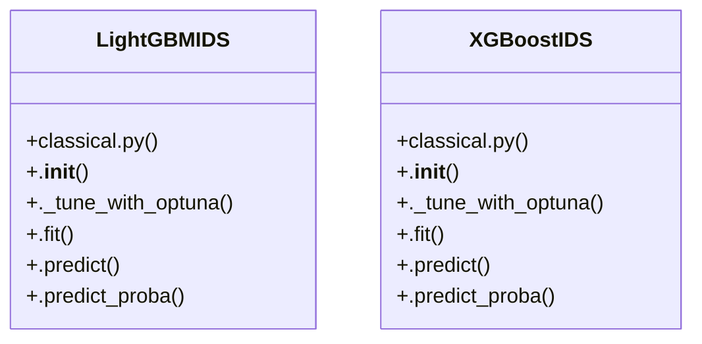

# Community 8

> 16 nodes · cohesion 0.17

## Key Concepts

- [LightGBMIDS](file:///D:/Codes/research_banks/is_ai-vuln/src/models/classical.py#L114) (11 connections)
- [XGBoostIDS](file:///D:/Codes/research_banks/is_ai-vuln/src/models/classical.py#L16) (11 connections)
- [.fit()](file:///D:/Codes/research_banks/is_ai-vuln/src/models/classical.py#L165) (3 connections)
- [._tune_with_optuna()](file:///D:/Codes/research_banks/is_ai-vuln/src/models/classical.py#L131) (3 connections)
- [.fit()](file:///D:/Codes/research_banks/is_ai-vuln/src/models/classical.py#L72) (3 connections)
- [classical.py](file:///D:/Codes/research_banks/is_ai-vuln/src/models/classical.py#L1) (3 connections)
- [.__init__()](file:///D:/Codes/research_banks/is_ai-vuln/src/models/classical.py#L117) (2 connections)
- [.predict()](file:///D:/Codes/research_banks/is_ai-vuln/src/models/classical.py#L186) (2 connections)
- [.predict_proba()](file:///D:/Codes/research_banks/is_ai-vuln/src/models/classical.py#L191) (2 connections)
- [Classical Gradient Boosted Decision Tree (GBDT) Baselines. Implements XGBoost an](file:///D:/Codes/research_banks/is_ai-vuln/src/models/classical.py#L1) (2 connections)
- [LightGBM Classifier Baseline with Histogram Gradient Optimization.](file:///D:/Codes/research_banks/is_ai-vuln/src/models/classical.py#L115) (2 connections)
- [XGBoost Classifier Baseline with Optuna Tuning and Hist/GPU acceleration.](file:///D:/Codes/research_banks/is_ai-vuln/src/models/classical.py#L17) (2 connections)
- [.__init__()](file:///D:/Codes/research_banks/is_ai-vuln/src/models/classical.py#L19) (2 connections)
- [.predict()](file:///D:/Codes/research_banks/is_ai-vuln/src/models/classical.py#L103) (2 connections)
- [.predict_proba()](file:///D:/Codes/research_banks/is_ai-vuln/src/models/classical.py#L108) (2 connections)
- [._tune_with_optuna()](file:///D:/Codes/research_banks/is_ai-vuln/src/models/classical.py#L34) (1 connections)

## Class Diagram

## Relationships

- [[Community 0]] (7 shared connections)

## Source Files

- [D:\Codes\research_banks\is_ai-vuln\src\models\classical.py](file:///D:/Codes/research_banks/is_ai-vuln/src/models/classical.py)

## Audit Trail

- EXTRACTED: 44 (83%)
- INFERRED: 9 (17%)
- AMBIGUOUS: 0 (0%)

---

*Part of the graphify knowledge wiki. See [[index]] to navigate.*