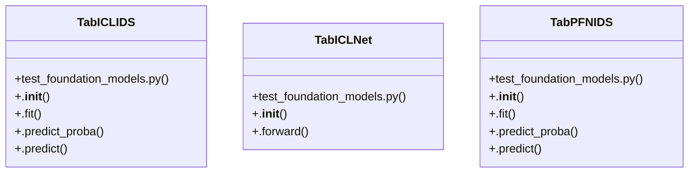

# Community 9

> 17 nodes · cohesion 0.16

## Key Concepts

- [TabICLIDS](file:///D:/Codes/research_banks/is_ai-vuln/scratch/test_foundation_models.py#L86) (6 connections)
- [TabPFNIDS](file:///D:/Codes/research_banks/is_ai-vuln/scratch/test_foundation_models.py#L8) (6 connections)
- [TabICLNet](file:///D:/Codes/research_banks/is_ai-vuln/scratch/test_foundation_models.py#L54) (5 connections)
- [.predict_proba()](file:///D:/Codes/research_banks/is_ai-vuln/scratch/test_foundation_models.py#L144) (4 connections)
- [test_foundation_models.py](file:///D:/Codes/research_banks/is_ai-vuln/scratch/test_foundation_models.py#L1) (3 connections)
- [.fit()](file:///D:/Codes/research_banks/is_ai-vuln/scratch/test_foundation_models.py#L101) (3 connections)
- [.__init__()](file:///D:/Codes/research_banks/is_ai-vuln/scratch/test_foundation_models.py#L88) (2 connections)
- [.predict()](file:///D:/Codes/research_banks/is_ai-vuln/scratch/test_foundation_models.py#L159) (2 connections)
- [.__init__()](file:///D:/Codes/research_banks/is_ai-vuln/scratch/test_foundation_models.py#L56) (2 connections)
- [.fit()](file:///D:/Codes/research_banks/is_ai-vuln/scratch/test_foundation_models.py#L18) (2 connections)
- [.predict()](file:///D:/Codes/research_banks/is_ai-vuln/scratch/test_foundation_models.py#L50) (2 connections)
- [.predict_proba()](file:///D:/Codes/research_banks/is_ai-vuln/scratch/test_foundation_models.py#L41) (2 connections)
- [Native PyTorch in-context learning transformer for tabular inputs (Qu et al., 20](file:///D:/Codes/research_banks/is_ai-vuln/scratch/test_foundation_models.py#L55) (1 connections)
- [Tabular In-Context Learning Foundation Model (Qu et al., 2025).](file:///D:/Codes/research_banks/is_ai-vuln/scratch/test_foundation_models.py#L87) (1 connections)
- [TabPFN tabular foundation model (Hollmann et al., Nature 2025).](file:///D:/Codes/research_banks/is_ai-vuln/scratch/test_foundation_models.py#L9) (1 connections)
- [.forward()](file:///D:/Codes/research_banks/is_ai-vuln/scratch/test_foundation_models.py#L74) (1 connections)
- [.__init__()](file:///D:/Codes/research_banks/is_ai-vuln/scratch/test_foundation_models.py#L10) (1 connections)

## Class Diagram

## Relationships

- No strong cross-community connections detected

## Source Files

- [D:\Codes\research_banks\is_ai-vuln\scratch\test_foundation_models.py](file:///D:/Codes/research_banks/is_ai-vuln/scratch/test_foundation_models.py)

## Audit Trail

- EXTRACTED: 44 (100%)
- INFERRED: 0 (0%)
- AMBIGUOUS: 0 (0%)

---

*Part of the graphify knowledge wiki. See [[index]] to navigate.*