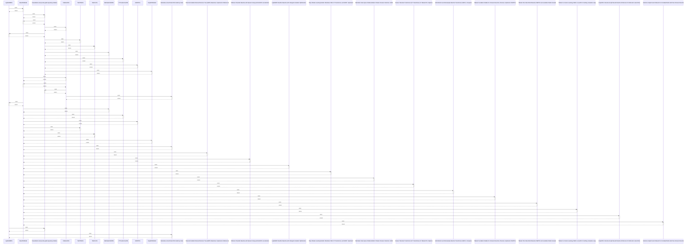

# LightGBMIDS

> God node · 11 connections · [D:\Codes\research_banks\is_ai-vuln\src\models\classical.py](file:///D:/Codes/research_banks/is_ai-vuln/src/models/classical.py#L114)

## Call Trace Diagram

## Connections by Relation

### contains
- [[classical.py]] `EXTRACTED`

### inherits
- [[BaseIDSModel]] `EXTRACTED`

### method
- [[._tune_with_optuna()]] `EXTRACTED`
- [[.fit()]] `EXTRACTED`
- [[.__init__()]] `EXTRACTED`
- [[.predict()]] `EXTRACTED`
- [[.predict_proba()]] `EXTRACTED`

### rationale_for
- [[LightGBM Classifier Baseline with Histogram Gradient Optimization.]] `EXTRACTED`

### uses
- [[BaseIDSModel]] `INFERRED`
- [[Visualization and journal-grade layouting modules.]] `INFERRED`
- [[Instantiate a benchmark IDS model by name.]] `INFERRED`

---

*Part of the graphify knowledge wiki. See [[index]] to navigate.*