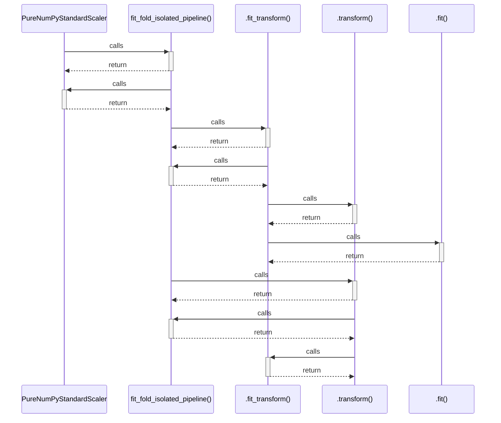

# PureNumPyStandardScaler

> God node · 7 connections · [D:\Codes\research_banks\is_ai-vuln\src\data\splitters.py](file:///D:/Codes/research_banks/is_ai-vuln/src/data/splitters.py#L47)

## Call Trace Diagram

## Connections by Relation

### calls
- [[fit_fold_isolated_pipeline()]] `EXTRACTED`

### contains
- [[splitters.py]] `EXTRACTED`

### method
- [[.fit_transform()]] `EXTRACTED`
- [[.transform()]] `EXTRACTED`
- [[.fit()]] `EXTRACTED`
- [[.__init__()]] `EXTRACTED`

### rationale_for
- [[Pure NumPy implementation of standard scaler for isolated or minimal environment]] `EXTRACTED`

---

*Part of the graphify knowledge wiki. See [[index]] to navigate.*