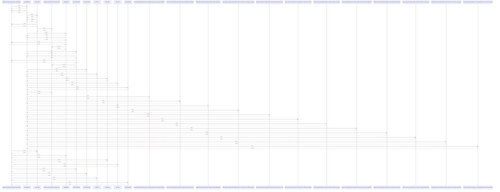

# Visualization and journal-grade layouting modules.

> God node · 16 connections · [D:\Codes\research_banks\is_ai-vuln\src\visualization\__init__.py](file:///D:/Codes/research_banks/is_ai-vuln/src/visualization/__init__.py#L1)

**Community:** [[Community 0]]

## Call Trace Diagram

## Connections by Relation

### rationale_for
- [[__init__.py]] `EXTRACTED`
- [[__init__.py]] `EXTRACTED`
- [[__init__.py]] `EXTRACTED`
- [[__init__.py]] `EXTRACTED`
- [[__init__.py]] `EXTRACTED`
- [[__init__.py]] `EXTRACTED`
- [[__init__.py]] `EXTRACTED`

### uses
- [[BaseIDSModel]] `INFERRED`
- [[XGBoostIDS]] `INFERRED`
- [[LightGBMIDS]] `INFERRED`
- [[TabPFNIDS]] `INFERRED`
- [[TabICLIDS]] `INFERRED`
- [[MambularSSMIDS]] `INFERRED`
- [[FTTransformerIDS]] `INFERRED`
- [[SAINTIDS]] `INFERRED`
- [[GraphIDSModel]] `INFERRED`

---

*Part of the graphify knowledge wiki. See [[index]] to navigate.*