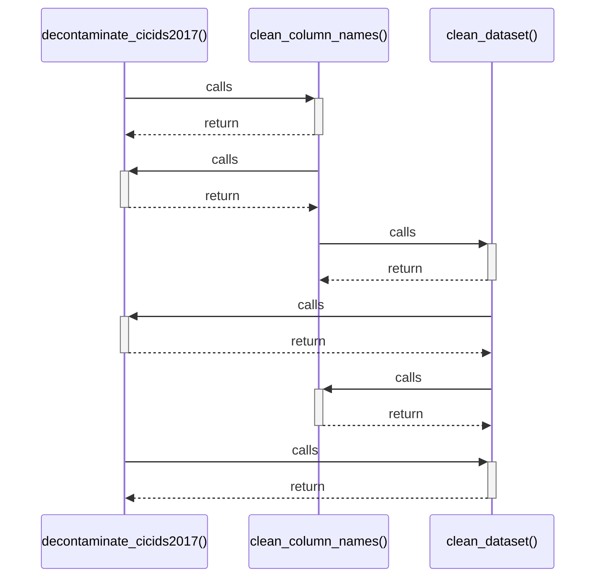

# decontaminate_cicids2017()

> God node · 4 connections · [D:\Codes\research_banks\is_ai-vuln\src\data\cleaner.py](file:///D:/Codes/research_banks/is_ai-vuln/src/data/cleaner.py#L23)

## Call Trace Diagram

## Connections by Relation

### calls
- [[clean_column_names()]] `EXTRACTED`
- [[clean_dataset()]] `EXTRACTED`

### contains
- [[cleaner.py]] `EXTRACTED`

### rationale_for
- [[Clean and decontaminate CICIDS2017 dataset according to SPW 2021 and TIFS 2022 f]] `EXTRACTED`

---

*Part of the graphify knowledge wiki. See [[index]] to navigate.*