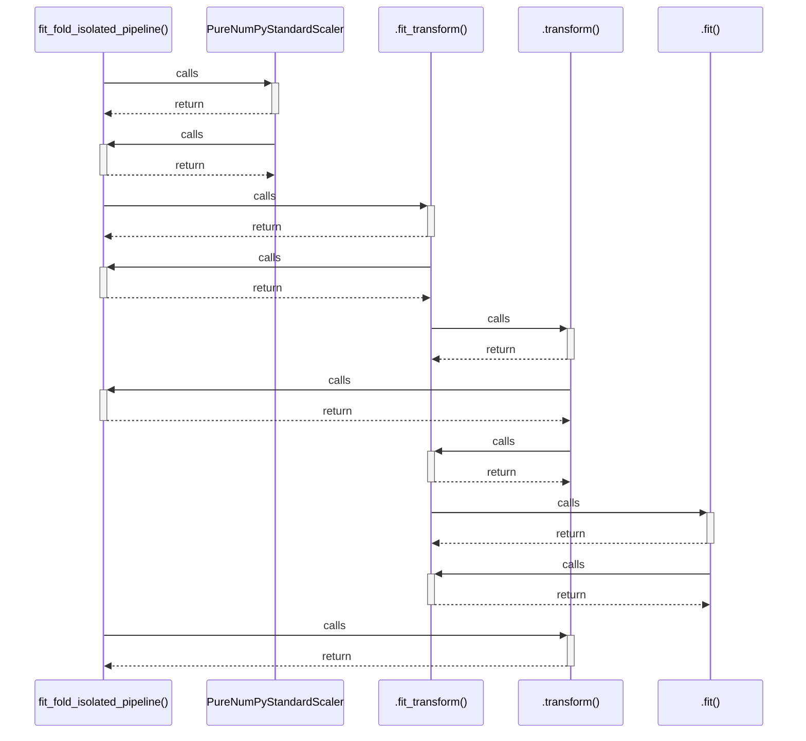

# fit_fold_isolated_pipeline()

> God node · 5 connections · [D:\Codes\research_banks\is_ai-vuln\src\data\splitters.py](file:///D:/Codes/research_banks/is_ai-vuln/src/data/splitters.py#L137)

## Call Trace Diagram

## Connections by Relation

### calls
- [[PureNumPyStandardScaler]] `EXTRACTED`
- [[.fit_transform()]] `EXTRACTED`
- [[.transform()]] `EXTRACTED`

### contains
- [[splitters.py]] `EXTRACTED`

### rationale_for
- [[Fit scaler and sampler STRICTLY within the train split, preventing leakage to va]] `EXTRACTED`

---

*Part of the graphify knowledge wiki. See [[index]] to navigate.*