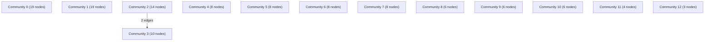

# Knowledge Graph Index

> Auto-generated by graphify. Start here — read community articles for context, then drill into god nodes for detail.

**119 nodes · 127 edges · 13 communities**

---

## System Architecture Flowchart

## Communities
(sorted by size, largest first)

- [[Community 0]] — 19 nodes
- [[Community 1]] — 19 nodes
- [[Community 2]] — 14 nodes
- [[Community 3]] — 10 nodes
- [[Community 4]] — 8 nodes
- [[Community 5]] — 8 nodes
- [[Community 6]] — 8 nodes
- [[Community 7]] — 8 nodes
- [[Community 8]] — 6 nodes
- [[Community 9]] — 6 nodes
- [[Community 10]] — 6 nodes
- [[Community 11]] — 4 nodes
- [[Community 12]] — 3 nodes

## God Nodes
(most connected concepts — the load-bearing abstractions)

- [[is_ai-vuln Project Overview]] — 12 connections
- [[CheckpointManager]] — 10 connections
- [[Visualization and journal-grade layouting modules.]] — 7 connections
- [[PureNumPyStandardScaler]] — 7 connections
- [[fit_fold_isolated_pipeline()]] — 5 connections
- [[clean_column_names()]] — 4 connections
- [[decontaminate_cicids2017()]] — 4 connections
- [[clean_dataset()]] — 4 connections
- [[AntiLeakageGroupKFold]] — 4 connections
- [[AntiLeakageTimeSeriesSplit]] — 4 connections

---

*Generated by [graphify](https://github.com/safishamsi/graphify)*