# Knowledge Graph Index

> Auto-generated by graphify. Start here — read community articles for context, then drill into god nodes for detail.

**309 nodes · 442 edges · 26 communities**

---

## System Architecture Flowchart

```mermaid
flowchart TD
    C0["Community 0 (49 nodes)"]
    C1["Community 1 (39 nodes)"]
    C2["Community 2 (38 nodes)"]
    C3["Community 3 (34 nodes)"]
    C4["Community 4 (19 nodes)"]
    C5["Community 5 (19 nodes)"]
    C6["Community 6 (16 nodes)"]
    C7["Community 7 (14 nodes)"]
    C8["Community 8 (14 nodes)"]
    C9["Community 9 (9 nodes)"]
    C10["Community 10 (9 nodes)"]
    C11["Community 11 (8 nodes)"]
    C12["Community 12 (8 nodes)"]
    C13["Community 13 (8 nodes)"]
    C14["Community 14 (6 nodes)"]
    C15["Community 15 (4 nodes)"]
    C16["Community 16 (4 nodes)"]
    C17["Community 17 (3 nodes)"]
    C18["Community 18 (1 nodes)"]
    C19["Community 19 (1 nodes)"]
    C20["Community 20 (1 nodes)"]
    C21["Community 21 (1 nodes)"]
    C22["Community 22 (1 nodes)"]
    C23["Community 23 (1 nodes)"]
    C24["Community 24 (1 nodes)"]
    C25["Community 25 (1 nodes)"]
    C0 -->|9 edges| C8
    C0 -->|7 edges| C1
    C1 -->|3 edges| C3
    C0 -->|3 edges| C10
    C9 -->|2 edges| C2
    C1 -->|2 edges| C6
    C1 -->|2 edges| C12
    C7 -->|2 edges| C2
    C3 -->|2 edges| C1
    C8 -->|2 edges| C0
    C1 -->|2 edges| C0
    C1 -->|1 edges| C16
    C1 -->|1 edges| C10
    C11 -->|1 edges| C2
    C3 -->|1 edges| C6
    C10 -->|1 edges| C0
    C1 -->|1 edges| C13
```

## Communities
(sorted by size, largest first)

- [[Community 0]] — 49 nodes
- [[Community 1]] — 39 nodes
- [[Community 2]] — 38 nodes
- [[Community 3]] — 34 nodes
- [[Community 4]] — 19 nodes
- [[Community 5]] — 19 nodes
- [[Community 6]] — 16 nodes
- [[Community 7]] — 14 nodes
- [[Community 8]] — 14 nodes
- [[Community 9]] — 9 nodes
- [[Community 10]] — 9 nodes
- [[Community 11]] — 8 nodes
- [[Community 12]] — 8 nodes
- [[Community 13]] — 8 nodes
- [[Community 14]] — 6 nodes
- [[Community 15]] — 4 nodes
- [[Community 16]] — 4 nodes
- [[Community 17]] — 3 nodes
- [[Community 18]] — 1 nodes
- [[Community 19]] — 1 nodes
- [[Community 20]] — 1 nodes
- [[Community 21]] — 1 nodes
- [[Community 22]] — 1 nodes
- [[Community 23]] — 1 nodes
- [[Community 24]] — 1 nodes
- [[Community 25]] — 1 nodes

## God Nodes
(most connected concepts — the load-bearing abstractions)

- [[BaseIDSModel]] — 30 connections
- [[run_tests()]] — 16 connections
- [[Visualization and journal-grade layouting modules.]] — 16 connections
- [[is_ai-vuln Project Overview]] — 12 connections
- [[run_closed_loop_fuzzy_dematel()]] — 11 connections
- [[XGBoostIDS]] — 11 connections
- [[LightGBMIDS]] — 11 connections
- [[run_preparation_pipeline()]] — 10 connections
- [[MambularSSMIDS]] — 10 connections
- [[FTTransformerIDS]] — 10 connections

---

*Generated by [graphify](https://github.com/safishamsi/graphify)*