# Knowledge Graph Index

> Auto-generated by graphify. Start here — read community articles for context, then drill into god nodes for detail.

**501 nodes · 686 edges · 77 communities**

---

## System Architecture Flowchart

```mermaid
flowchart TD
    C0["Community 0 (75 nodes)"]
    C1["Community 1 (45 nodes)"]
    C2["Community 2 (40 nodes)"]
    C3["Community 3 (38 nodes)"]
    C4["Community 4 (37 nodes)"]
    C5["Community 5 (36 nodes)"]
    C6["Community 6 (32 nodes)"]
    C7["Community 7 (19 nodes)"]
    C8["Community 8 (19 nodes)"]
    C9["Community 9 (17 nodes)"]
    C10["Community 10 (17 nodes)"]
    C11["Community 11 (13 nodes)"]
    C12["Community 12 (10 nodes)"]
    C13["Community 13 (9 nodes)"]
    C14["Community 14 (8 nodes)"]
    C15["Community 15 (6 nodes)"]
    C16["Community 16 (6 nodes)"]
    C17["Community 17 (4 nodes)"]
    C18["Community 18 (3 nodes)"]
    C19["Community 19 (3 nodes)"]
    C20["Community 20 (3 nodes)"]
    C21["Community 21 (3 nodes)"]
    C22["Community 22 (2 nodes)"]
    C23["Community 23 (2 nodes)"]
    C24["Community 24 (2 nodes)"]
    C25["Community 25 (1 nodes)"]
    C26["Community 26 (1 nodes)"]
    C27["Community 27 (1 nodes)"]
    C28["Community 28 (1 nodes)"]
    C29["Community 29 (1 nodes)"]
    C30["Community 30 (1 nodes)"]
    C31["Community 31 (1 nodes)"]
    C32["Community 32 (1 nodes)"]
    C33["Community 33 (1 nodes)"]
    C34["Community 34 (1 nodes)"]
    C35["Community 35 (1 nodes)"]
    C36["Community 36 (1 nodes)"]
    C37["Community 37 (1 nodes)"]
    C38["Community 38 (1 nodes)"]
    C39["Community 39 (1 nodes)"]
    C40["Community 40 (1 nodes)"]
    C41["Data Splitting (1 nodes)"]
    C42["Community 42 (1 nodes)"]
    C43["Community 43 (1 nodes)"]
    C44["Community 44 (1 nodes)"]
    C45["Community 45 (1 nodes)"]
    C46["Time Series Cross-validation (1 nodes)"]
    C47["Data Splitting (1 nodes)"]
    C48["Preprocessing (1 nodes)"]
    C49["unknown (1 nodes)"]
    C50["unknown (1 nodes)"]
    C51["unknown (1 nodes)"]
    C52["unknown (1 nodes)"]
    C53["unknown (1 nodes)"]
    C54["unknown (1 nodes)"]
    C55["unknown (1 nodes)"]
    C56["Community 56 (1 nodes)"]
    C57["Community 57 (1 nodes)"]
    C58["Community 58 (1 nodes)"]
    C59["Community 59 (1 nodes)"]
    C60["Community 60 (1 nodes)"]
    C61["Community 61 (1 nodes)"]
    C62["Community 62 (1 nodes)"]
    C63["Community 63 (1 nodes)"]
    C64["Community 64 (1 nodes)"]
    C65["Community 65 (1 nodes)"]
    C66["Community 66 (1 nodes)"]
    C67["Community 67 (1 nodes)"]
    C68["Community 68 (1 nodes)"]
    C69["Community 69 (1 nodes)"]
    C70["Community 70 (1 nodes)"]
    C71["Community 71 (1 nodes)"]
    C72["Community 72 (1 nodes)"]
    C73["Community 73 (1 nodes)"]
    C74["Time Series Cross-validation (1 nodes)"]
    C75["Data Splitting (1 nodes)"]
    C76["Preprocessing (1 nodes)"]
    C0 -->|5 edges| C2
    C11 -->|4 edges| C5
    C2 -->|3 edges| C3
    C3 -->|3 edges| C2
    C3 -->|3 edges| C4
    C2 -->|2 edges| C10
    C13 -->|2 edges| C5
    C1 -->|2 edges| C5
    C3 -->|2 edges| C1
    C4 -->|2 edges| C3
    C0 -->|2 edges| C3
    C7 -->|1 edges| C5
    C2 -->|1 edges| C1
    C2 -->|1 edges| C5
    C2 -->|1 edges| C7
    C1 -->|1 edges| C7
    C1 -->|1 edges| C4
    C14 -->|1 edges| C1
    C1 -->|1 edges| C10
    C10 -->|1 edges| C1
    C10 -->|1 edges| C5
    C4 -->|1 edges| C12
    C3 -->|1 edges| C12
    C3 -->|1 edges| C7
    C2 -->|1 edges| C0
```

## Communities
(sorted by size, largest first)

- [[Community 0]] — 75 nodes
- [[Community 1]] — 45 nodes
- [[Community 2]] — 40 nodes
- [[Community 3]] — 38 nodes
- [[Community 4]] — 37 nodes
- [[Community 5]] — 36 nodes
- [[Community 6]] — 32 nodes
- [[Community 7]] — 19 nodes
- [[Community 8]] — 19 nodes
- [[Community 9]] — 17 nodes
- [[Community 10]] — 17 nodes
- [[Community 11]] — 13 nodes
- [[Community 12]] — 10 nodes
- [[Community 13]] — 9 nodes
- [[Community 14]] — 8 nodes
- [[Community 15]] — 6 nodes
- [[Community 16]] — 6 nodes
- [[Community 17]] — 4 nodes
- [[Community 18]] — 3 nodes
- [[Community 19]] — 3 nodes
- [[Community 20]] — 3 nodes
- [[Community 21]] — 3 nodes
- [[Community 22]] — 2 nodes
- [[Community 23]] — 2 nodes
- [[Community 24]] — 2 nodes
- [[Community 25]] — 1 nodes
- [[Community 26]] — 1 nodes
- [[Community 27]] — 1 nodes
- [[Community 28]] — 1 nodes
- [[Community 29]] — 1 nodes
- [[Community 30]] — 1 nodes
- [[Community 31]] — 1 nodes
- [[Community 32]] — 1 nodes
- [[Community 33]] — 1 nodes
- [[Community 34]] — 1 nodes
- [[Community 35]] — 1 nodes
- [[Community 36]] — 1 nodes
- [[Community 37]] — 1 nodes
- [[Community 38]] — 1 nodes
- [[Community 39]] — 1 nodes
- [[Community 40]] — 1 nodes
- [[Data Splitting]] — 1 nodes
- [[Community 42]] — 1 nodes
- [[Community 43]] — 1 nodes
- [[Community 44]] — 1 nodes
- [[Community 45]] — 1 nodes
- [[Time Series Cross-validation]] — 1 nodes
- [[Data Splitting]] — 1 nodes
- [[Preprocessing]] — 1 nodes
- [[unknown]] — 1 nodes
- [[unknown]] — 1 nodes
- [[unknown]] — 1 nodes
- [[unknown]] — 1 nodes
- [[unknown]] — 1 nodes
- [[unknown]] — 1 nodes
- [[unknown]] — 1 nodes
- [[Community 56]] — 1 nodes
- [[Community 57]] — 1 nodes
- [[Community 58]] — 1 nodes
- [[Community 59]] — 1 nodes
- [[Community 60]] — 1 nodes
- [[Community 61]] — 1 nodes
- [[Community 62]] — 1 nodes
- [[Community 63]] — 1 nodes
- [[Community 64]] — 1 nodes
- [[Community 65]] — 1 nodes
- [[Community 66]] — 1 nodes
- [[Community 67]] — 1 nodes
- [[Community 68]] — 1 nodes
- [[Community 69]] — 1 nodes
- [[Community 70]] — 1 nodes
- [[Community 71]] — 1 nodes
- [[Community 72]] — 1 nodes
- [[Community 73]] — 1 nodes
- [[Time Series Cross-validation]] — 1 nodes
- [[Data Splitting]] — 1 nodes
- [[Preprocessing]] — 1 nodes

## God Nodes
(most connected concepts — the load-bearing abstractions)

- [[BaseIDSModel]] — 30 connections
- [[run_track_a_benchmark()]] — 18 connections
- [[run_tests()]] — 16 connections
- [[Visualization and journal-grade layouting modules.]] — 16 connections
- [[is_ai-vuln Project Overview]] — 12 connections
- [[run_preparation_pipeline()]] — 11 connections
- [[run_closed_loop_fuzzy_dematel()]] — 11 connections
- [[XGBoostIDS]] — 11 connections
- [[LightGBMIDS]] — 11 connections
- [[CheckpointManager]] — 11 connections

---

*Generated by [graphify](https://github.com/safishamsi/graphify)*