# Knowledge Graph Index

> Auto-generated by graphify. Start here — read community articles for context, then drill into god nodes for detail.

**402 nodes · 574 edges · 49 communities**

---

## System Architecture Flowchart

```mermaid
flowchart TD
    C0["Community 0 (68 nodes)"]
    C1["Community 1 (46 nodes)"]
    C2["Community 2 (45 nodes)"]
    C3["Community 3 (37 nodes)"]
    C4["Community 4 (36 nodes)"]
    C5["Community 5 (19 nodes)"]
    C6["Community 6 (19 nodes)"]
    C7["Community 7 (17 nodes)"]
    C8["Community 8 (16 nodes)"]
    C9["Community 9 (13 nodes)"]
    C10["Community 10 (11 nodes)"]
    C11["Community 11 (9 nodes)"]
    C12["Community 12 (9 nodes)"]
    C13["Community 13 (8 nodes)"]
    C14["Community 14 (6 nodes)"]
    C15["Community 15 (4 nodes)"]
    C16["Community 16 (3 nodes)"]
    C17["Community 17 (3 nodes)"]
    C18["Community 18 (3 nodes)"]
    C19["Community 19 (1 nodes)"]
    C20["Community 20 (1 nodes)"]
    C21["Community 21 (1 nodes)"]
    C22["Community 22 (1 nodes)"]
    C23["Community 23 (1 nodes)"]
    C24["Community 24 (1 nodes)"]
    C25["Community 25 (1 nodes)"]
    C26["Community 26 (1 nodes)"]
    C27["Community 27 (1 nodes)"]
    C28["Community 28 (1 nodes)"]
    C29["Community 29 (1 nodes)"]
    C30["Community 30 (1 nodes)"]
    C31["Community 31 (1 nodes)"]
    C32["Community 32 (1 nodes)"]
    C33["Community 33 (1 nodes)"]
    C34["Community 34 (1 nodes)"]
    C35["Community 35 (1 nodes)"]
    C36["Community 36 (1 nodes)"]
    C37["Community 37 (1 nodes)"]
    C38["Community 38 (1 nodes)"]
    C39["Community 39 (1 nodes)"]
    C40["Community 40 (1 nodes)"]
    C41["Data Splitting (1 nodes)"]
    C42["Community 42 (1 nodes)"]
    C43["Community 43 (1 nodes)"]
    C44["Community 44 (1 nodes)"]
    C45["Community 45 (1 nodes)"]
    C46["Time Series Cross-validation (1 nodes)"]
    C47["Data Splitting (1 nodes)"]
    C48["Preprocessing (1 nodes)"]
    C0 -->|5 edges| C1
    C9 -->|4 edges| C4
    C1 -->|3 edges| C3
    C0 -->|3 edges| C12
    C11 -->|2 edges| C4
    C1 -->|2 edges| C8
    C2 -->|2 edges| C4
    C1 -->|2 edges| C2
    C3 -->|2 edges| C1
    C1 -->|1 edges| C12
    C2 -->|1 edges| C10
    C2 -->|1 edges| C3
    C13 -->|1 edges| C2
    C2 -->|1 edges| C7
    C7 -->|1 edges| C2
    C7 -->|1 edges| C4
    C3 -->|1 edges| C8
    C12 -->|1 edges| C0
    C1 -->|1 edges| C10
    C1 -->|1 edges| C0
```

## Communities
(sorted by size, largest first)

- [[Community 0]] — 68 nodes
- [[Community 1]] — 46 nodes
- [[Community 2]] — 45 nodes
- [[Community 3]] — 37 nodes
- [[Community 4]] — 36 nodes
- [[Community 5]] — 19 nodes
- [[Community 6]] — 19 nodes
- [[Community 7]] — 17 nodes
- [[Community 8]] — 16 nodes
- [[Community 9]] — 13 nodes
- [[Community 10]] — 11 nodes
- [[Community 11]] — 9 nodes
- [[Community 12]] — 9 nodes
- [[Community 13]] — 8 nodes
- [[Community 14]] — 6 nodes
- [[Community 15]] — 4 nodes
- [[Community 16]] — 3 nodes
- [[Community 17]] — 3 nodes
- [[Community 18]] — 3 nodes
- [[Community 19]] — 1 nodes
- [[Community 20]] — 1 nodes
- [[Community 21]] — 1 nodes
- [[Community 22]] — 1 nodes
- [[Community 23]] — 1 nodes
- [[Community 24]] — 1 nodes
- [[Community 25]] — 1 nodes
- [[Community 26]] — 1 nodes
- [[Community 27]] — 1 nodes
- [[Community 28]] — 1 nodes
- [[Community 29]] — 1 nodes
- [[Community 30]] — 1 nodes
- [[Community 31]] — 1 nodes
- [[Community 32]] — 1 nodes
- [[Community 33]] — 1 nodes
- [[Community 34]] — 1 nodes
- [[Community 35]] — 1 nodes
- [[Community 36]] — 1 nodes
- [[Community 37]] — 1 nodes
- [[Community 38]] — 1 nodes
- [[Community 39]] — 1 nodes
- [[Community 40]] — 1 nodes
- [[Data Splitting]] — 1 nodes
- [[Community 42]] — 1 nodes
- [[Community 43]] — 1 nodes
- [[Community 44]] — 1 nodes
- [[Community 45]] — 1 nodes
- [[Time Series Cross-validation]] — 1 nodes
- [[Data Splitting]] — 1 nodes
- [[Preprocessing]] — 1 nodes

## God Nodes
(most connected concepts — the load-bearing abstractions)

- [[BaseIDSModel]] — 30 connections
- [[run_tests()]] — 16 connections
- [[Visualization and journal-grade layouting modules.]] — 16 connections
- [[is_ai-vuln Project Overview]] — 12 connections
- [[run_preparation_pipeline()]] — 11 connections
- [[run_closed_loop_fuzzy_dematel()]] — 11 connections
- [[XGBoostIDS]] — 11 connections
- [[LightGBMIDS]] — 11 connections
- [[prepare_benchmark_dataset()]] — 10 connections
- [[MambularSSMIDS]] — 10 connections

---

*Generated by [graphify](https://github.com/safishamsi/graphify)*