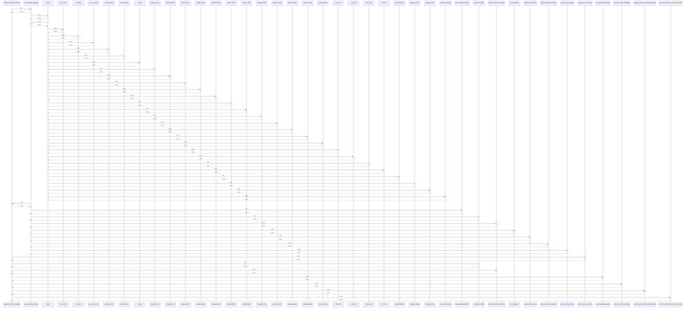

# prepare_benchmark_dataset()

> God node · 10 connections · [D:\Codes\research_banks\is_ai-vuln\src\data\drive_downloader.py](file:///D:/Codes/research_banks/is_ai-vuln/src/data/drive_downloader.py#L299)

## Call Trace Diagram

## Connections by Relation

### calls
- [[run_preparation_pipeline()]] `INFERRED`
- [[resolve_track_b_dataset()]] `INFERRED`
- [[is_synthetic_path()]] `EXTRACTED`
- [[initialize_dataset_directories()]] `EXTRACTED`
- [[scan_available_datasets()]] `EXTRACTED`
- [[test_drive_folder_simulation()]] `INFERRED`
- [[generate_synthetic_benchmark_sample()]] `EXTRACTED`
- [[test_drive_downloader_real_vs_synthetic()]] `INFERRED`

### contains
- [[drive_downloader.py]] `EXTRACTED`

### rationale_for
- [[Retrieve benchmark dataset: checks for authentic files in user-provided structur]] `EXTRACTED`

---

*Part of the graphify knowledge wiki. See [[index]] to navigate.*