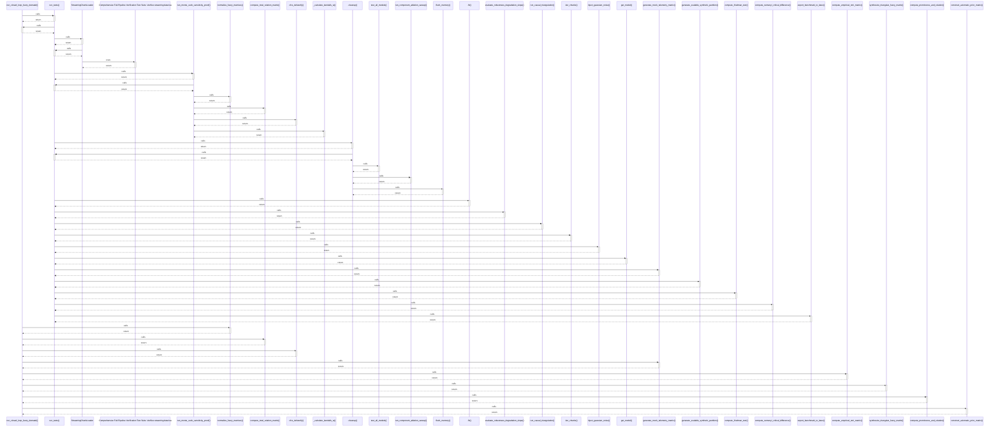

# run_closed_loop_fuzzy_dematel()

> God node · 11 connections · [D:\Codes\research_banks\is_ai-vuln\src\dematel\fuzzy_engine.py](file:///D:/Codes/research_banks/is_ai-vuln/src/dematel/fuzzy_engine.py#L134)

## Call Trace Diagram

## Connections by Relation

### calls
- [[run_tests()]] `INFERRED`
- [[normalize_fuzzy_matrices()]] `EXTRACTED`
- [[compute_total_relation_matrix()]] `EXTRACTED`
- [[cfcs_defuzzify()]] `EXTRACTED`
- [[generate_mock_telemetry_matrix()]] `INFERRED`
- [[compute_empirical_nmi_matrix()]] `INFERRED`
- [[synthesize_triangular_fuzzy_matrix()]] `EXTRACTED`
- [[compute_prominence_and_relation()]] `EXTRACTED`
- [[construct_axiomatic_prior_matrix()]] `INFERRED`

### contains
- [[fuzzy_engine.py]] `EXTRACTED`

### rationale_for
- [[Execute complete autonomous Fuzzy DEMATEL causal simulation pipeline.]] `EXTRACTED`

---

*Part of the graphify knowledge wiki. See [[index]] to navigate.*