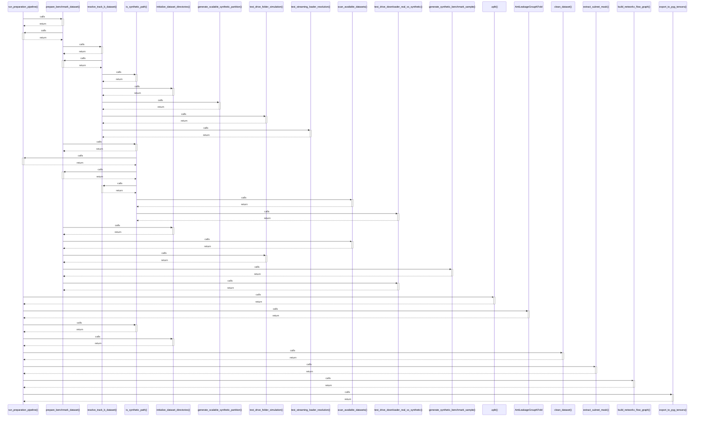

# run_preparation_pipeline()

> God node · 11 connections · [D:\Codes\research_banks\is_ai-vuln\src\data\prep_pipeline.py](file:///D:/Codes/research_banks/is_ai-vuln/src/data/prep_pipeline.py#L39)

## Call Trace Diagram

## Connections by Relation

### calls
- [[prepare_benchmark_dataset()]] `INFERRED`
- [[.split()]] `INFERRED`
- [[AntiLeakageGroupKFold]] `INFERRED`
- [[is_synthetic_path()]] `INFERRED`
- [[initialize_dataset_directories()]] `INFERRED`
- [[clean_dataset()]] `INFERRED`
- [[extract_subnet_mask()]] `INFERRED`
- [[build_networkx_flow_graph()]] `INFERRED`
- [[export_to_pyg_tensors()]] `INFERRED`

### contains
- [[prep_pipeline.py]] `EXTRACTED`

### rationale_for
- [[Execute complete ingestion, cleaning, anti-leakage splitting, and artifact gener]] `EXTRACTED`

---

*Part of the graphify knowledge wiki. See [[index]] to navigate.*