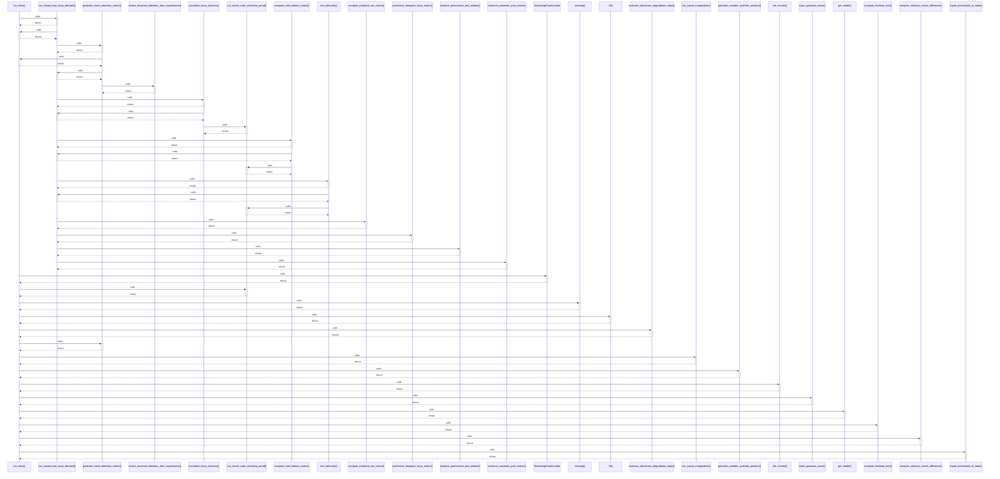

# run_tests()

> God node · 16 connections · [D:\Codes\research_banks\is_ai-vuln\scratch\test_full_pipeline.py](file:///D:/Codes/research_banks/is_ai-vuln/scratch/test_full_pipeline.py#L36)

## Call Trace Diagram

## Connections by Relation

### calls
- [[run_closed_loop_fuzzy_dematel()]] `INFERRED`
- [[StreamingChunkLoader]] `INFERRED`
- [[run_monte_carlo_sensitivity_proof()]] `INFERRED`
- [[.cleanup()]] `INFERRED`
- [[.fit()]] `INFERRED`
- [[evaluate_robustness_degradation_slope()]] `INFERRED`
- [[generate_mock_telemetry_matrix()]] `INFERRED`
- [[run_causal_triangulation()]] `INFERRED`
- [[generate_scalable_synthetic_partition()]] `INFERRED`
- [[.iter_chunks()]] `INFERRED`
- [[inject_gaussian_noise()]] `INFERRED`
- [[get_model()]] `INFERRED`
- [[compute_friedman_test()]] `INFERRED`
- [[compute_nemenyi_critical_difference()]] `INFERRED`
- [[export_benchmark_to_latex()]] `INFERRED`

### contains
- [[test_full_pipeline.py]] `EXTRACTED`

---

*Part of the graphify knowledge wiki. See [[index]] to navigate.*