# run_track_a_benchmark()

> God node · 18 connections · [D:\Codes\research_banks\is_ai-vuln\scratch\cell14_phase2a.py](file:///D:/Codes/research_banks/is_ai-vuln/scratch/cell14_phase2a.py#L11)

## Call Trace Diagram

```mermaid
sequenceDiagram
    participant P0 as run_track_a_benchmark()
    participant P1 as .split()
    participant P2 as run_preparation_pipeline()
    participant P3 as prepare_benchmark_dataset()
    participant P4 as AntiLeakageGroupKFold
    participant P5 as is_synthetic_path()
    participant P6 as initialize_dataset_directories()
    participant P7 as clean_dataset()
    participant P8 as extract_subnet_mask()
    participant P9 as build_networkx_flow_graph()
    participant P10 as export_to_pyg_tensors()
    participant P11 as prepare_dataset()
    participant P12 as flush_memory()
    participant P13 as decontaminate_dataset()
    participant P14 as build_flow_multigraph()
    participant P15 as code_cell()
    participant P16 as md_cell()
    participant P17 as set_cell_source()
    participant P18 as upgrade_nb04()
    participant P19 as indent_block()
    participant P20 as .split()
    participant P21 as update_cell_2()
    participant P22 as update_nb01()
    participant P23 as update_nb02()
    participant P24 as update_nb03()
    participant P25 as update_nb04()
    participant P26 as update_nb05()
    participant P27 as update_nb06()
    participant P28 as upgrade_nb01()
    participant P29 as upgrade_nb02()
    participant P30 as upgrade_nb04()
    participant P31 as upgrade_nb05()
    participant P32 as upgrade_nb06()
    participant P33 as code_cell()
    participant P34 as md_cell()
    participant P35 as code_cell()
    participant P36 as md_cell()
    participant P37 as upgrade_nb02()
    participant P38 as upgrade_nb03()
    participant P39 as upgrade_nb04()
    participant P40 as validate_notebooks()
    participant P41 as CheckpointManager
    participant P42 as .fit()
    participant P43 as .predict()
    participant P44 as get_model()
    participant P45 as .profile_inference()
    participant P46 as evaluate_fold_run()
    participant P47 as .should_skip_model()
    participant P48 as .should_skip_fold()
    participant P49 as .transform()
    participant P50 as .predict_proba()
    participant P51 as calculate_ttf_utility()
    participant P52 as safe_slice()
    P0->>+ P1: calls
    P1-->>- P0: return
    P1->>+ P0: calls
    P0-->>- P1: return
    P1->>+ P2: calls
    P2-->>- P1: return
    P2->>+ P1: calls
    P1-->>- P2: return
    P2->>+ P3: calls
    P3-->>- P2: return
    P2->>+ P4: calls
    P4-->>- P2: return
    P2->>+ P5: calls
    P5-->>- P2: return
    P2->>+ P6: calls
    P6-->>- P2: return
    P2->>+ P7: calls
    P7-->>- P2: return
    P2->>+ P8: calls
    P8-->>- P2: return
    P2->>+ P9: calls
    P9-->>- P2: return
    P2->>+ P10: calls
    P10-->>- P2: return
    P1->>+ P11: calls
    P11-->>- P1: return
    P11->>+ P1: calls
    P1-->>- P11: return
    P11->>+ P12: calls
    P12-->>- P11: return
    P11->>+ P13: calls
    P13-->>- P11: return
    P11->>+ P14: calls
    P14-->>- P11: return
    P1->>+ P15: calls
    P15-->>- P1: return
    P1->>+ P16: calls
    P16-->>- P1: return
    P1->>+ P17: calls
    P17-->>- P1: return
    P1->>+ P18: calls
    P18-->>- P1: return
    P1->>+ P19: calls
    P19-->>- P1: return
    P1->>+ P20: calls
    P20-->>- P1: return
    P1->>+ P21: calls
    P21-->>- P1: return
    P1->>+ P22: calls
    P22-->>- P1: return
    P1->>+ P23: calls
    P23-->>- P1: return
    P1->>+ P24: calls
    P24-->>- P1: return
    P1->>+ P25: calls
    P25-->>- P1: return
    P1->>+ P26: calls
    P26-->>- P1: return
    P1->>+ P27: calls
    P27-->>- P1: return
    P1->>+ P28: calls
    P28-->>- P1: return
    P1->>+ P29: calls
    P29-->>- P1: return
    P1->>+ P30: calls
    P30-->>- P1: return
    P1->>+ P31: calls
    P31-->>- P1: return
    P1->>+ P32: calls
    P32-->>- P1: return
    P1->>+ P33: calls
    P33-->>- P1: return
    P1->>+ P34: calls
    P34-->>- P1: return
    P1->>+ P35: calls
    P35-->>- P1: return
    P1->>+ P36: calls
    P36-->>- P1: return
    P1->>+ P37: calls
    P37-->>- P1: return
    P1->>+ P38: calls
    P38-->>- P1: return
    P1->>+ P39: calls
    P39-->>- P1: return
    P1->>+ P40: calls
    P40-->>- P1: return
    P0->>+ P41: calls
    P41-->>- P0: return
    P0->>+ P4: calls
    P4-->>- P0: return
    P0->>+ P42: calls
    P42-->>- P0: return
    P0->>+ P43: calls
    P43-->>- P0: return
    P0->>+ P44: calls
    P44-->>- P0: return
    P0->>+ P45: calls
    P45-->>- P0: return
    P0->>+ P46: calls
    P46-->>- P0: return
    P0->>+ P12: calls
    P12-->>- P0: return
    P0->>+ P8: calls
    P8-->>- P0: return
    P0->>+ P47: calls
    P47-->>- P0: return
    P0->>+ P48: calls
    P48-->>- P0: return
    P0->>+ P49: calls
    P49-->>- P0: return
    P0->>+ P50: calls
    P50-->>- P0: return
    P0->>+ P51: calls
    P51-->>- P0: return
    P0->>+ P52: calls
    P52-->>- P0: return
```

## Connections by Relation

### calls
- [[.split()]] `INFERRED`
- [[CheckpointManager]] `INFERRED`
- [[AntiLeakageGroupKFold]] `INFERRED`
- [[.fit()]] `INFERRED`
- [[.predict()]] `INFERRED`
- [[get_model()]] `INFERRED`
- [[.profile_inference()]] `INFERRED`
- [[evaluate_fold_run()]] `INFERRED`
- [[flush_memory()]] `INFERRED`
- [[extract_subnet_mask()]] `INFERRED`
- [[.should_skip_model()]] `INFERRED`
- [[.should_skip_fold()]] `INFERRED`
- [[.transform()]] `INFERRED`
- [[.predict_proba()]] `INFERRED`
- [[calculate_ttf_utility()]] `INFERRED`
- [[safe_slice()]] `EXTRACTED`

### contains
- [[cell14_phase2a.py]] `EXTRACTED`

### rationale_for
- [[Execute the full 8-model × N-fold Track A benchmark for ONE dataset.]] `EXTRACTED`

---

*Part of the graphify knowledge wiki. See [[index]] to navigate.*